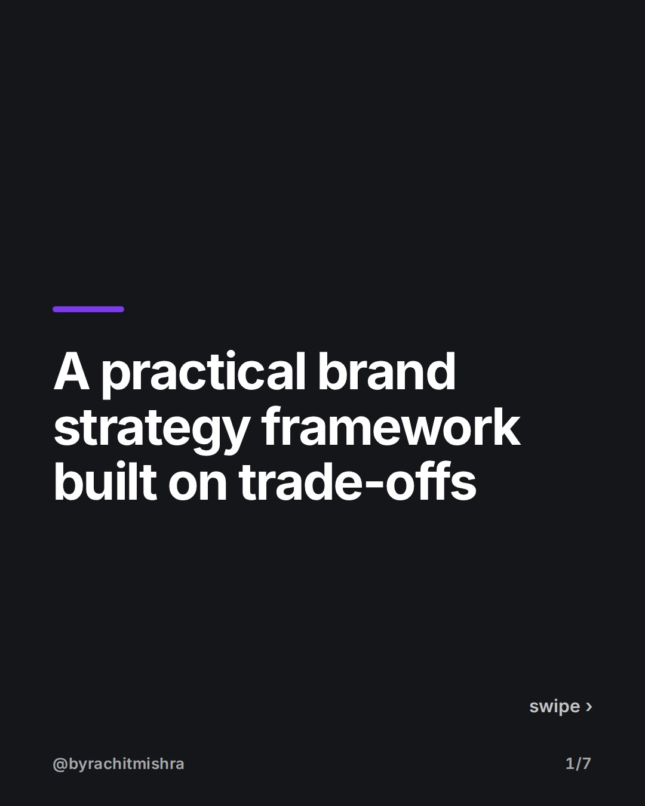
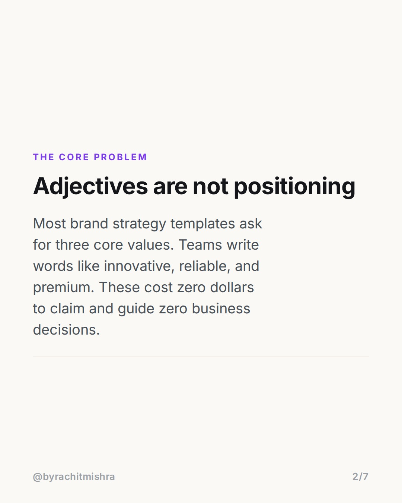
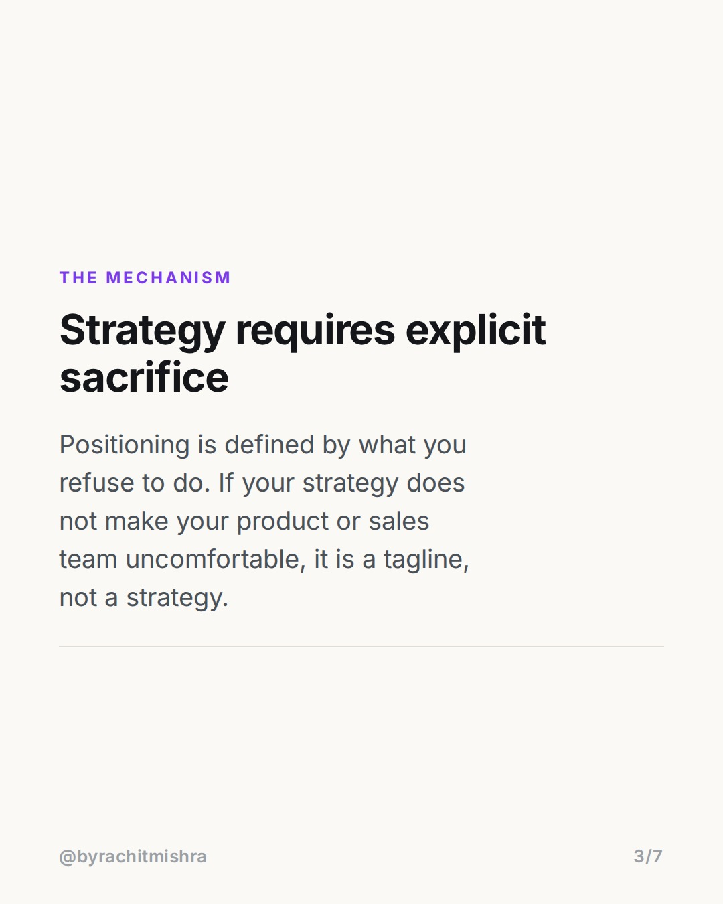
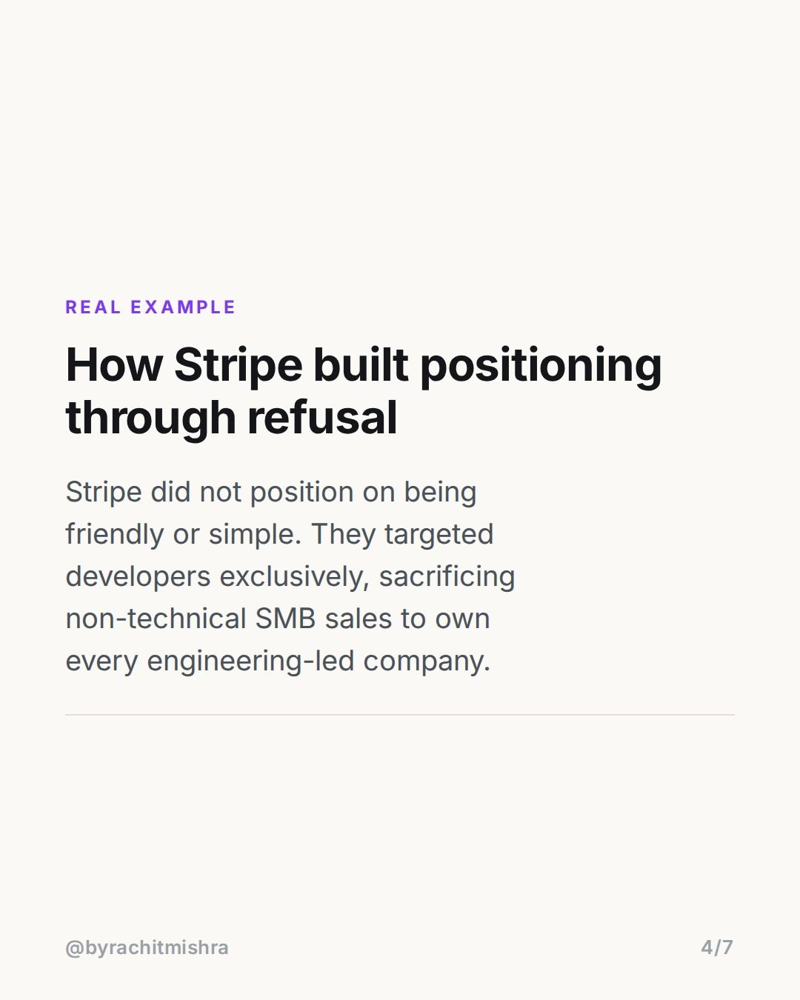
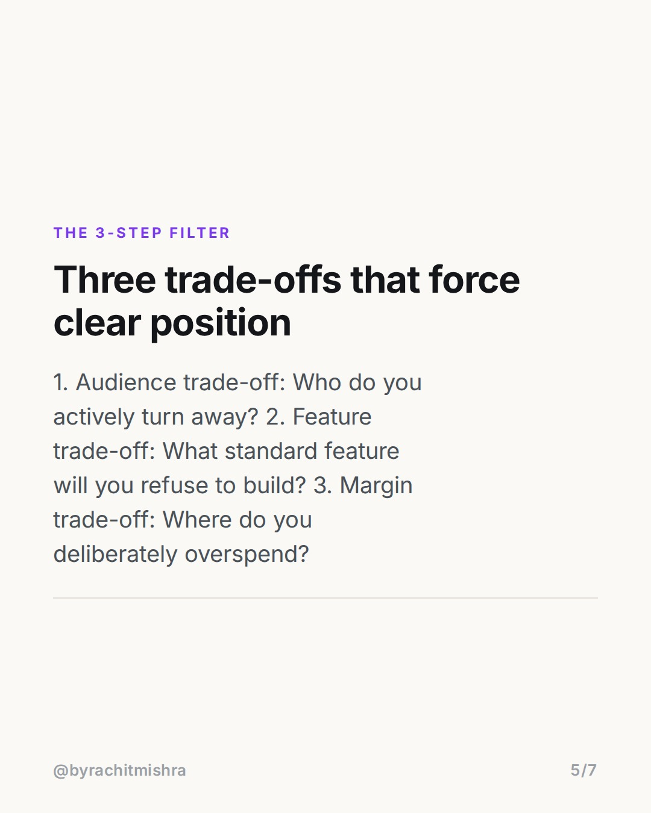
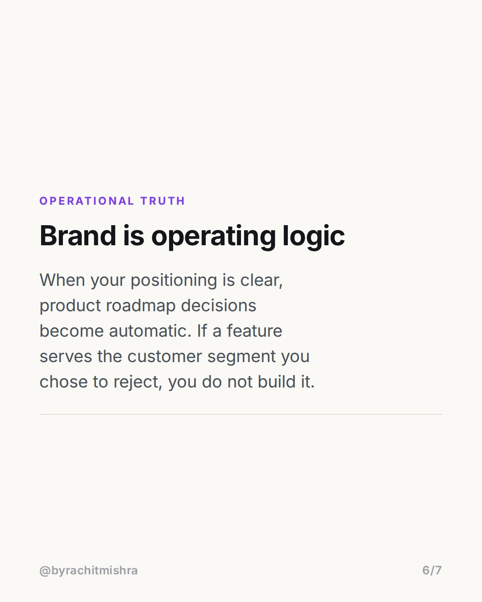

# brand strategy framework trade offs

**CAROUSEL** · Brand Strategy · goes live **2026-07-27T08:30:00+05:30**

> Targeting: `brand strategy framework`
>
> Claim: A useful brand strategy framework is defined by explicit trade-offs and operational sacrifices, not brand adjectives.

## Slides

7 rendered images sit in this folder — upload them in filename order.

**1.** 
### A practical brand strategy framework built on trade-offs



**2.** THE CORE PROBLEM
### Adjectives are not positioning
Most brand strategy templates ask for three core values. Teams write words like innovative, reliable, and premium. These cost zero dollars to claim and guide zero business decisions.



**3.** THE MECHANISM
### Strategy requires explicit sacrifice
Positioning is defined by what you refuse to do. If your strategy does not make your product or sales team uncomfortable, it is a tagline, not a strategy.



**4.** REAL EXAMPLE
### How Stripe built positioning through refusal
Stripe did not position on being friendly or simple. They targeted developers exclusively, sacrificing non-technical SMB sales to own every engineering-led company.



**5.** THE 3-STEP FILTER
### Three trade-offs that force clear position
1. Audience trade-off: Who do you actively turn away? 2. Feature trade-off: What standard feature will you refuse to build? 3. Margin trade-off: Where do you deliberately overspend?



**6.** OPERATIONAL TRUTH
### Brand is operating logic
When your positioning is clear, product roadmap decisions become automatic. If a feature serves the customer segment you chose to reject, you do not build it.



**7.** 
### Send this to your marketing team
Before your next quarterly planning session, audit your brand values against what your business actually chooses to sacrifice.


## Caption — copy from here

```
A practical brand strategy framework is not a list of adjectives. It is a list of operational trade-offs.

Most brand decks are filled with words like premium, trusted, and customer-centric. These words carry no weight because no competitor claims to be cheap, untrustworthy, and indifferent.

Real positioning requires deliberate sacrifice. When Stripe launched, they did not try to win every online merchant. They built exclusively for developers and actively ignored non-technical business owners. That single sacrifice dictated their product architecture, documentation standards, and distribution model.

If your brand strategy does not tell your team who to turn away, it is internal decoration, not positioning.

Send this post to your brand lead before your next strategy review.

#brandstrategy #brandpositioning #marketingstrategy #brandbuilding #branding
```

## Alt text

```
A seven slide carousel explaining how trade-offs form a functional brand strategy framework.
```

## How this post could fail

The post risks sounding overly theoretical if the Stripe developer example isn't immediately recognized as an operational choice by non-technical marketers.
