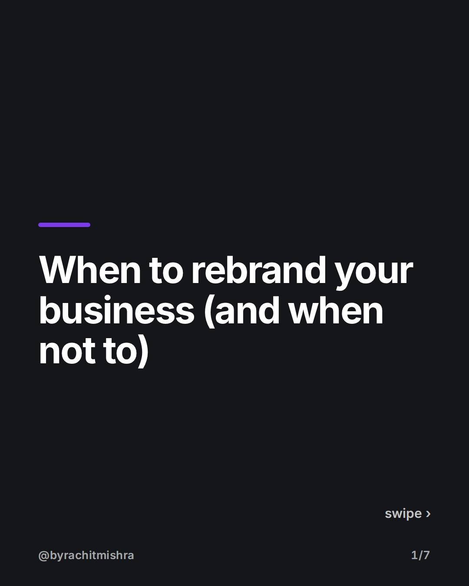
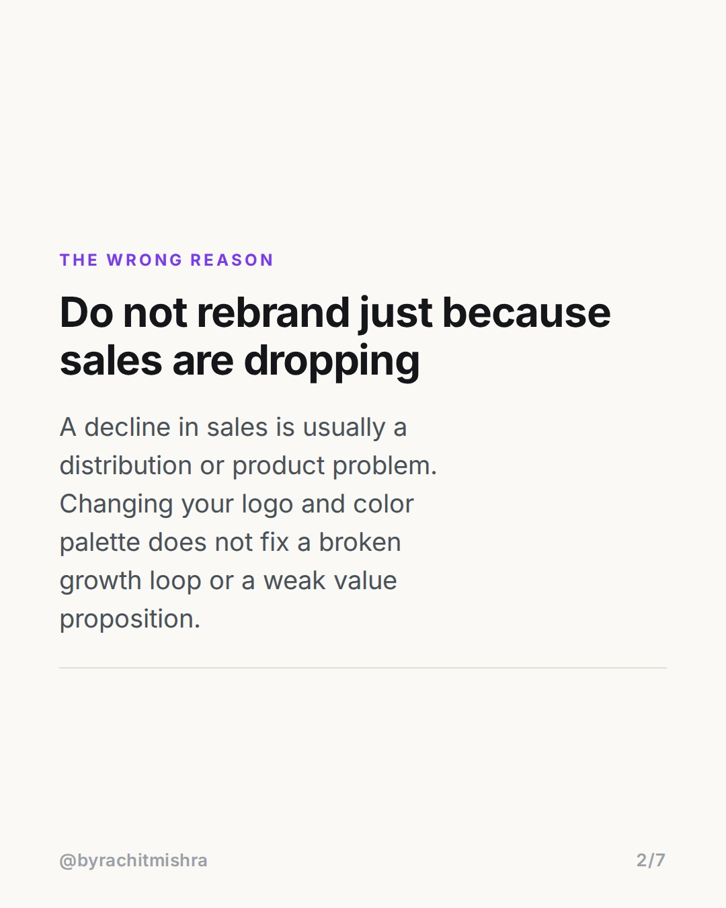
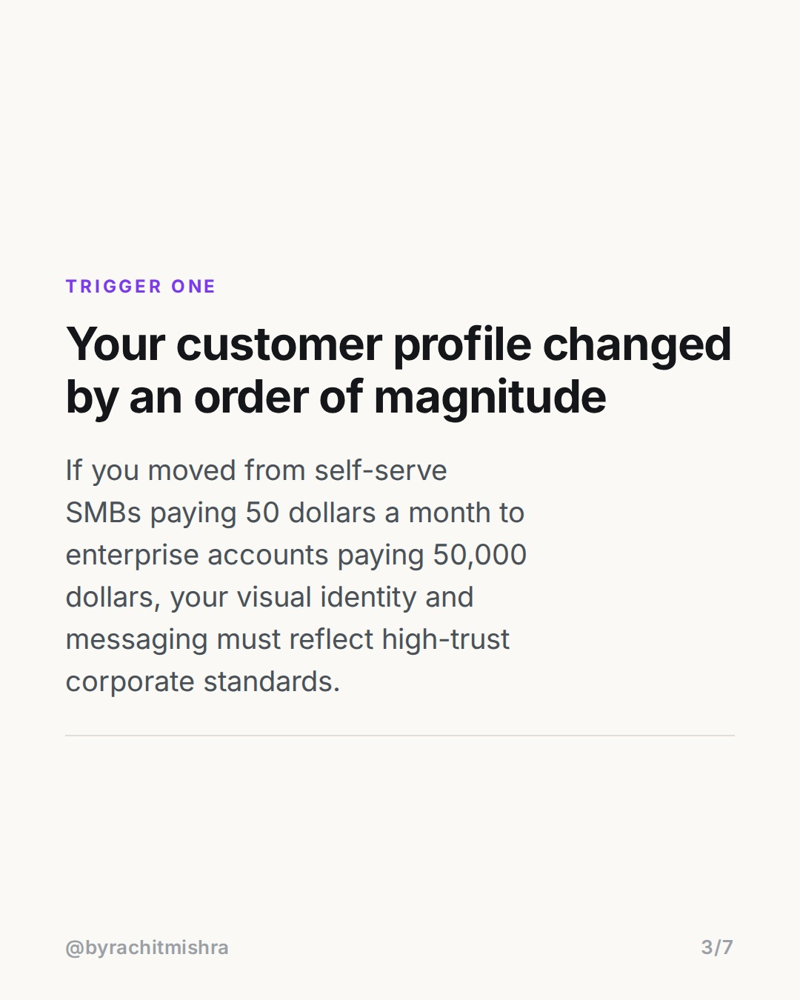
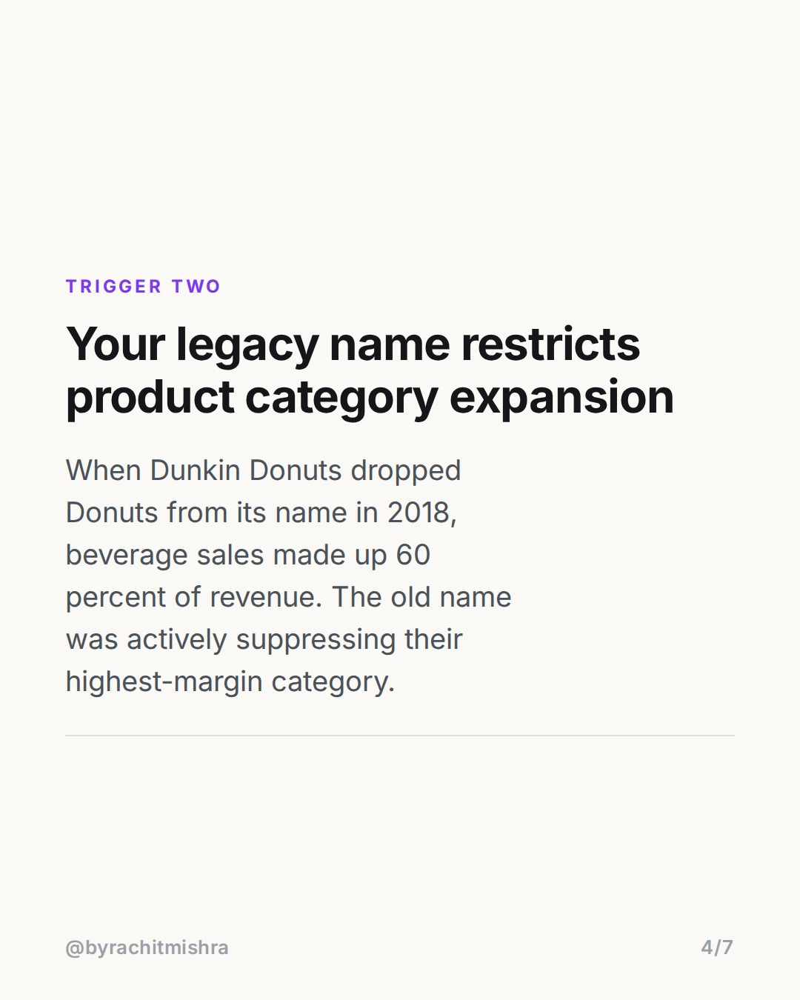
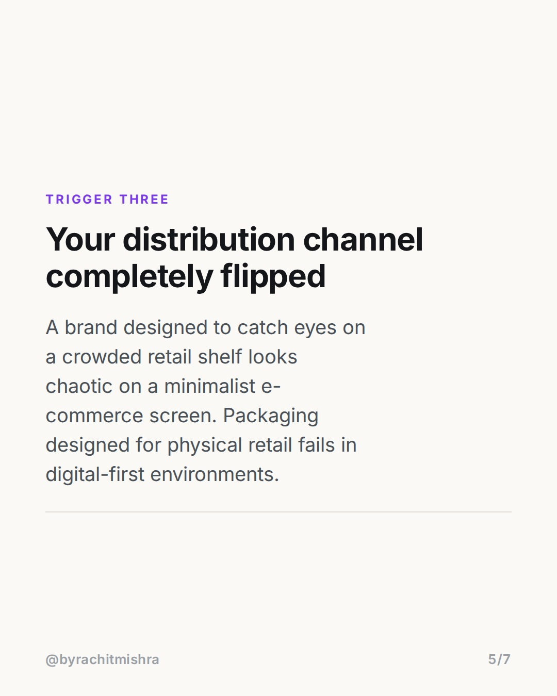
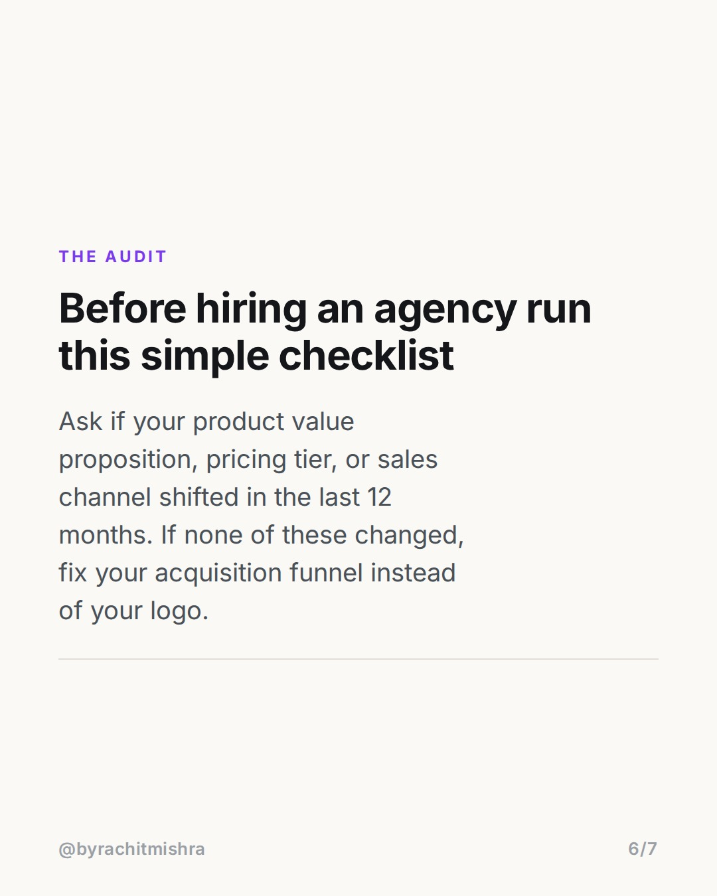

# whentorebrandtriggers

**CAROUSEL** · Brand Strategy · goes live **2026-07-27T08:30:00+05:30**

> Targeting: `when to rebrand`
>
> Claim: A rebrand is only justified when unit economics, product scope, or distribution channels fundamentally change.

## Slides

7 rendered images sit in this folder — upload them in filename order.

**1.** 
### When to rebrand your business (and when not to)



**2.** The wrong reason
### Do not rebrand just because sales are dropping
A decline in sales is usually a distribution or product problem. Changing your logo and color palette does not fix a broken growth loop or a weak value proposition.



**3.** Trigger one
### Your customer profile changed by an order of magnitude
If you moved from self-serve SMBs paying 50 dollars a month to enterprise accounts paying 50,000 dollars, your visual identity and messaging must reflect high-trust corporate standards.



**4.** Trigger two
### Your legacy name restricts product category expansion
When Dunkin Donuts dropped Donuts from its name in 2018, beverage sales made up 60 percent of revenue. The old name was actively suppressing their highest-margin category.



**5.** Trigger three
### Your distribution channel completely flipped
A brand designed to catch eyes on a crowded retail shelf looks chaotic on a minimalist e-commerce screen. Packaging designed for physical retail fails in digital-first environments.



**6.** The audit
### Before hiring an agency run this simple checklist
Ask if your product value proposition, pricing tier, or sales channel shifted in the last 12 months. If none of these changed, fix your acquisition funnel instead of your logo.



**7.** 
### Send this to a founder planning a redesign
Save this post for your next brand strategy review or forward it to a teammate currently questioning their visual identity.


## Caption — copy from here

```
Knowing exactly when to rebrand saves millions in wasted agency fees and lost brand equity.

Most corporate rebrands happen for bad reasons. An incoming marketing executive wants to leave a mark, sales dipped for two consecutive quarters, or internal teams grew bored of the visual guidelines. None of these justify altering customer recall.

A rebrand is a structural response to operational shifts. When Dunkin dropped Donuts from its name in 2018, beverage sales already accounted for 60 percent of total revenue. The operational reality had moved, and the existing name was capping margin expansion.

If your pricing tier, buyer persona, or primary acquisition channel has not changed in the past year, redesigning your identity will not solve your revenue problems.

Changing your logo when your product funnel is broken is expensive procrastination.

Send this to a founder or marketing lead currently debating a rebrand.

#brandstrategy #rebranding #brandpositioning #marketingstrategy #brandbuilding
```

## Alt text

```
Slide deck explaining when to rebrand based on customer, category, and distribution shifts.
```

## How this post could fail

If the Dunkin example feels too widely cited, readers might view the insight as familiar case-study repetition rather than actionable operational advice.

## Sources

- [Dunkin Brand Name Change Analysis 2018](https://www.cnn.com/2018/09/25/business/dunkin-donuts-new-name/index.html)
