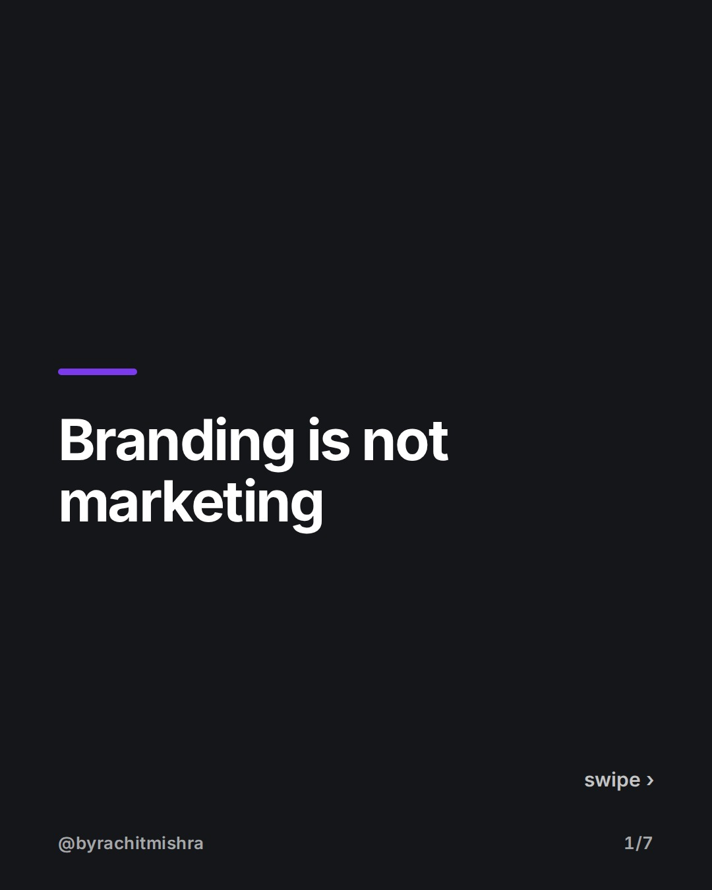
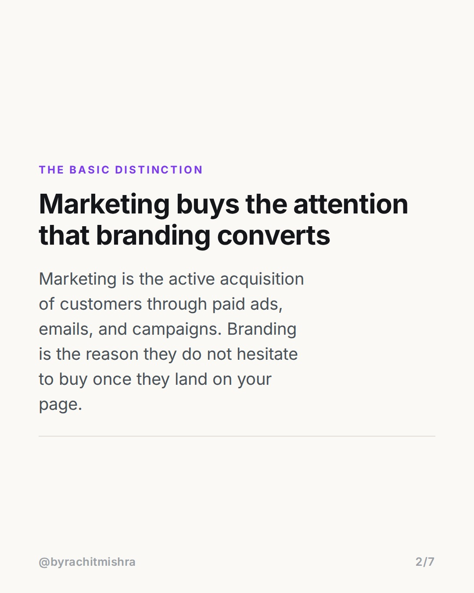
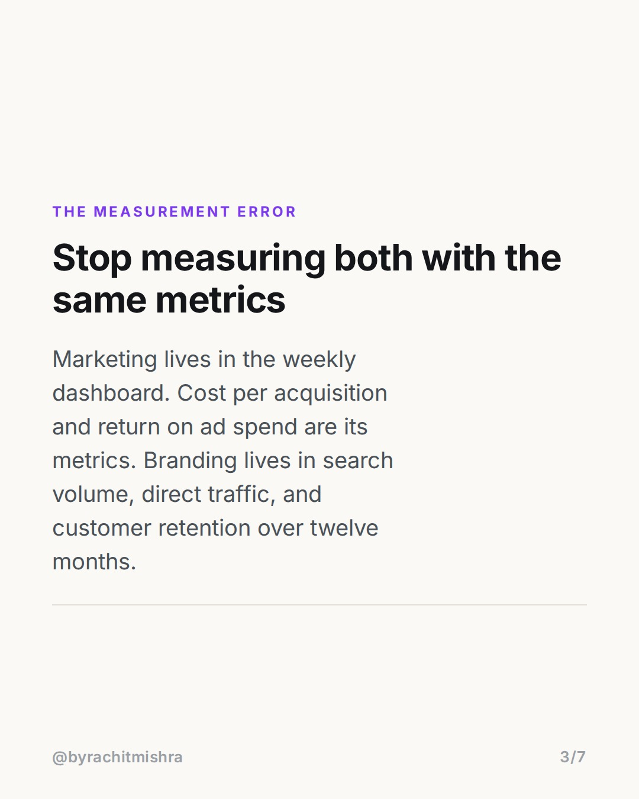
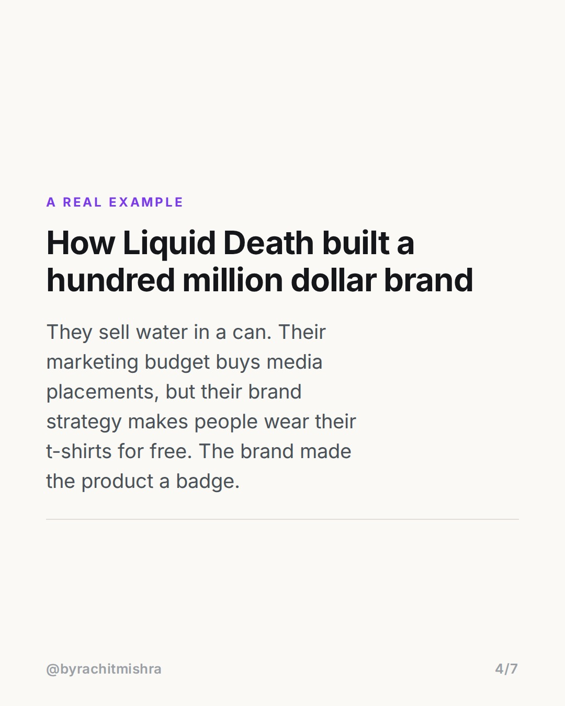
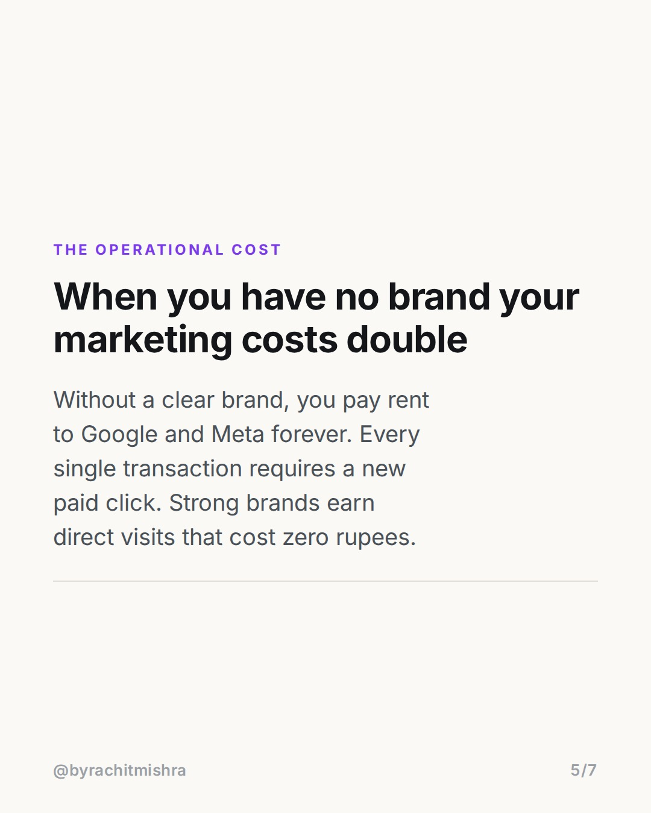
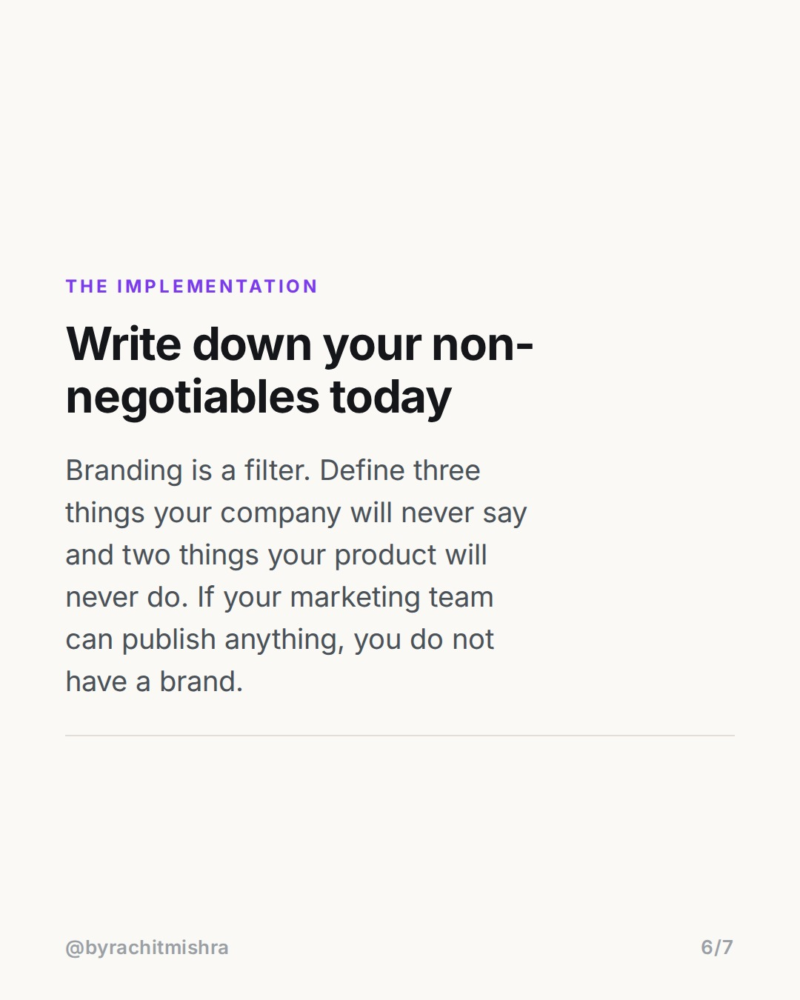

# branding_vs_marketing_resource_allocation

**CAROUSEL** · Brand Strategy · goes live **2026-08-01T10:30:00+05:30**

> Targeting: `difference between branding and marketing`
>
> Claim: Companies fail at brand building because they treat branding as an expense of marketing instead of a constraint on how marketing is executed.

## Slides

7 rendered images sit in this folder — upload them in filename order.

**1.** 
### Branding is not marketing



**2.** The basic distinction
### Marketing buys the attention that branding converts
Marketing is the active acquisition of customers through paid ads, emails, and campaigns. Branding is the reason they do not hesitate to buy once they land on your page.



**3.** The measurement error
### Stop measuring both with the same metrics
Marketing lives in the weekly dashboard. Cost per acquisition and return on ad spend are its metrics. Branding lives in search volume, direct traffic, and customer retention over twelve months.



**4.** A real example
### How Liquid Death built a hundred million dollar brand
They sell water in a can. Their marketing budget buys media placements, but their brand strategy makes people wear their t-shirts for free. The brand made the product a badge.



**5.** The operational cost
### When you have no brand your marketing costs double
Without a clear brand, you pay rent to Google and Meta forever. Every single transaction requires a new paid click. Strong brands earn direct visits that cost zero rupees.



**6.** The implementation
### Write down your non-negotiables today
Branding is a filter. Define three things your company will never say and two things your product will never do. If your marketing team can publish anything, you do not have a brand.



**7.** 
### Share this with a growth marketer who needs it


## Caption — copy from here

```
Knowing the difference between branding and marketing saves you from wasting half your annual budget.

Most early-stage companies collapse these two functions into one single budget line. They hire a performance marketer and ask them to build the brand identity. This is a structural mistake.

Marketing is an active, outward push. It is your ad spend, your cold emails, and your discount campaigns. It drives the transaction today.

Branding is an inward pull. It is the deliberate choice of who you are for, what you price at, and what you refuse to do. It determines your margin tomorrow.

Think of marketing as the fuel and branding as the engine. If you pour premium fuel into a broken engine, you do not go faster; you just waste money.

When your brand strategy is clear, your customer acquisition cost drops because your audience already trusts the premise before they see the ad.

Send this to a founder or growth marketer who is tired of rising acquisition costs.

#brandstrategy #brandpositioning #marketingstrategy #brandbuilding #branding
```

## Alt text

```
Text-based slides explaining the structural difference between branding and marketing functions.
```

## How this post could fail

The post could sound like abstract theory if the Liquid Death example does not ground the operational difference between paid acquisition and organic brand pull.
