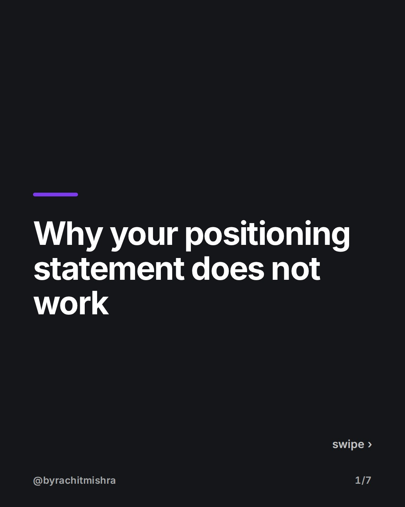
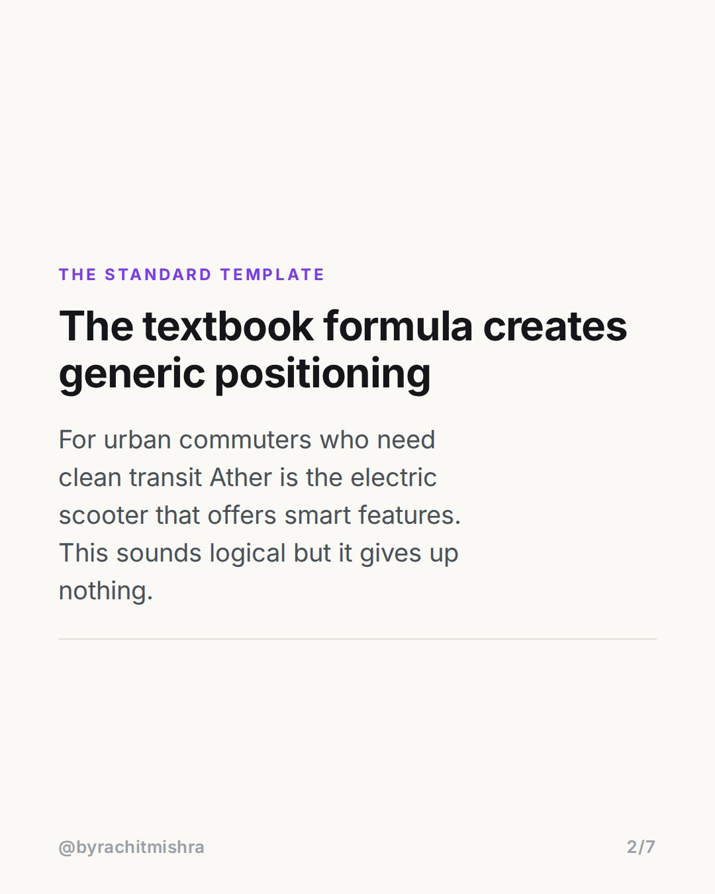
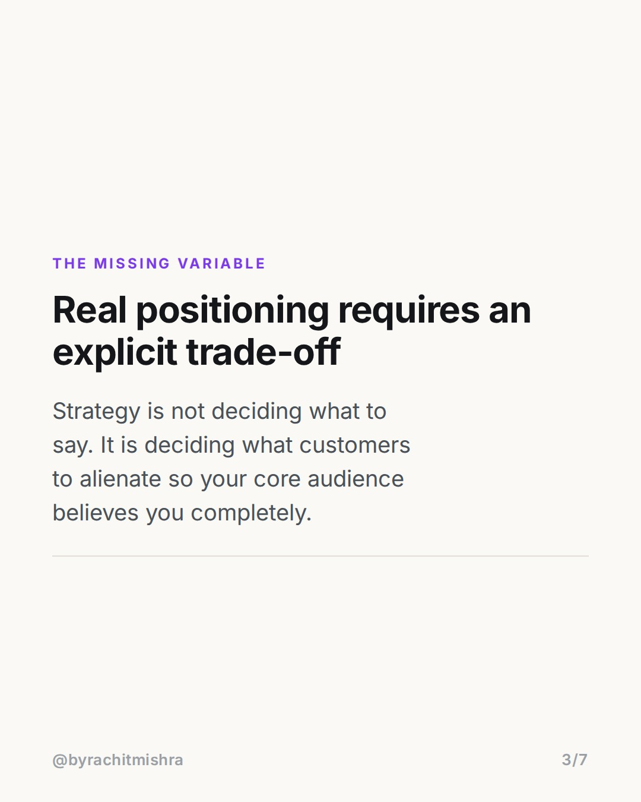
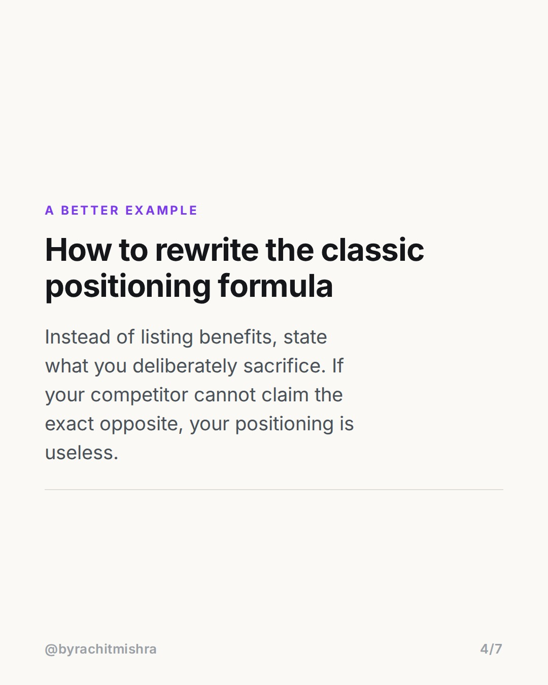
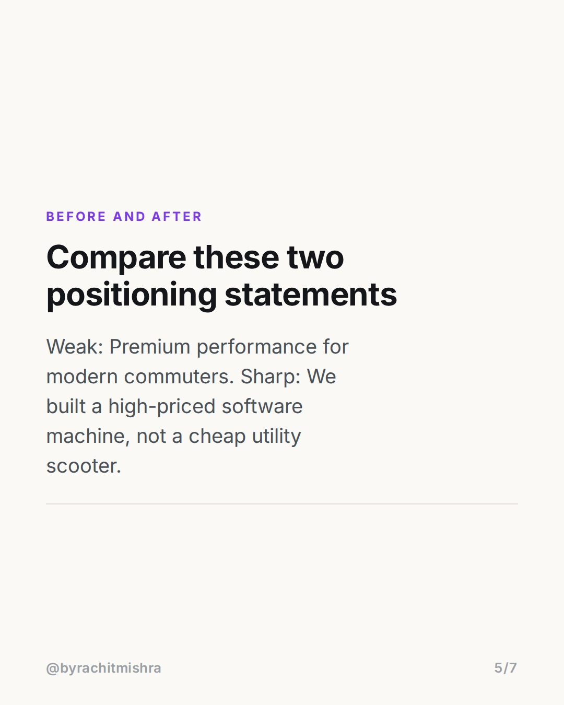
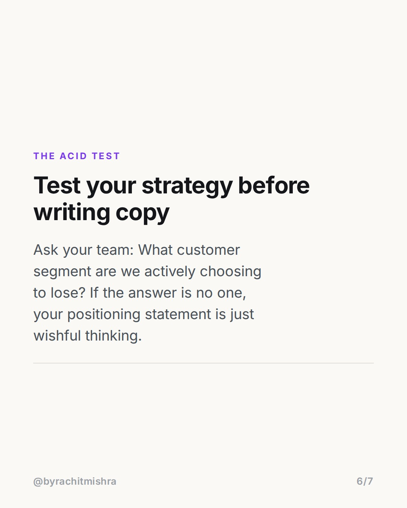
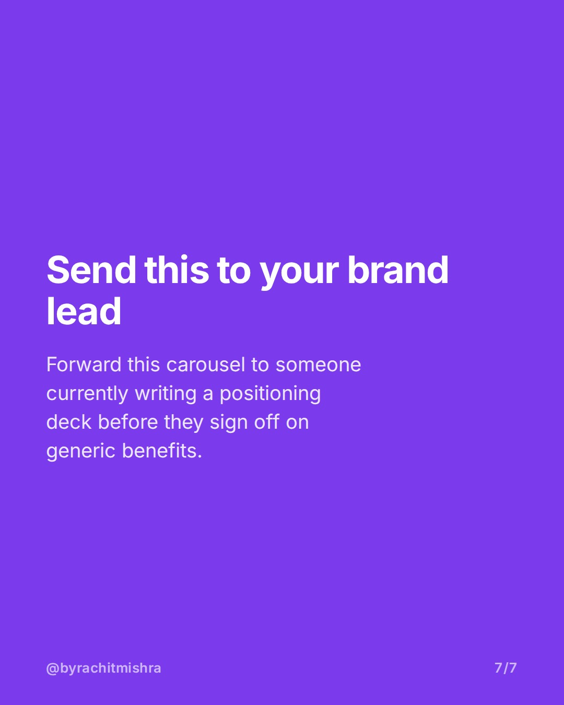

# brandpositioningstatementexample

**CAROUSEL** · Brand Strategy · goes live **2026-08-01T10:30:00+05:30**

> Targeting: `brand positioning statement example`
>
> Claim: A positioning statement is useless unless it explicitly names what the brand chooses to give up.

## Slides

7 rendered images sit in this folder — upload them in filename order.

**1.** 
### Why your positioning statement does not work



**2.** THE STANDARD TEMPLATE
### The textbook formula creates generic positioning
For urban commuters who need clean transit Ather is the electric scooter that offers smart features. This sounds logical but it gives up nothing.



**3.** THE MISSING VARIABLE
### Real positioning requires an explicit trade-off
Strategy is not deciding what to say. It is deciding what customers to alienate so your core audience believes you completely.



**4.** A BETTER EXAMPLE
### How to rewrite the classic positioning formula
Instead of listing benefits, state what you deliberately sacrifice. If your competitor cannot claim the exact opposite, your positioning is useless.



**5.** BEFORE AND AFTER
### Compare these two positioning statements
Weak: Premium performance for modern commuters. Sharp: We built a high-priced software machine, not a cheap utility scooter.



**6.** THE ACID TEST
### Test your strategy before writing copy
Ask your team: What customer segment are we actively choosing to lose? If the answer is no one, your positioning statement is just wishful thinking.



**7.** 
### Send this to your brand lead
Forward this carousel to someone currently writing a positioning deck before they sign off on generic benefits.



## Caption — copy from here

```
Every standard brand positioning statement example misses the one thing that makes strategy work: explicit trade-offs.

Most positioning templates follow the classic formula: For [target audience] who [need], [brand] is the [category] that [key benefit].

The problem with this template is that it allows brand teams to list positive adjectives without making a hard choice. When Ather launched in India, they did not position themselves as an electric scooter for commuters. They built a high-priced, software-driven vehicle and accepted losing the mass price-sensitive market entirely.

If your competitor cannot take the exact opposite stance without sounding irrational, you have not positioned your brand. You have just written a wish list.

Real brand strategy is defined by what you choose to sacrifice.

Forward this to a marketer who is writing positioning copy this week.

#brandstrategy #brandpositioning #marketingstrategy #brandbuilding #branding
```

## Alt text

```
Slide deck breaking down how to write a brand positioning statement using explicit trade-offs.
```

## How this post could fail

The post could be criticized for oversimplifying classic positioning frameworks or being overly harsh on standard marketing textbook models.
