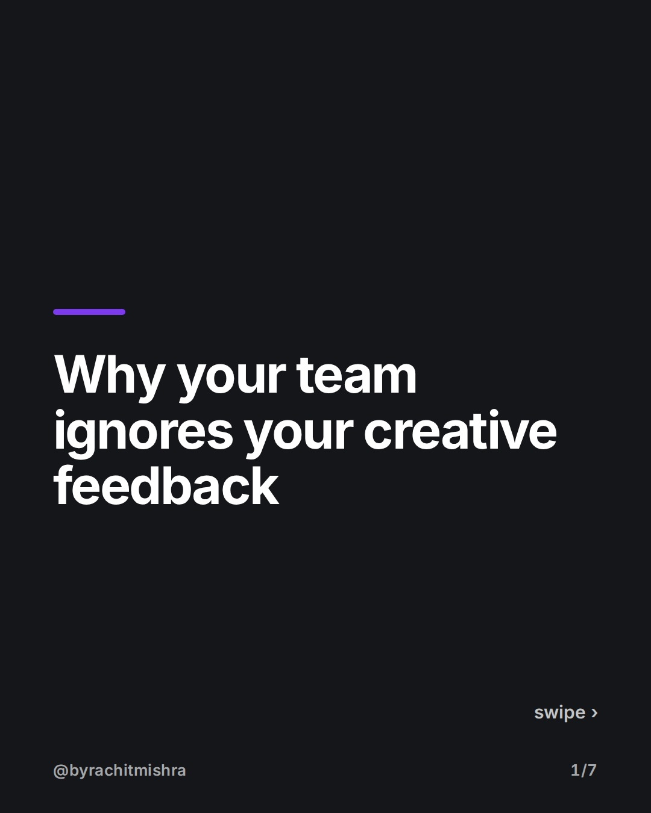
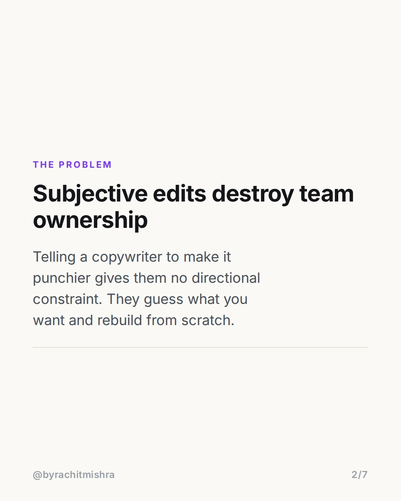
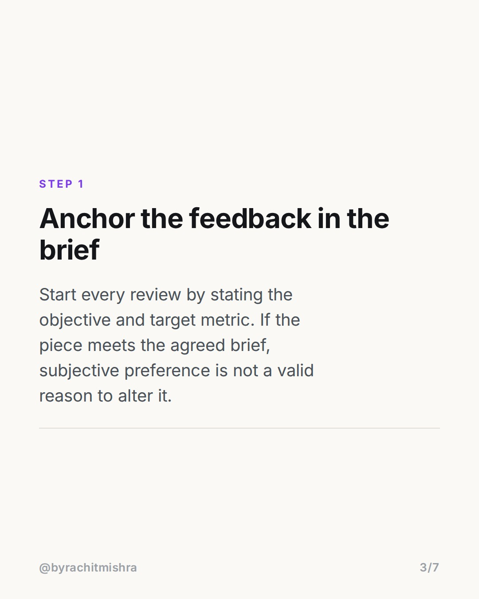
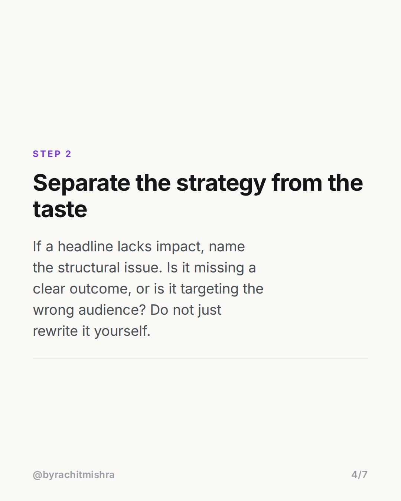
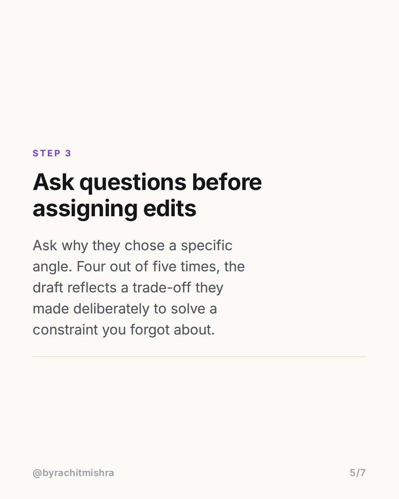
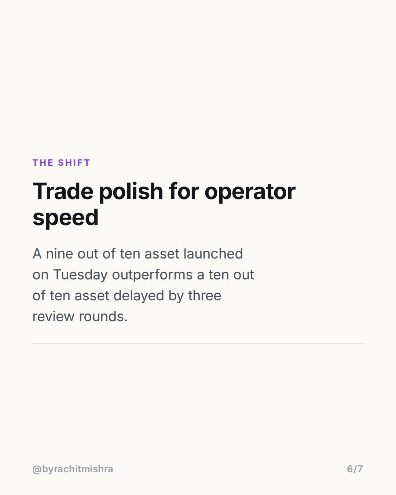

# givingfeedbackframework

**CAROUSEL** · Leadership · goes live **2026-07-30T09:30:00+05:30**

> Targeting: `giving feedback to your team`
>
> Claim: Giving feedback to your team fails when managers critique subjective preferences instead of agreed strategic constraints.

## Slides

7 rendered images sit in this folder — upload them in filename order.

**1.** 
### Why your team ignores your creative feedback



**2.** The Problem
### Subjective edits destroy team ownership
Telling a copywriter to make it punchier gives them no directional constraint. They guess what you want and rebuild from scratch.



**3.** Step 1
### Anchor the feedback in the brief
Start every review by stating the objective and target metric. If the piece meets the agreed brief, subjective preference is not a valid reason to alter it.



**4.** Step 2
### Separate the strategy from the taste
If a headline lacks impact, name the structural issue. Is it missing a clear outcome, or is it targeting the wrong audience? Do not just rewrite it yourself.



**5.** Step 3
### Ask questions before assigning edits
Ask why they chose a specific angle. Four out of five times, the draft reflects a trade-off they made deliberately to solve a constraint you forgot about.



**6.** The Shift
### Trade polish for operator speed
A nine out of ten asset launched on Tuesday outperforms a ten out of ten asset delayed by three review rounds.



**7.** 
### Build a faster review cycle
Send this to a senior manager on your team who reviews creative or campaign work every week.


## Caption — copy from here

```
Giving feedback to your team fails when you critique the wording instead of the underlying strategy.

When a manager rewrites copy or redesigns a layout directly, the team stops thinking strategically. They start trying to guess what the manager personally prefers.

To fix this, shift from taste-based edits to criteria-based reviews:
1. Confirm the constraint before touching the creative.
2. Point out structural gaps instead of rewriting lines.
3. Ask why a choice was made before changing it.

Good management preserves execution speed by setting standard parameters, not by controlling every word.

Send this to a team lead who spends too many hours in creative reviews.

#marketingleadership #leadershiplessons #careergrowth #teammanagement #leadership
```

## Alt text

```
A seven slide carousel detailing a three step framework for giving feedback to your team.
```

## How this post could fail

The post could read like generic management advice if the slides do not clearly distinguish between taste edits and strategic constraints.
