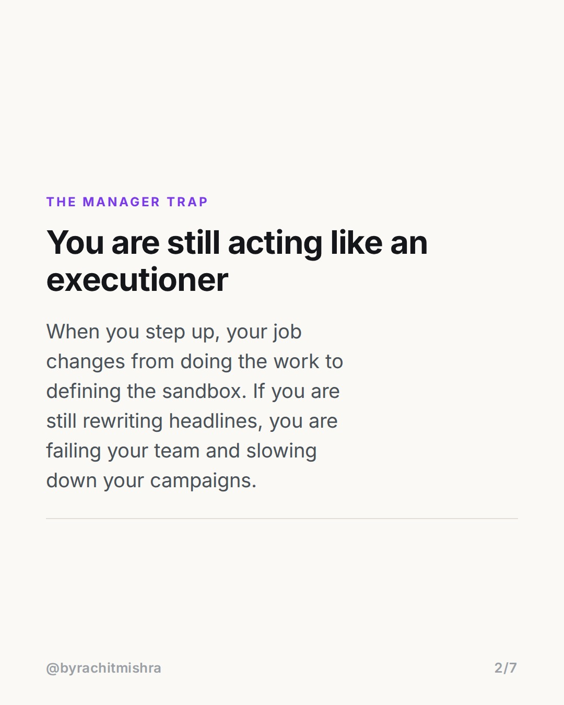
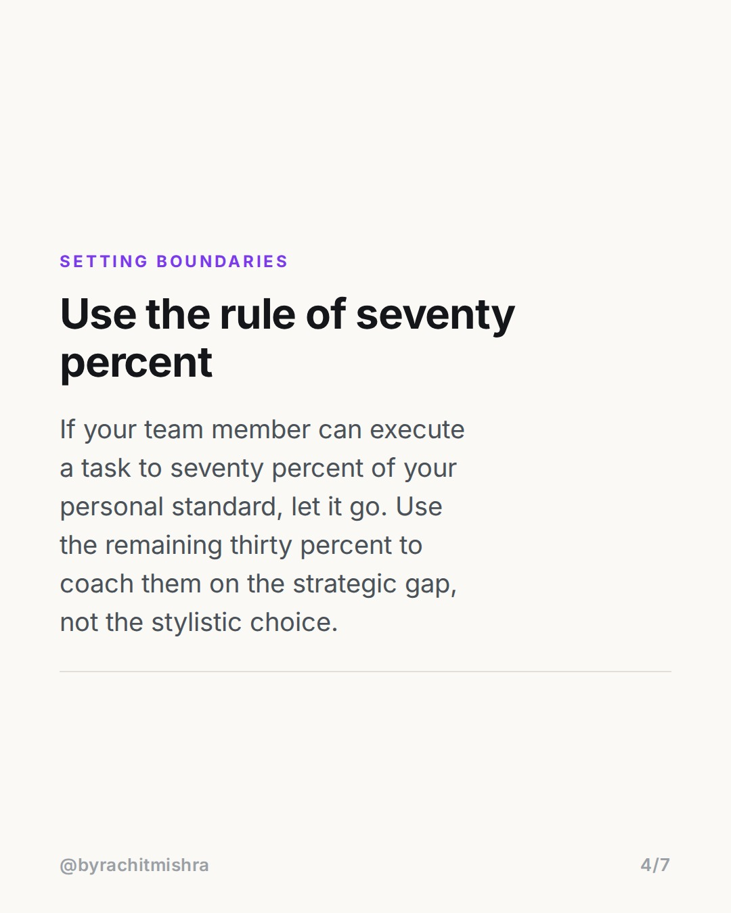
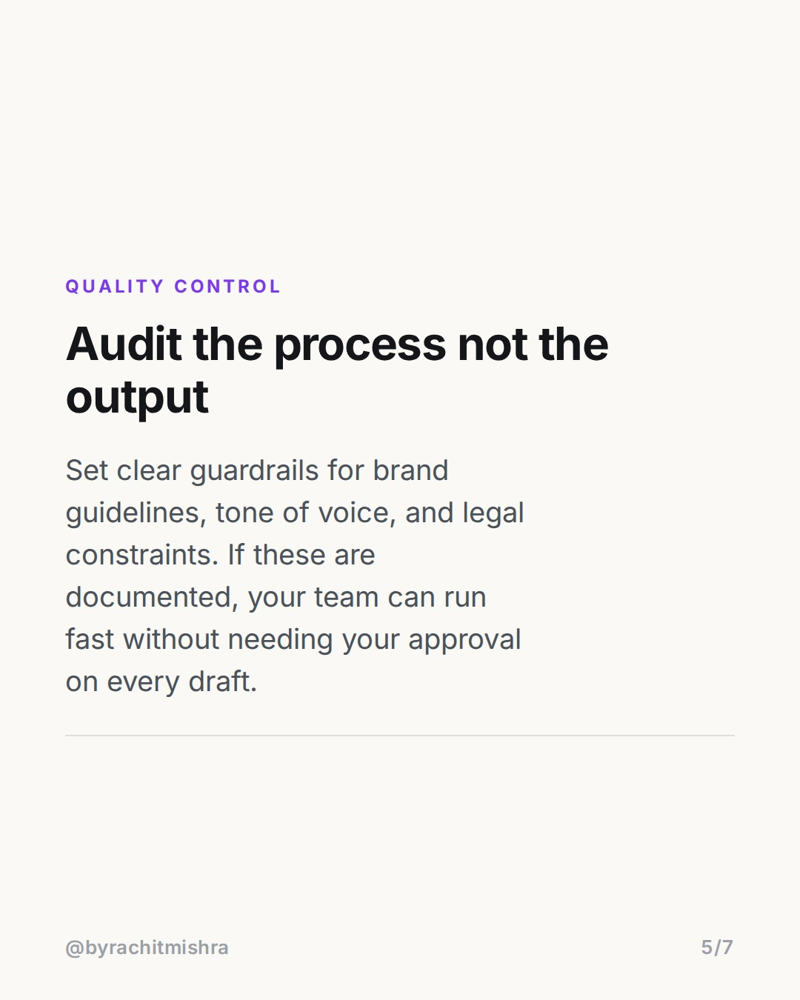
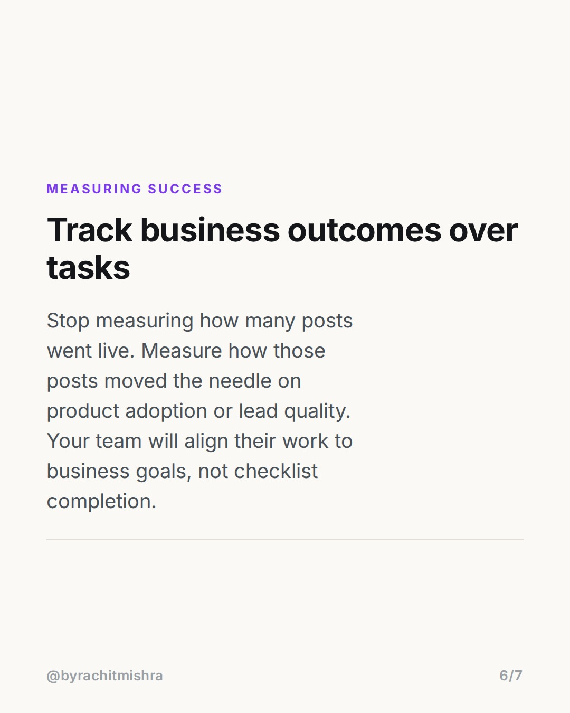

# how_to_lead_a_marketing_team

**CAROUSEL** · Leadership · goes live **2026-07-30T09:30:00+05:30**

> Targeting: `how to lead a marketing team`
>
> Claim: To successfully lead a marketing team, a manager must transition from reviewing individual creative outputs to establishing strategic guardrails and auditing the initial brief.

## Slides

7 rendered images sit in this folder — upload them in filename order.

**1.** 
### How to lead a marketing team without micromanaging


**2.** The Manager Trap
### You are still acting like an executioner
When you step up, your job changes from doing the work to defining the sandbox. If you are still rewriting headlines, you are failing your team and slowing down your campaigns.



**3.** The Real Lever
### Shift your focus to the strategic brief
Instead of correcting copy on a finished landing page, spend your time on the brief. Define the audience, the single minded proposition, and the business constraint before work starts.


**4.** Setting Boundaries
### Use the rule of seventy percent
If your team member can execute a task to seventy percent of your personal standard, let it go. Use the remaining thirty percent to coach them on the strategic gap, not the stylistic choice.



**5.** Quality Control
### Audit the process not the output
Set clear guardrails for brand guidelines, tone of voice, and legal constraints. If these are documented, your team can run fast without needing your approval on every draft.



**6.** Measuring Success
### Track business outcomes over tasks
Stop measuring how many posts went live. Measure how those posts moved the needle on product adoption or lead quality. Your team will align their work to business goals, not checklist completion.



**7.** 
### Send this to a new manager
Share this carousel with a marketing leader who is currently building out their team and needs to step back from execution.


## Caption — copy from here

```
If you want to know how to lead a marketing team, stop rewriting their copy and start auditing their creative briefs.

The moment you become a manager, your output is no longer your work. Your output is your team's work. Yet, most new leaders spend 80% of their day in the weeds—editing commas, tweaking layouts, and micro-managing social media designs.

When you do this, you create a bottleneck. Your team stops thinking because they know you will rewrite it anyway.

Here is the transition you need to make:

1. Ownership of the brief: Spend your energy defining the business constraint, the core message, and the target audience before the work begins.
2. The 70% rule: If a team member delivers work that is 70% as good as you would have done it, ship it. Use the delta as a coaching moment for strategy, not style.
3. Systemize guardrails: Document your tone of voice and brand rules once. Let them self-edit against the document rather than relying on your personal approval.

My perspective is simple: Leadership is not about ensuring every piece of work looks exactly like you did it. It is about building a system where your team can produce high-quality work without you in the room.

If you have a peer who recently stepped into a management role, share this with them.

#marketingleadership #leadershiplessons #teammanagement #leadership
```

## Alt text

```
Text graphic showing how to lead a marketing team by focusing on strategy, not micromanagement.
```

## How this post could fail

The post could sound like generic management advice if it does not ground the transition in specific marketing artifacts like creative briefs and copy editing.
