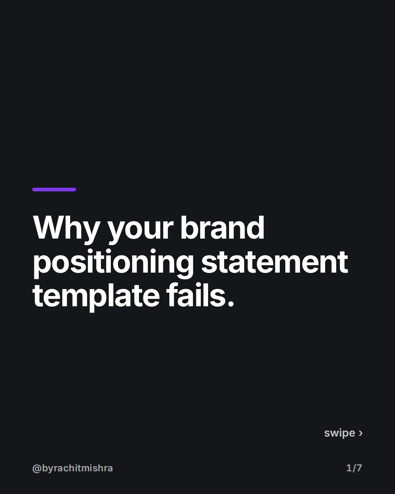
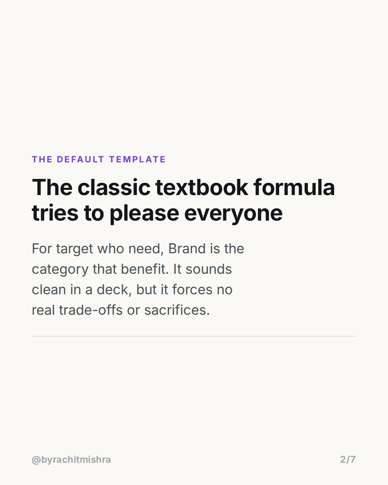
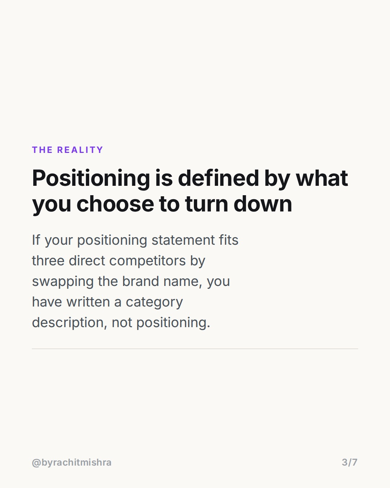
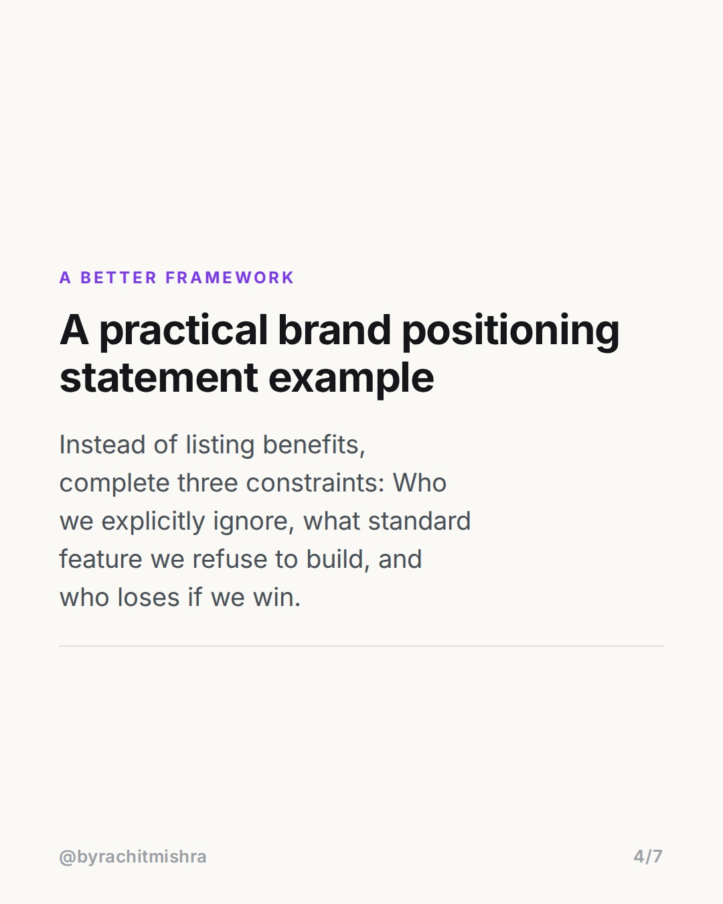
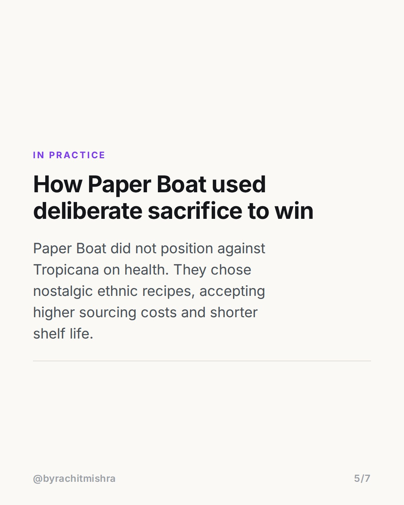
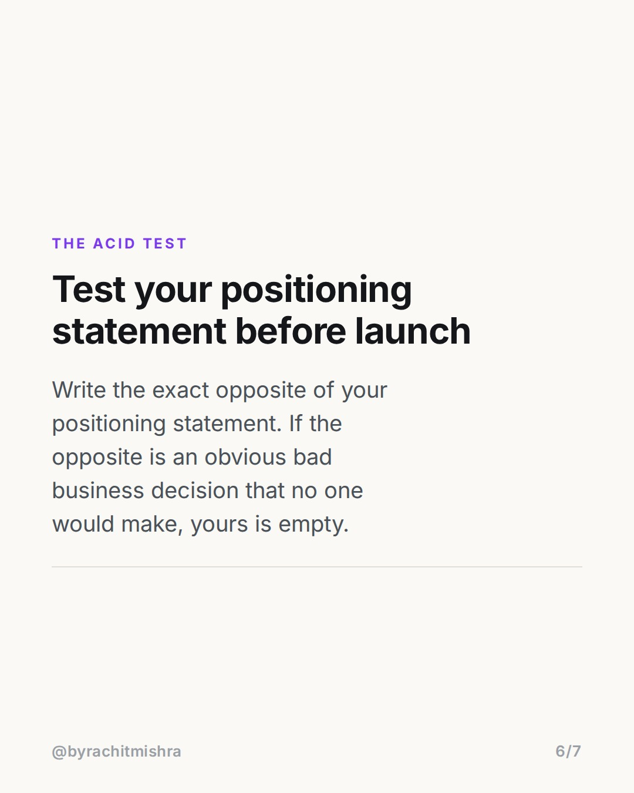
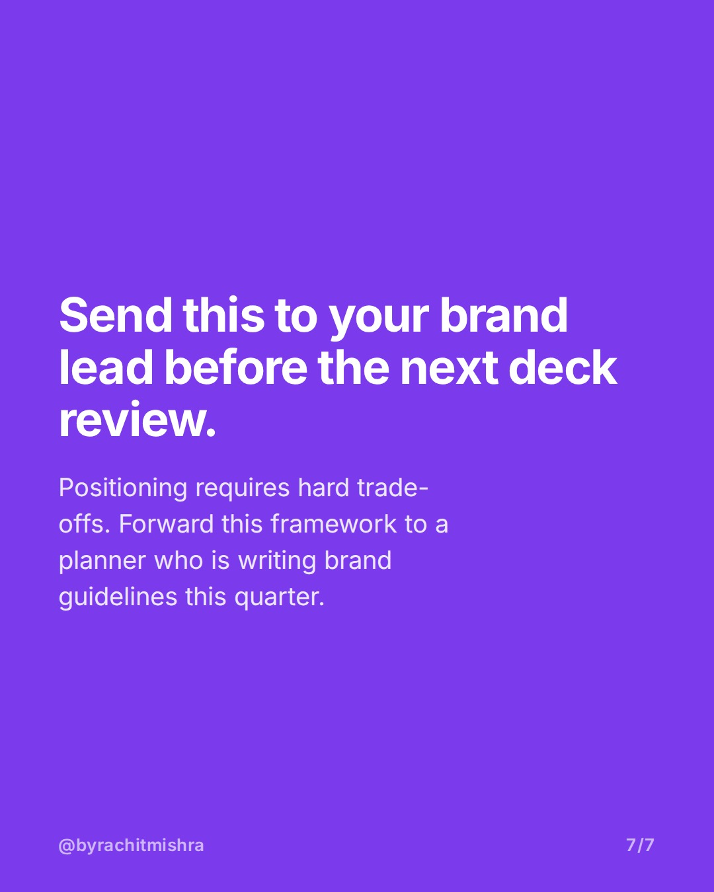

# positioning_statement_tradeoffs

**CAROUSEL** · Brand Strategy · goes live **2026-08-03T08:30:00+05:30**

> Targeting: `brand positioning statement example`
>
> Claim: A positioning statement is useless unless it explicitly defines what a brand sacrifices, rather than just summarizing what it offers.

## Slides

7 rendered images sit in this folder — upload them in filename order.

**1.** 
### Why your brand positioning statement template fails.



**2.** THE DEFAULT TEMPLATE
### The classic textbook formula tries to please everyone
For target who need, Brand is the category that benefit. It sounds clean in a deck, but it forces no real trade-offs or sacrifices.



**3.** THE REALITY
### Positioning is defined by what you choose to turn down
If your positioning statement fits three direct competitors by swapping the brand name, you have written a category description, not positioning.



**4.** A BETTER FRAMEWORK
### A practical brand positioning statement example
Instead of listing benefits, complete three constraints: Who we explicitly ignore, what standard feature we refuse to build, and who loses if we win.



**5.** IN PRACTICE
### How Paper Boat used deliberate sacrifice to win
Paper Boat did not position against Tropicana on health. They chose nostalgic ethnic recipes, accepting higher sourcing costs and shorter shelf life.



**6.** THE ACID TEST
### Test your positioning statement before launch
Write the exact opposite of your positioning statement. If the opposite is an obvious bad business decision that no one would make, yours is empty.



**7.** 
### Send this to your brand lead before the next deck review.
Positioning requires hard trade-offs. Forward this framework to a planner who is writing brand guidelines this quarter.



## Caption — copy from here

```
Every standard brand positioning statement example you find online misses the point of positioning: deliberate sacrifice.

If you fill in the classic formula—'For [target] who [need]...'—you usually end up with a sentence that every competitor in your category could also sign off on. A real positioning statement is not a summary of your product feature set; it is an internal alignment tool that tells your product, sales, and marketing teams what you will actively refuse to do.

When Paper Boat launched in India, they did not position against mass fruit juices on price or broad appeal. They chose complex ethnic recipes like Aam Panna and Jaljeera, deliberately accepting shorter shelf life and higher supply chain friction to own nostalgic memory. That trade-off made their market position defendable.

Before you approve your next strategy deck, run the inversion test: write the exact opposite of your draft statement. If the opposite statement reads like complete nonsense that no real company would ever claim, your original statement is just category noise.

If your strategy makes everyone in the room comfortable, you haven't made a choice yet.

Send this to a brand manager or strategist preparing their positioning deck for next quarter.

#brandstrategy #brandpositioning #marketingstrategy #brandbuilding #branding
```

## Alt text

```
Text carousel detailing a brand positioning statement example and trade-off framework on slide.
```

## How this post could fail

The post risks sounding purely theoretical if the Paper Boat example is not framed specifically around operational supply chain trade-offs versus simple packaging differences.
