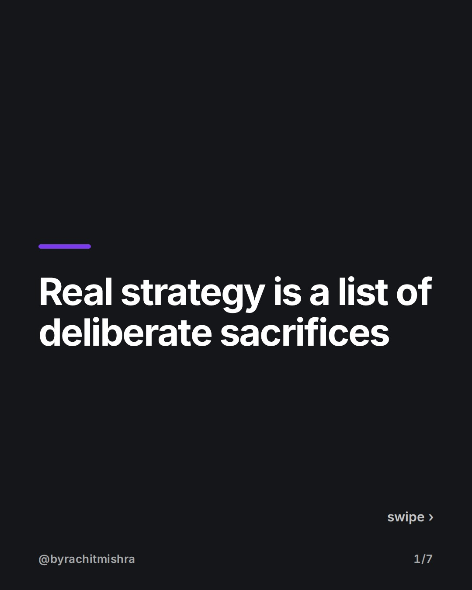
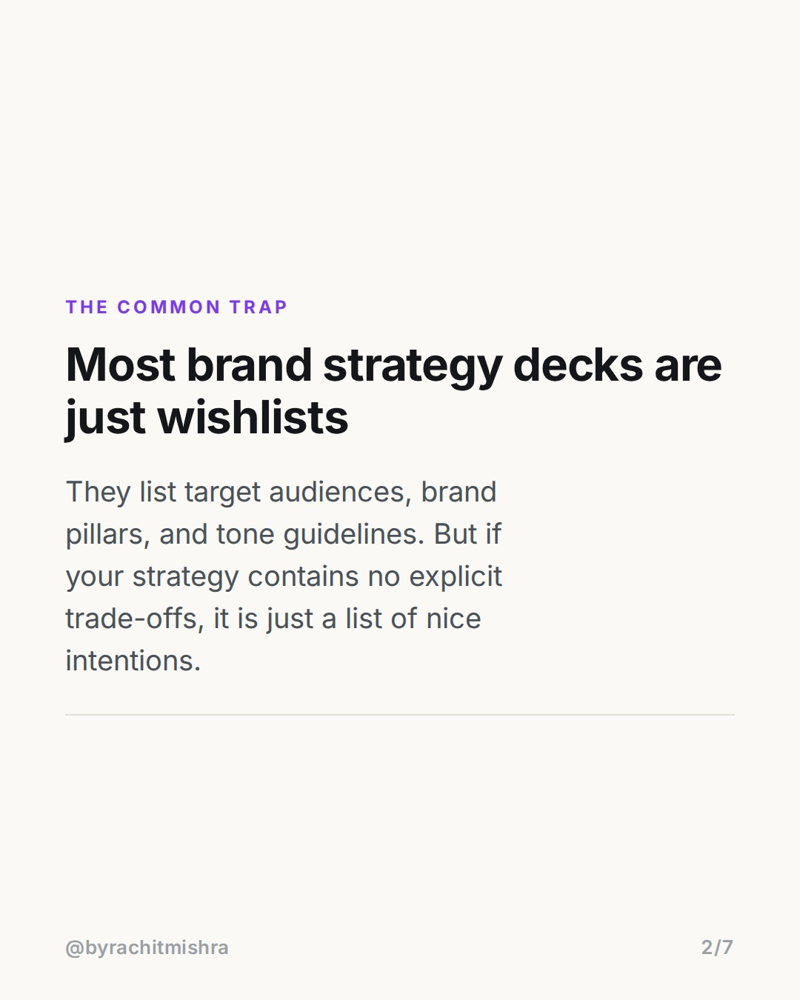
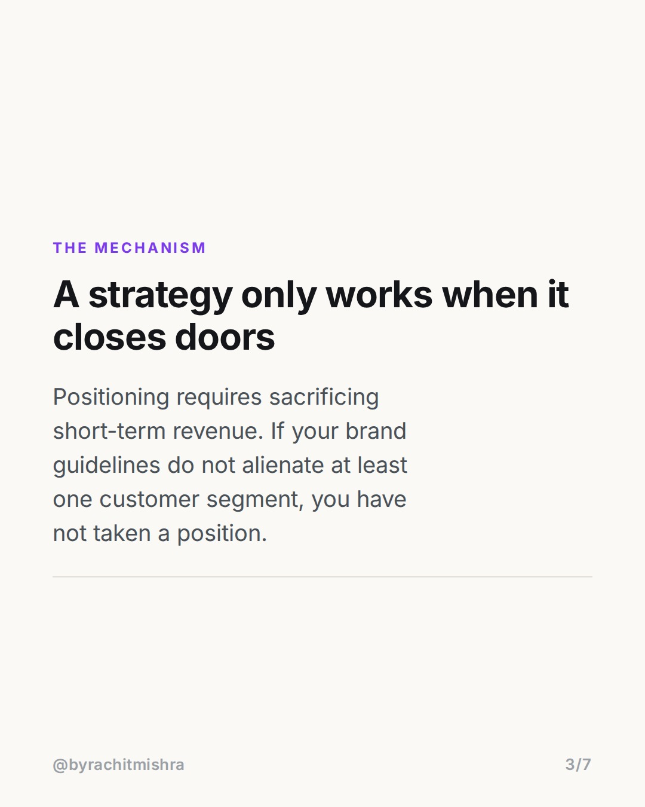
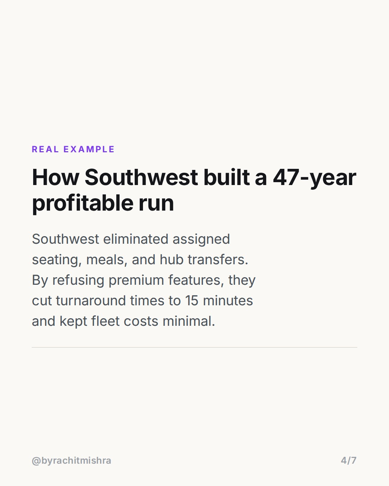
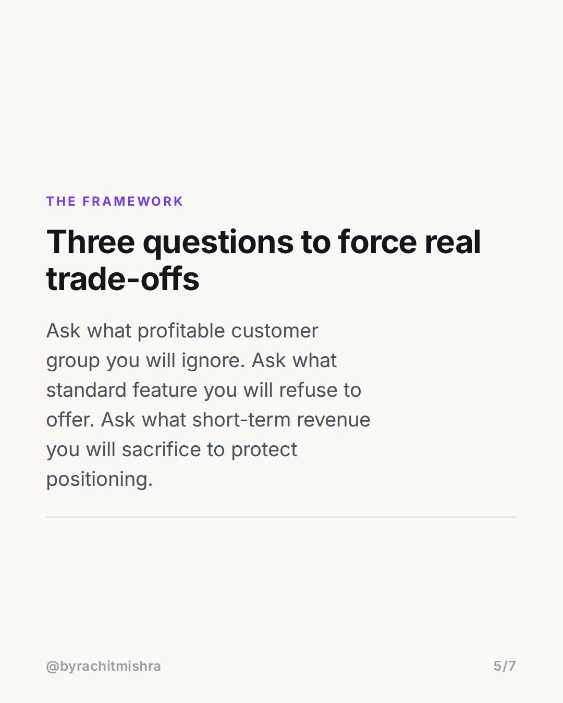
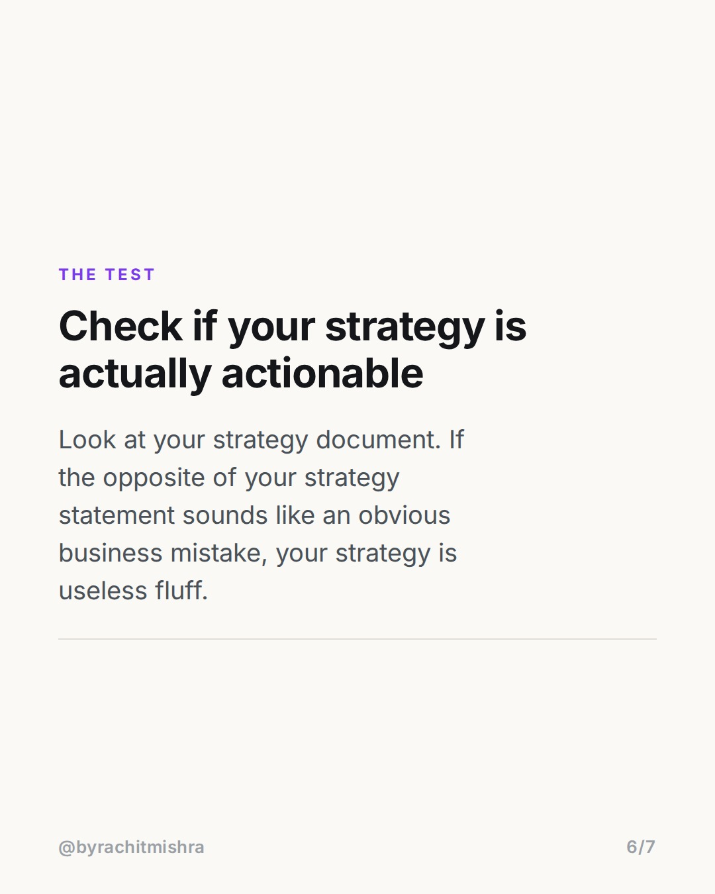
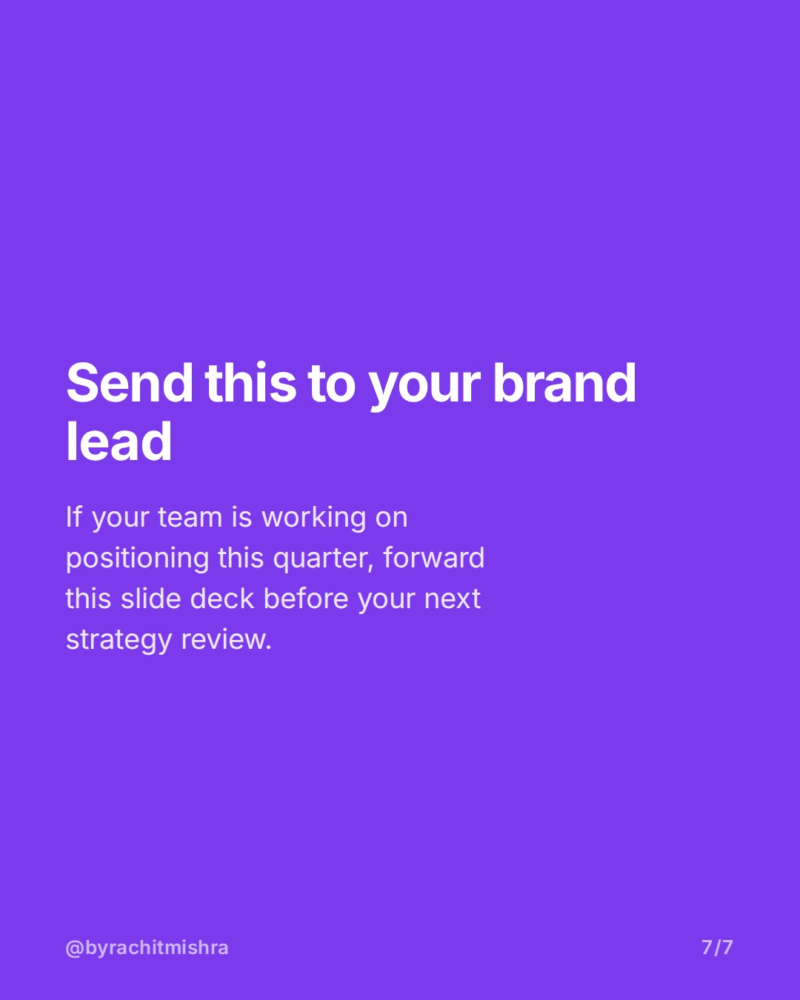

# brand_strategy_operational_tradeoffs

**CAROUSEL** · Brand Strategy · goes live **2026-08-08T10:30:00+05:30**

> Targeting: `how to build a brand strategy`
>
> Claim: Real brand strategy is defined by what a business deliberately refuses to do, not by its aspirations.

## Slides

7 rendered images sit in this folder — upload them in filename order.

**1.** 
### Real strategy is a list of deliberate sacrifices



**2.** The Common Trap
### Most brand strategy decks are just wishlists
They list target audiences, brand pillars, and tone guidelines. But if your strategy contains no explicit trade-offs, it is just a list of nice intentions.



**3.** The Mechanism
### A strategy only works when it closes doors
Positioning requires sacrificing short-term revenue. If your brand guidelines do not alienate at least one customer segment, you have not taken a position.



**4.** Real Example
### How Southwest built a 47-year profitable run
Southwest eliminated assigned seating, meals, and hub transfers. By refusing premium features, they cut turnaround times to 15 minutes and kept fleet costs minimal.



**5.** The Framework
### Three questions to force real trade-offs
Ask what profitable customer group you will ignore. Ask what standard feature you will refuse to offer. Ask what short-term revenue you will sacrifice to protect positioning.



**6.** The Test
### Check if your strategy is actually actionable
Look at your strategy document. If the opposite of your strategy statement sounds like an obvious business mistake, your strategy is useless fluff.



**7.** 
### Send this to your brand lead
If your team is working on positioning this quarter, forward this slide deck before your next strategy review.



## Caption — copy from here

```
Knowing how to build a brand strategy starts with choosing what your business will refuse to do.

Most strategy documents are useless because they try to capture every possible customer. They define values like quality or customer focus that no competitor would ever reject. Real strategy requires operational sacrifice.

When Southwest Airlines built their brand, they eliminated meals, assigned seats, and hub transfers. That operational choice cut plane turnaround time to 15 minutes versus the industry average of 45 minutes, leading to 47 consecutive profitable years.

If the opposite of your positioning statement sounds like bad management, you do not have a strategy yet.

Send this to a marketer on your team who is writing brand guidelines this month.

#brandstrategy #brandpositioning #marketingstrategy #brandbuilding #branding
```

## Alt text

```
Slide deck explaining how to build a brand strategy around operational sacrifice.
```

## How this post could fail

The Southwest Airlines example is a classical case study and may feel familiar to senior brand strategists.
