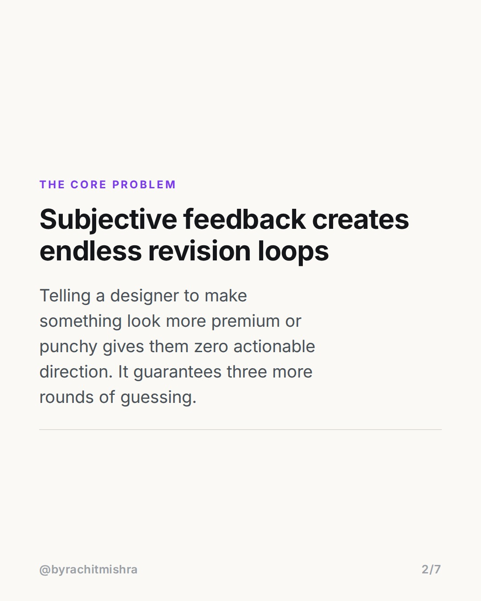
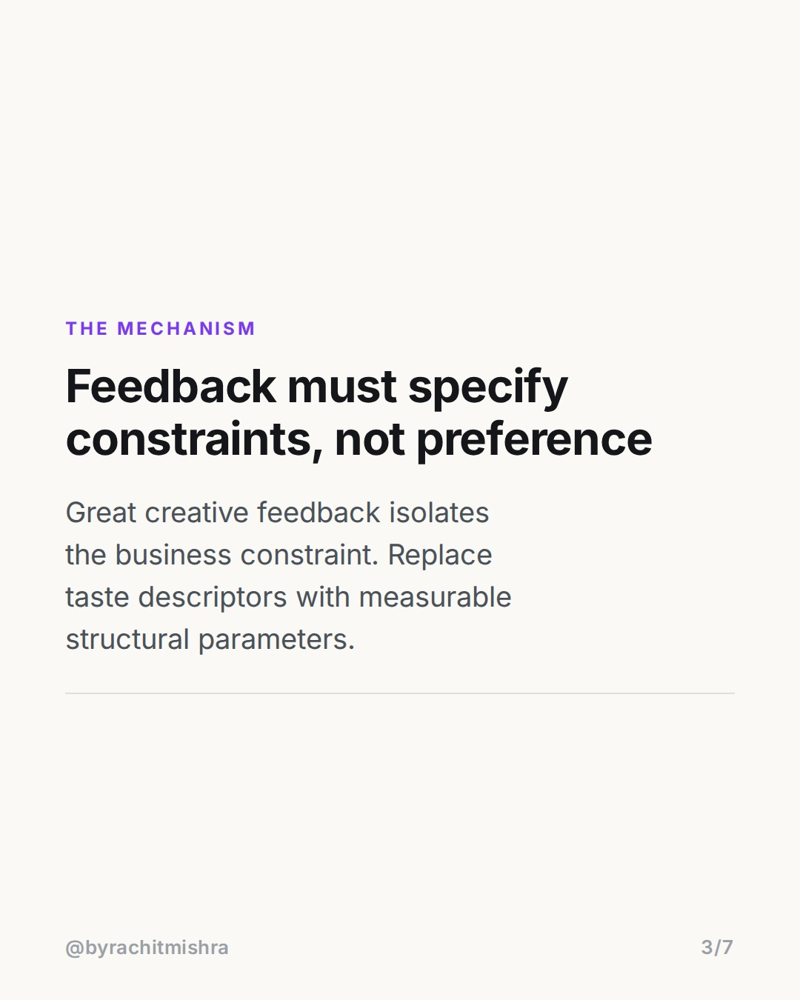
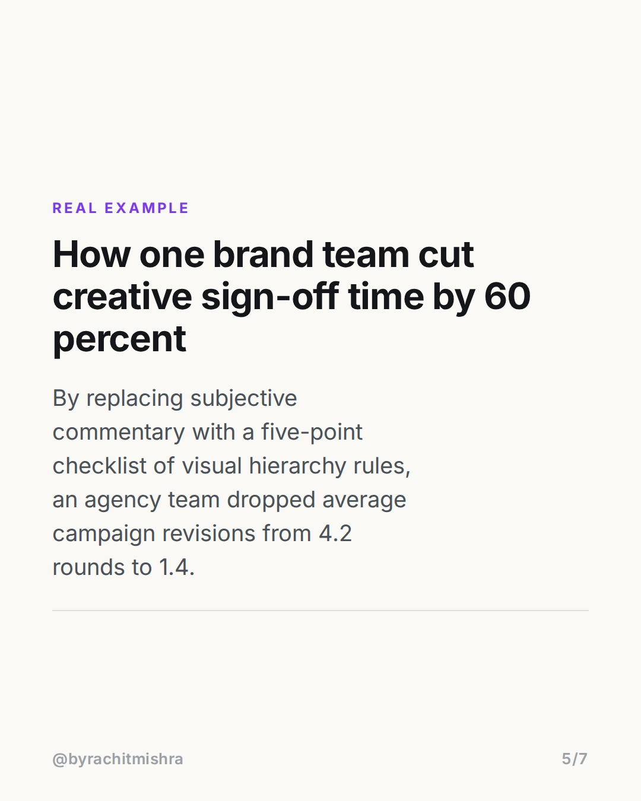
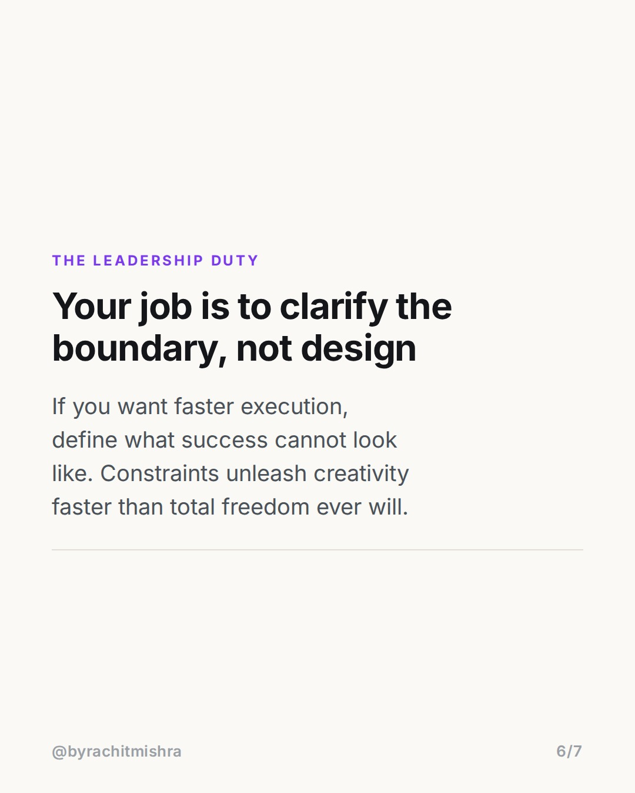

# giving_feedback_creative_teams

**CAROUSEL** · Leadership · goes live **2026-08-06T09:30:00+05:30**

> Targeting: `giving feedback to your team`
>
> Claim: Replacing subjective taste adjectives with explicit structural constraints reduces creative revision rounds from four to one.

## Slides

7 rendered images sit in this folder — upload them in filename order.

**1.** 
### How to fix vague feedback on creative work


**2.** The Core Problem
### Subjective feedback creates endless revision loops
Telling a designer to make something look more premium or punchy gives them zero actionable direction. It guarantees three more rounds of guessing.



**3.** The Mechanism
### Feedback must specify constraints, not preference
Great creative feedback isolates the business constraint. Replace taste descriptors with measurable structural parameters.



**4.** Before and After
### Swap taste adjectives for clear functional rules
Vague: Make this headline pop. Specific: Cut four words from the headline so it fits on two lines without shrinking the font size.


**5.** Real Example
### How one brand team cut creative sign-off time by 60 percent
By replacing subjective commentary with a five-point checklist of visual hierarchy rules, an agency team dropped average campaign revisions from 4.2 rounds to 1.4.



**6.** The Leadership Duty
### Your job is to clarify the boundary, not design
If you want faster execution, define what success cannot look like. Constraints unleash creativity faster than total freedom ever will.



**7.** 
### Save this framework for your next review
Send this to a brand manager or team lead who spends too many hours stuck in round four of creative revisions.


## Caption — copy from here

```
Mastering giving feedback to your team comes down to eliminating taste adjectives from your review comments.

When a marketing manager tells a designer or copywriter to make an asset punchier, clean, or premium, they are delegating strategy back down to the creator. The creator guesses, fails, and re-submits.

An agency team I audited tracked their revision cycles over six months. When feedback shifted from aesthetic opinions to operational parameters (word count caps, visual focal points, contrast ratios), average revisions dropped from 4.2 rounds to 1.4 rounds per asset.

Clear constraints compress revision cycles. Aesthetic opinions multiply them.

Send this to a team lead who wants to cut creative review time in half.

#marketingleadership #leadershiplessons #careergrowth #teamculture #leadership
```

## Alt text

```
Slide showing actionable framework for giving feedback to your team on creative work.
```

## How this post could fail

If the distinction between structural constraints and aesthetic opinion is not sharp enough, managers might misinterpret this as micromanagement rather than clarity.
