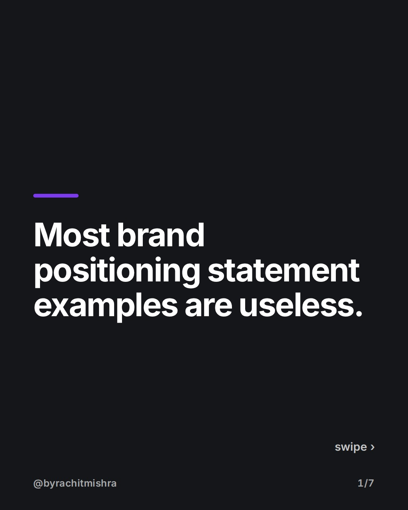
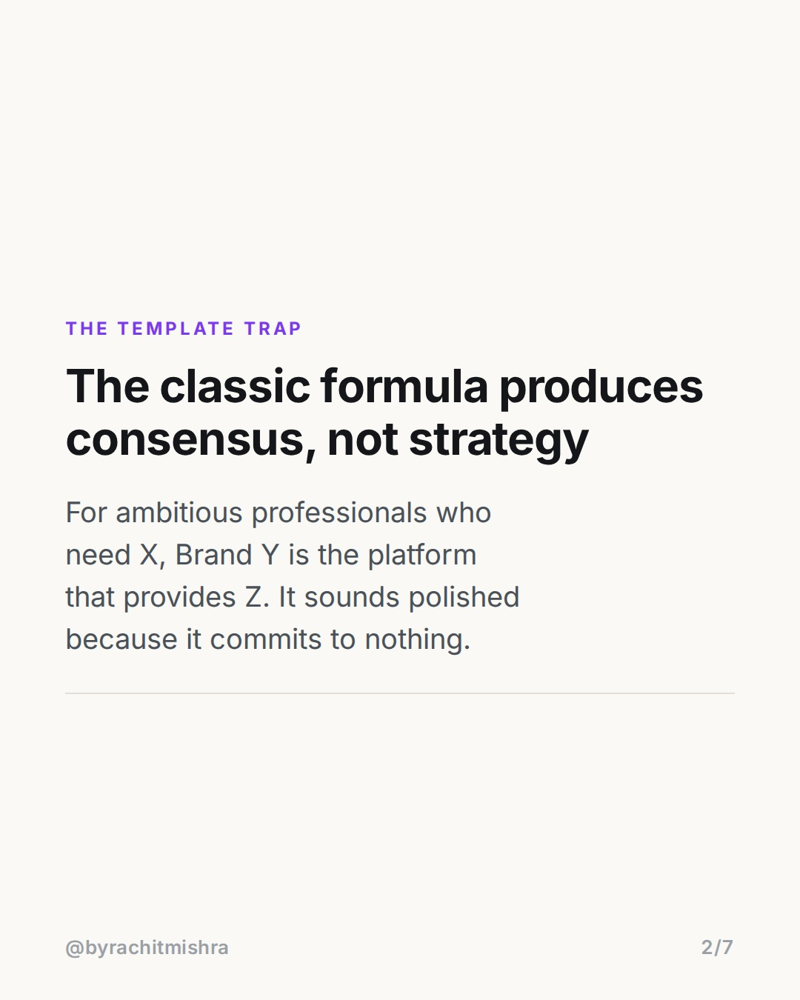
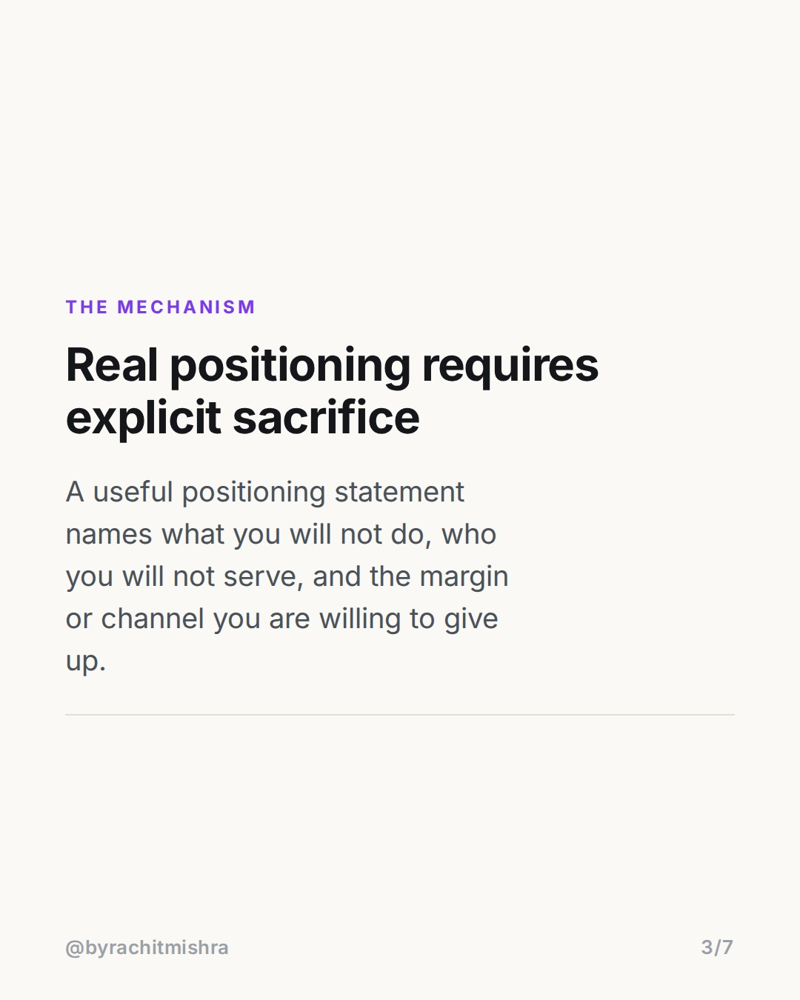
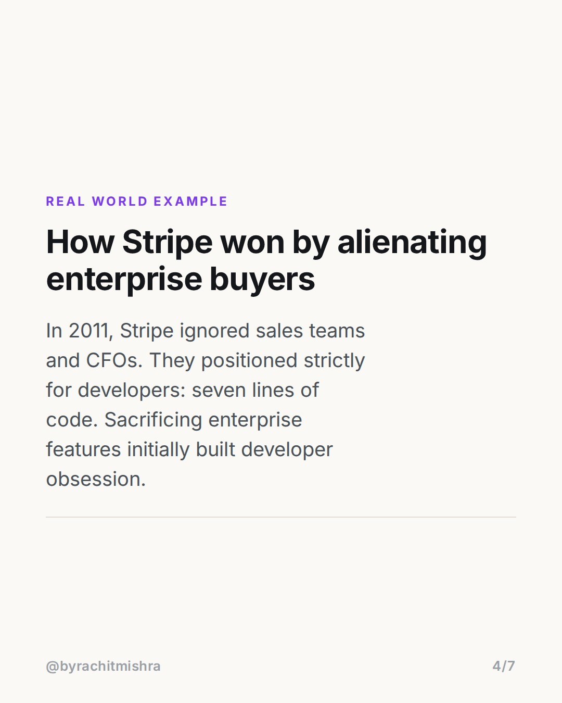
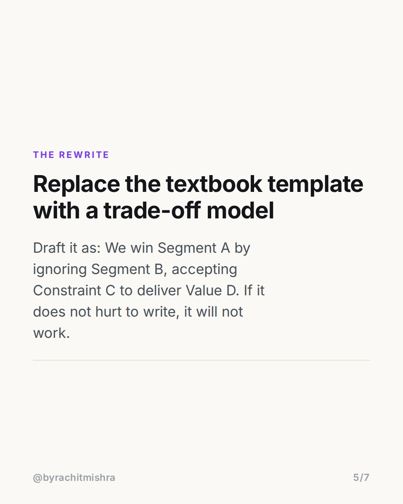
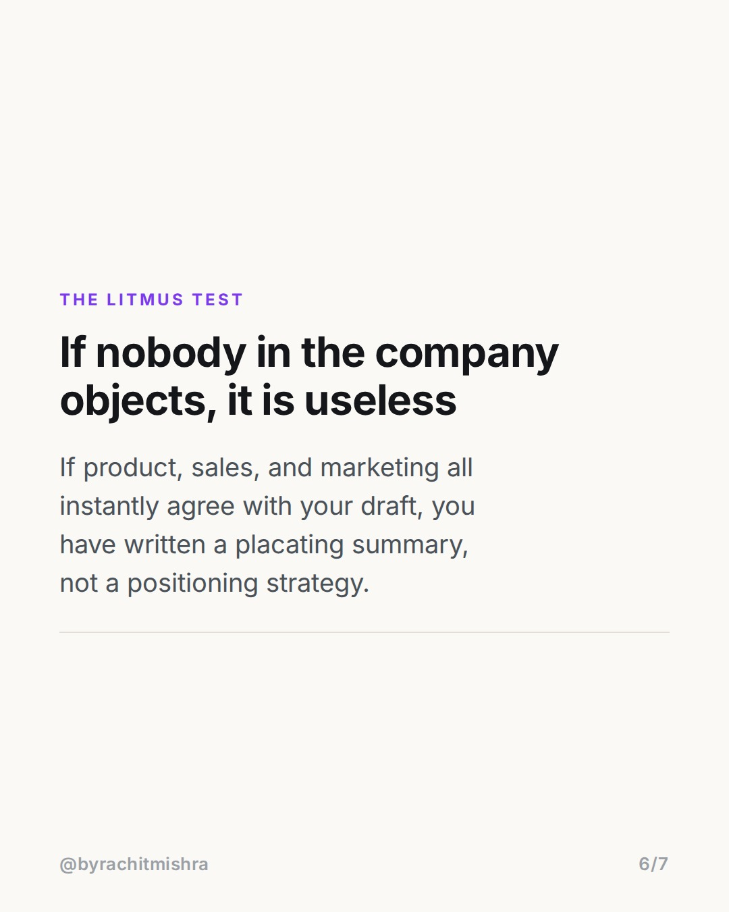
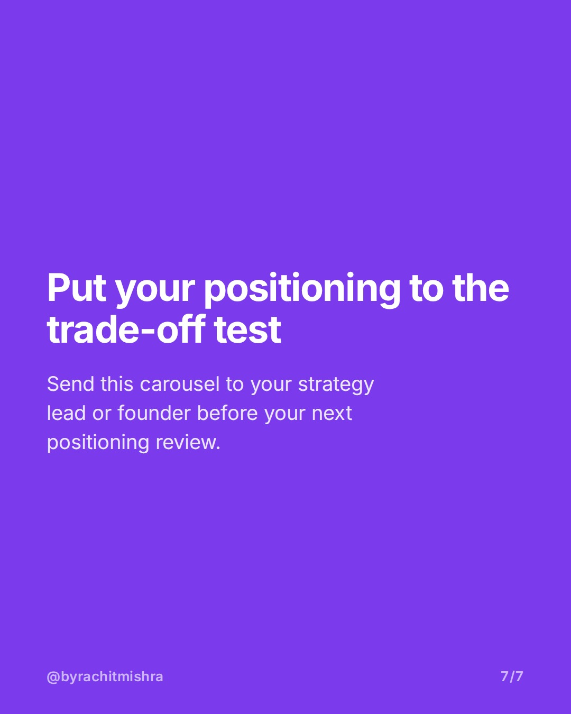

# brandpositioningstatementexample

**CAROUSEL** · Brand Strategy · goes live **2026-08-10T08:30:00+05:30**

> Targeting: `brand positioning statement example`
>
> Claim: Textbook brand positioning statement templates fail because they optimize for internal consensus rather than strategic sacrifice.

## Slides

7 rendered images sit in this folder — upload them in filename order.

**1.** 
### Most brand positioning statement examples are useless.



**2.** The Template Trap
### The classic formula produces consensus, not strategy
For ambitious professionals who need X, Brand Y is the platform that provides Z. It sounds polished because it commits to nothing.



**3.** The Mechanism
### Real positioning requires explicit sacrifice
A useful positioning statement names what you will not do, who you will not serve, and the margin or channel you are willing to give up.



**4.** Real World Example
### How Stripe won by alienating enterprise buyers
In 2011, Stripe ignored sales teams and CFOs. They positioned strictly for developers: seven lines of code. Sacrificing enterprise features initially built developer obsession.



**5.** The Rewrite
### Replace the textbook template with a trade-off model
Draft it as: We win Segment A by ignoring Segment B, accepting Constraint C to deliver Value D. If it does not hurt to write, it will not work.



**6.** The Litmus Test
### If nobody in the company objects, it is useless
If product, sales, and marketing all instantly agree with your draft, you have written a placating summary, not a positioning strategy.



**7.** 
### Put your positioning to the trade-off test
Send this carousel to your strategy lead or founder before your next positioning review.



## Caption — copy from here

```
Searching for a brand positioning statement example usually leads to the same 4-part template. Here is why it fails.

The classic textbook formula asks for target audience, frame of reference, point of difference, and reason to believe. It produces sentences that everyone in the room nods at because it costs nothing to say.

Real positioning is not a summary of what you do. It is an agreement on what you refuse to do.

When Stripe launched in 2011, they did not position as payment processing for all internet businesses. They positioned exclusively for developers who wanted to paste seven lines of code, completely ignoring traditional enterprise buying committees for years.

If your statement does not make your sales lead or product lead slightly uncomfortable, it is not strategy. It is description.

Send this to the person writing your next brand deck.

#brandstrategy #brandpositioning #marketingstrategy #brandbuilding #branding
```

## Alt text

```
Text slide showing a brand positioning statement example comparing consensus to strategic sacrifice.
```

## How this post could fail

This post could fail if readers misinterpret strategic sacrifice as advice to niche down so narrowly that the total addressable market becomes commercially unviable.
