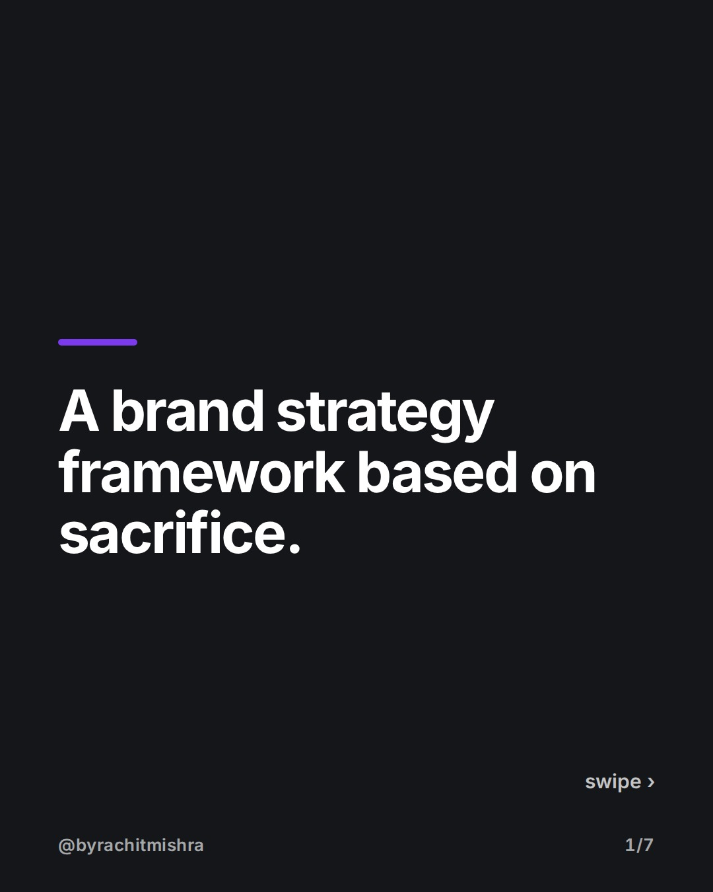
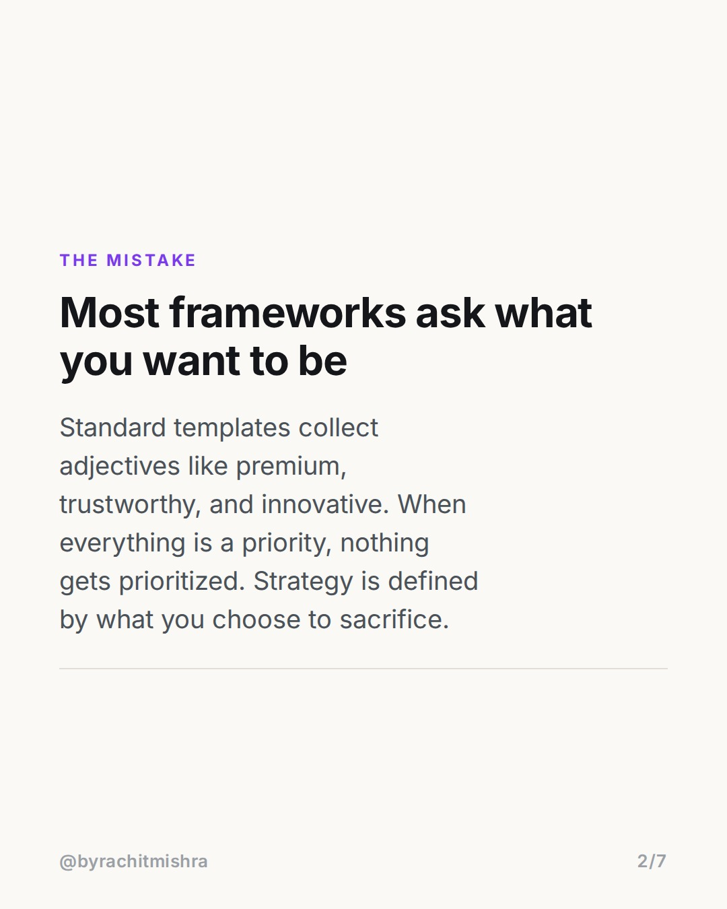
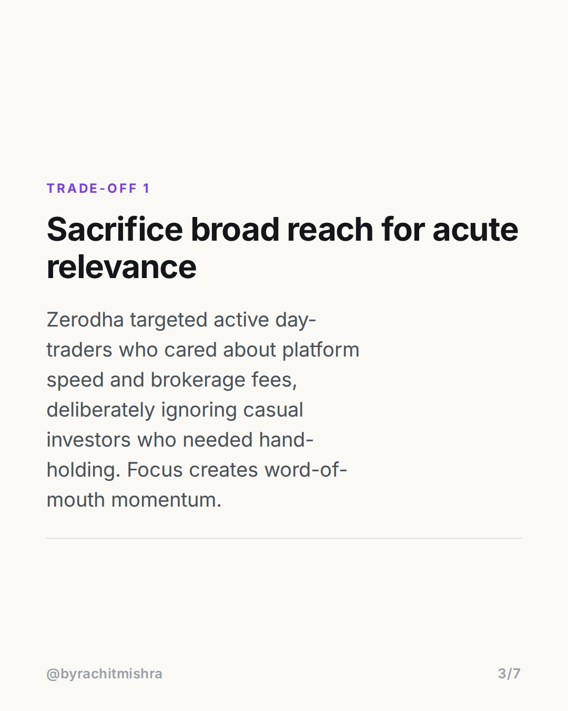
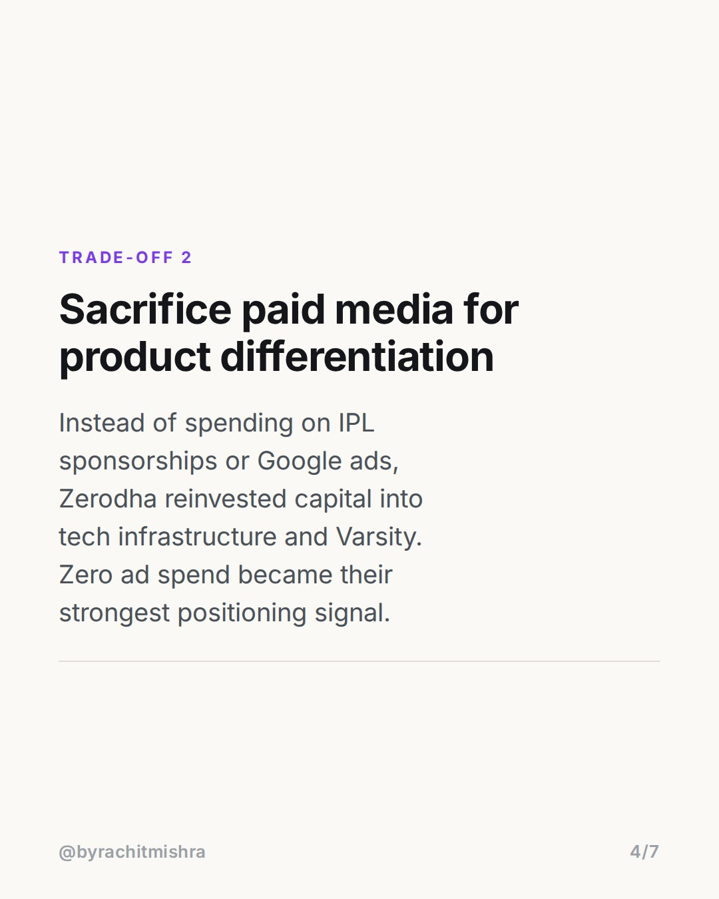
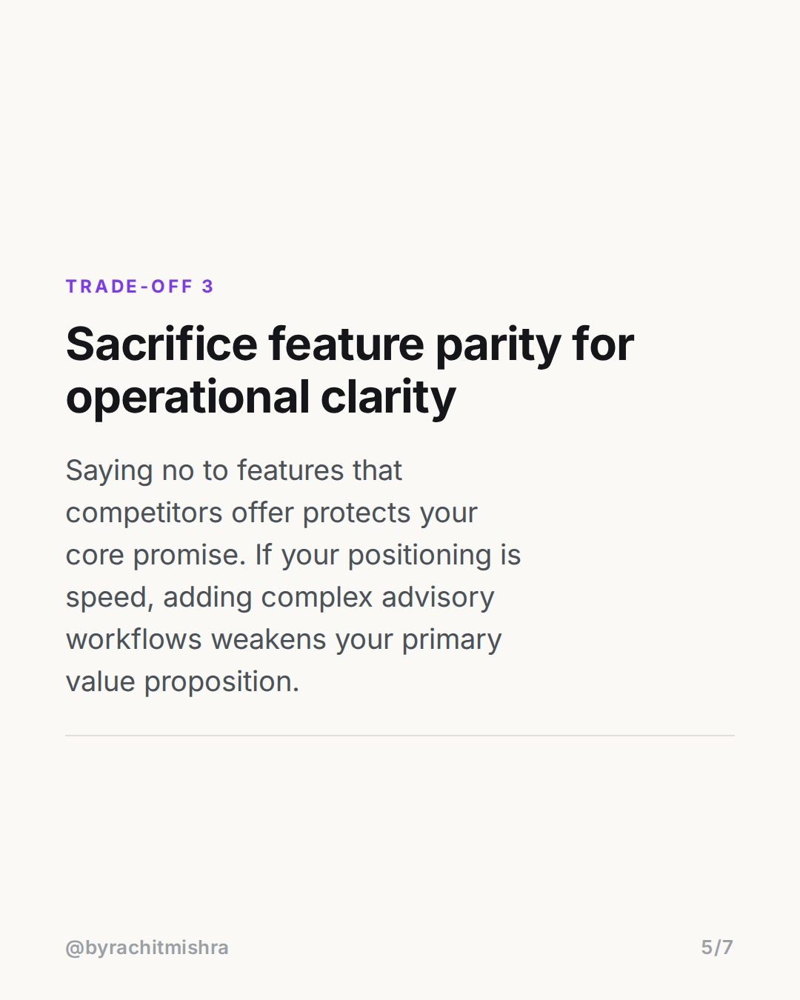
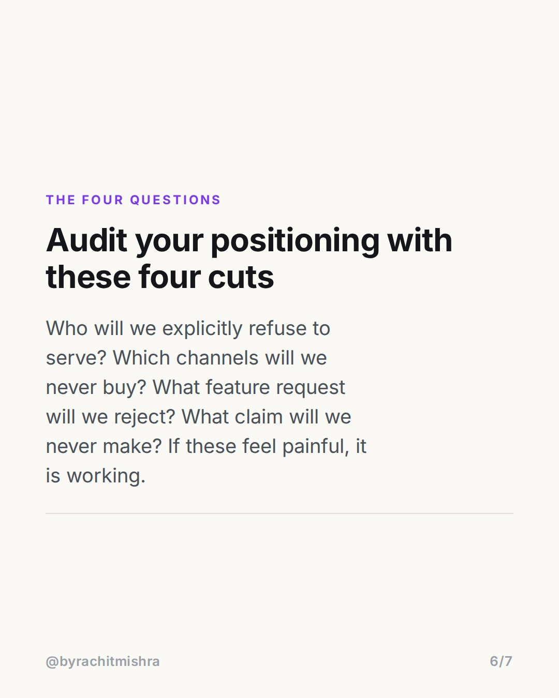
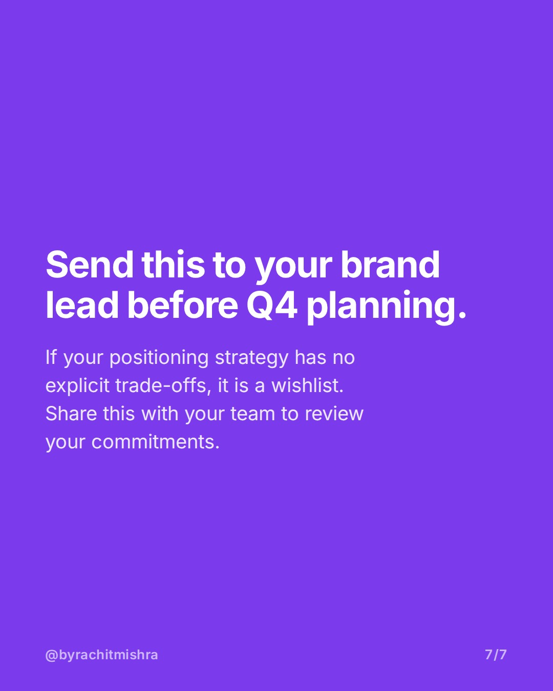

# brand_strategy_framework_tradeoffs

**CAROUSEL** · Brand Strategy · goes live **2026-08-15T10:30:00+05:30**

> Targeting: `brand strategy framework`
>
> Claim: A valid brand strategy is defined by operational refusals rather than aspirational adjectives.

## Slides

7 rendered images sit in this folder — upload them in filename order.

**1.** 
### A brand strategy framework based on sacrifice.



**2.** THE MISTAKE
### Most frameworks ask what you want to be
Standard templates collect adjectives like premium, trustworthy, and innovative. When everything is a priority, nothing gets prioritized. Strategy is defined by what you choose to sacrifice.



**3.** TRADE-OFF 1
### Sacrifice broad reach for acute relevance
Zerodha targeted active day-traders who cared about platform speed and brokerage fees, deliberately ignoring casual investors who needed hand-holding. Focus creates word-of-mouth momentum.



**4.** TRADE-OFF 2
### Sacrifice paid media for product differentiation
Instead of spending on IPL sponsorships or Google ads, Zerodha reinvested capital into tech infrastructure and Varsity. Zero ad spend became their strongest positioning signal.



**5.** TRADE-OFF 3
### Sacrifice feature parity for operational clarity
Saying no to features that competitors offer protects your core promise. If your positioning is speed, adding complex advisory workflows weakens your primary value proposition.



**6.** THE FOUR QUESTIONS
### Audit your positioning with these four cuts
Who will we explicitly refuse to serve? Which channels will we never buy? What feature request will we reject? What claim will we never make? If these feel painful, it is working.



**7.** 
### Send this to your brand lead before Q4 planning.
If your positioning strategy has no explicit trade-offs, it is a wishlist. Share this with your team to review your commitments.



## Caption — copy from here

```
Every practical brand strategy framework starts with sacrifice, not a list of aspirational adjectives.

When Zerodha scaled to over 10 million active client accounts, they did it without spending a single rupee on performance ads or celebrity endorsements. Their positioning was defined by explicit refusals: no ad spend, no relationship managers, no advisory services.

Most positioning documents fail because they are wishlists. They stack words like 'innovative', 'customer-centric', and 'premium' without deciding what the business will give up to deliver them.

A real strategy requires four clear trade-offs: who you refuse to sell to, which distribution channels you ignore, which features you refuse to build, and which claims you refuse to make.

If your brand strategy does not make your sales or product team slightly uncomfortable, you have written a vision statement, not a strategy.

Send this carousel to your strategy lead before your next positioning review.

#brandstrategy #brandpositioning #marketingstrategy #brandbuilding #branding
```

## Alt text

```
Slide presentation on a brand strategy framework based on business trade-offs.
```

## How this post could fail

The post could be dismissed as standard positioning theory if the Zerodha example is not tied directly to hard operational refusals rather than general brand success.

## Sources

- [Zerodha Bootstrapped Journey & Business Model](https://zerodha.com/about)
