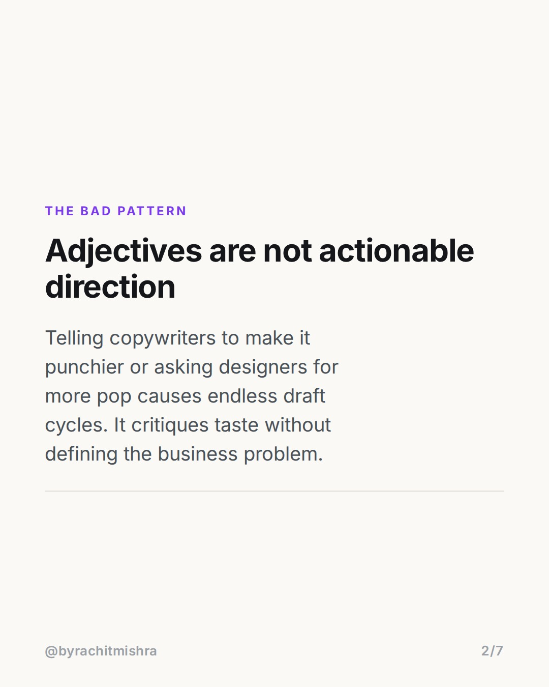
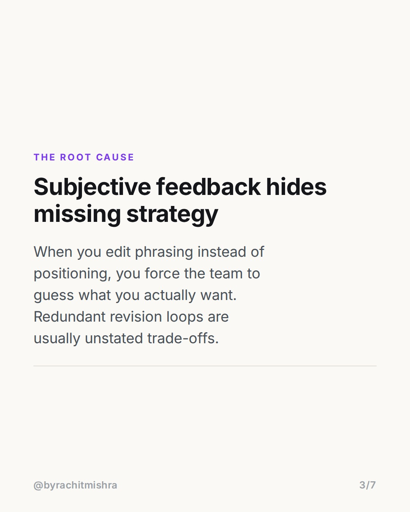
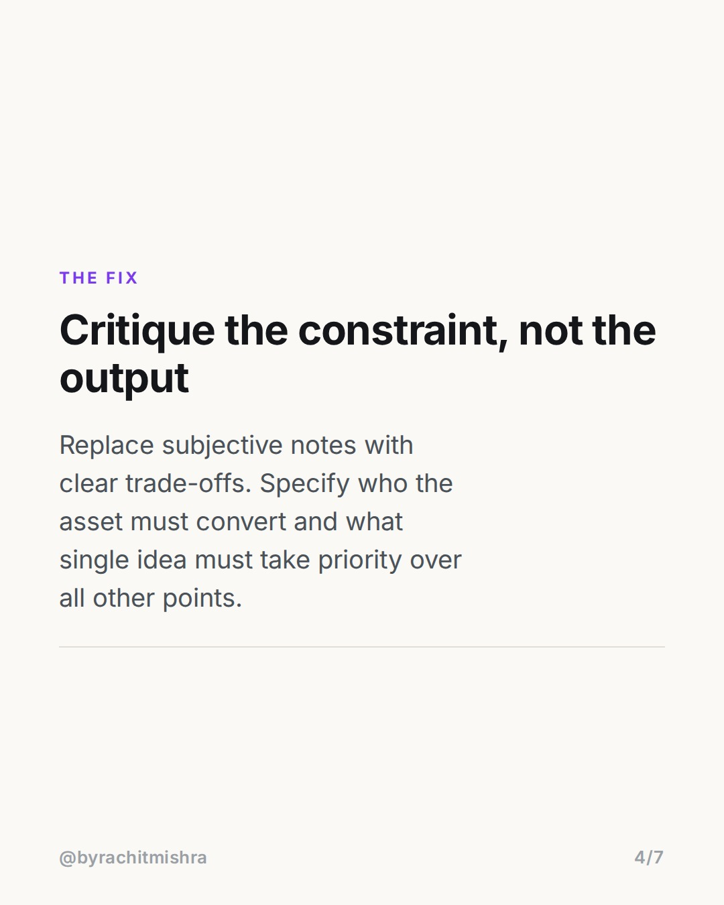
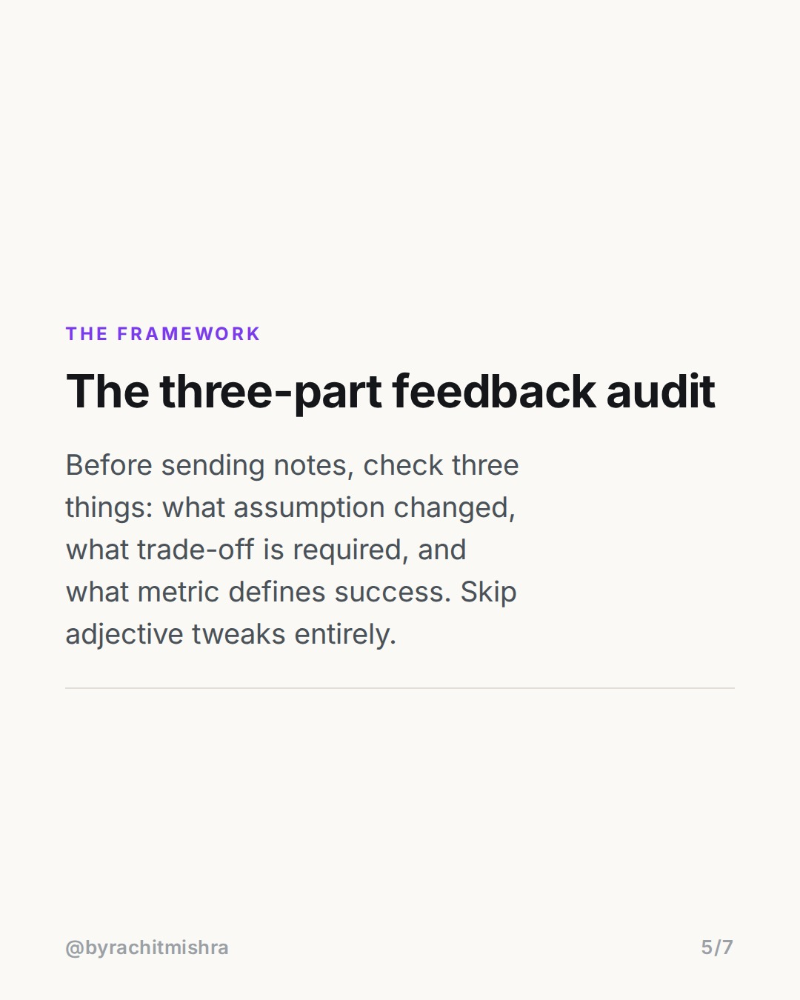
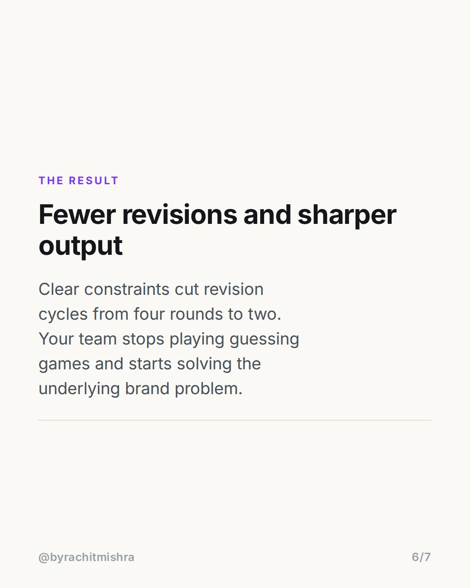

# givingfeedbacktoteam

**CAROUSEL** · Leadership · goes live **2026-08-13T09:30:00+05:30**

> Targeting: `giving feedback to your team`
>
> Claim: Creative revision loops happen because leaders critique subjective phrasing instead of defining business constraints.

## Slides

7 rendered images sit in this folder — upload them in filename order.

**1.** 
### Why your team keeps missing the brief


**2.** The Bad Pattern
### Adjectives are not actionable direction
Telling copywriters to make it punchier or asking designers for more pop causes endless draft cycles. It critiques taste without defining the business problem.



**3.** The Root Cause
### Subjective feedback hides missing strategy
When you edit phrasing instead of positioning, you force the team to guess what you actually want. Redundant revision loops are usually unstated trade-offs.



**4.** The Fix
### Critique the constraint, not the output
Replace subjective notes with clear trade-offs. Specify who the asset must convert and what single idea must take priority over all other points.



**5.** The Framework
### The three-part feedback audit
Before sending notes, check three things: what assumption changed, what trade-off is required, and what metric defines success. Skip adjective tweaks entirely.



**6.** The Result
### Fewer revisions and sharper output
Clear constraints cut revision cycles from four rounds to two. Your team stops playing guessing games and starts solving the underlying brand problem.



**7.** 
### Send this to a manager in your team
Save this framework for your next creative review, or send it to a team lead who is stuck in endless revision cycles.


## Caption — copy from here

```
When giving feedback to your team, changing words in draft three is usually a sign that your brief was incomplete.

Most marketing leaders spend hours tweaking adjectives in copy and asking for more pop in visual layouts. This feels like editing, but it is actually guessing.

When a review cycle takes four or five iterations, the problem is rarely execution quality. It is strategic ambiguity. Telling a writer to make copy punchier gives them nothing to build on. Telling them that the post must prioritize retention over acquisition changes every sentence they write.

Good creative feedback names the trade-off. It defines what to sacrifice to make the message work.

Subjective editing is lazy management disguised as attention to detail.

Send this to a lead on your team who is managing agency partners or internal reviews this week.

#marketingleadership #leadershiplessons #teamculture #managementtips #peoplemanagement
```

## Alt text

```
A text carousel explaining how marketing leaders can improve giving feedback to your team.
```

## How this post could fail

If the advice feels like generic corporate management rather than specifically addressing marketing creative reviews, agency planners will scroll past it.
