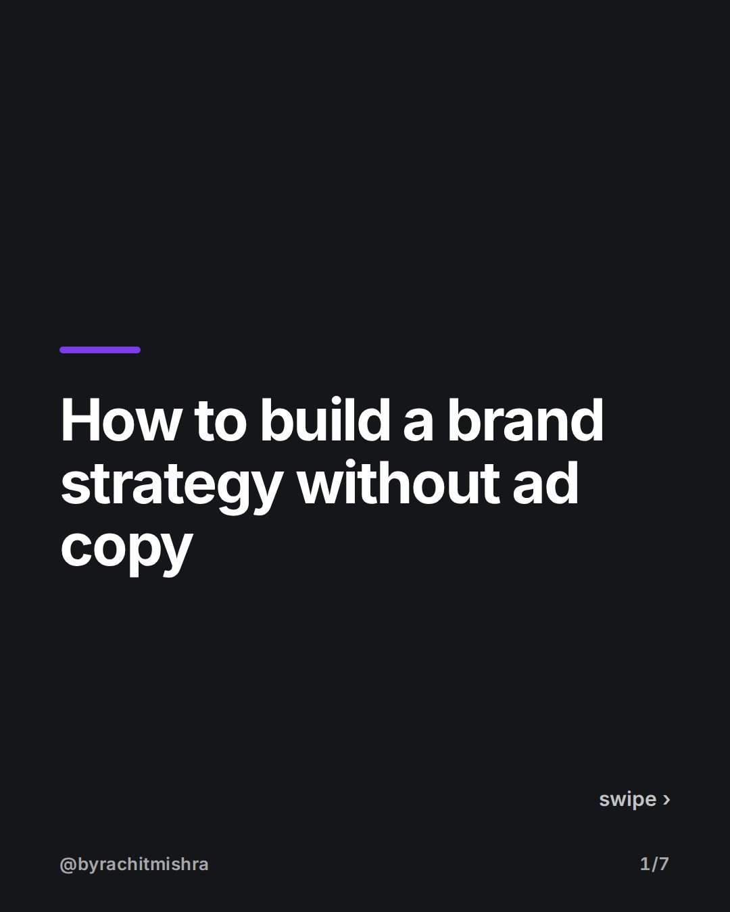
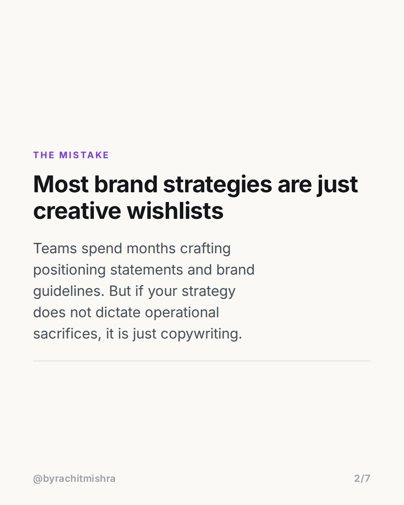
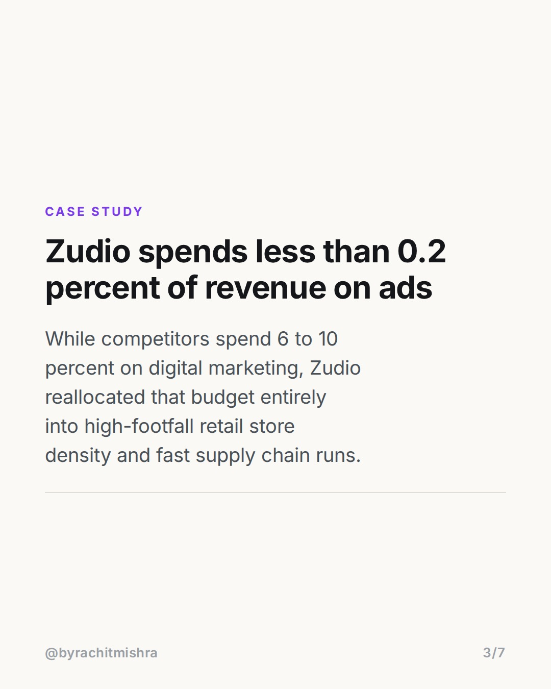
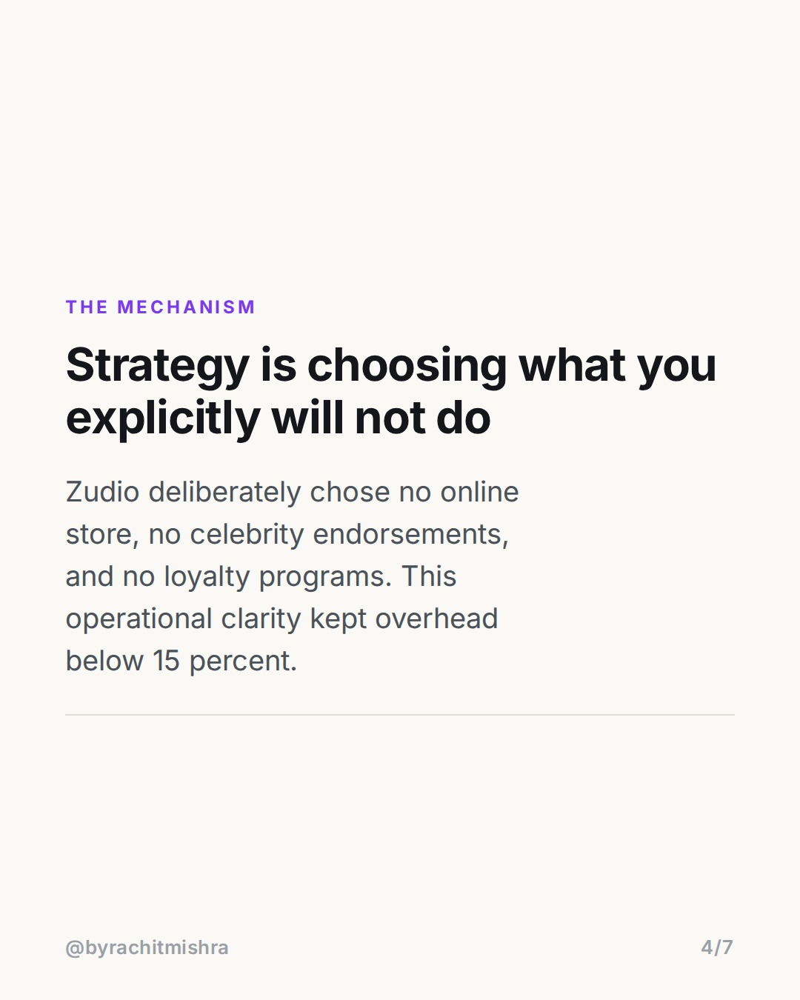
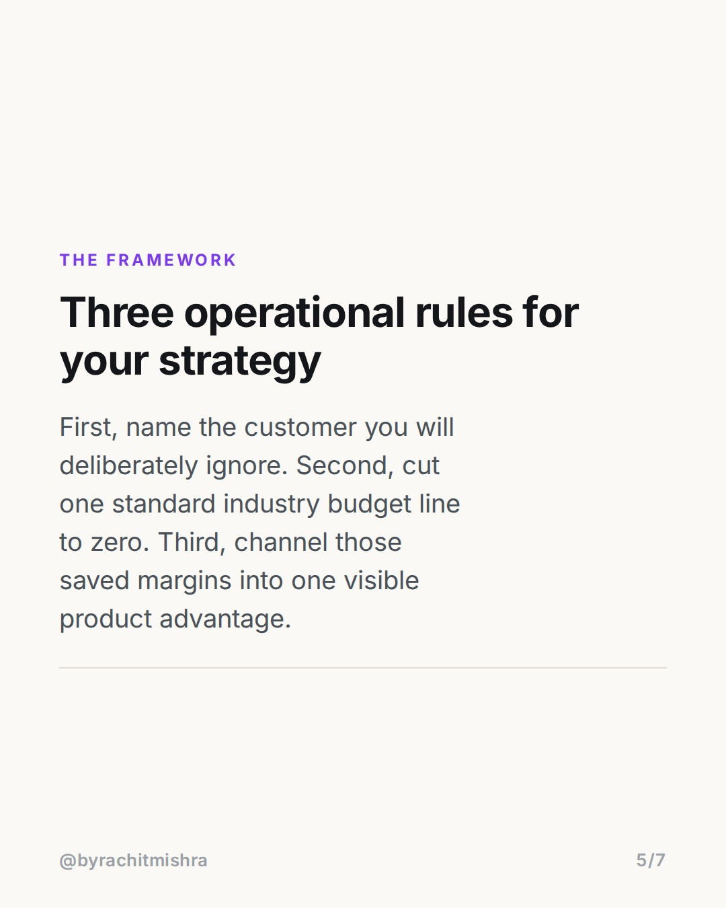
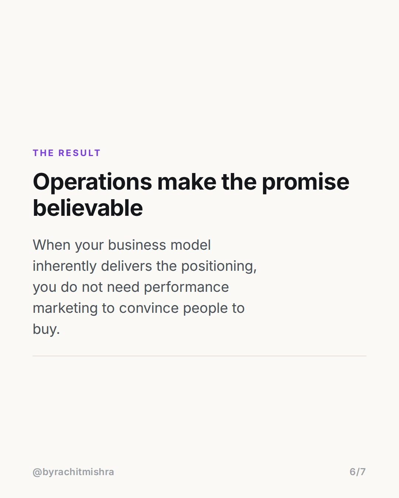
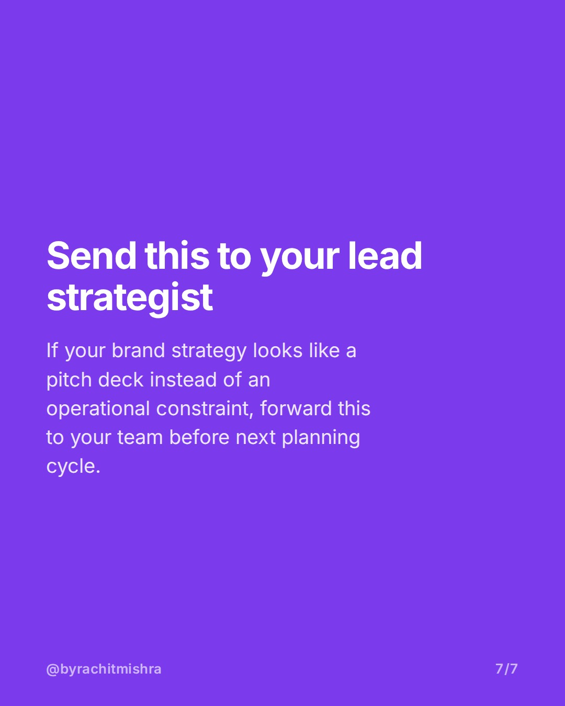

# zudio_brand_strategy_tradeoffs

**CAROUSEL** · Brand Strategy · goes live **2026-08-17T08:30:00+05:30**

> Targeting: `how to build a brand strategy`
>
> Claim: A real brand strategy is defined by operational trade-offs that force product differentiation, not by mission statements.

## Slides

7 rendered images sit in this folder — upload them in filename order.

**1.** 
### How to build a brand strategy without ad copy



**2.** THE MISTAKE
### Most brand strategies are just creative wishlists
Teams spend months crafting positioning statements and brand guidelines. But if your strategy does not dictate operational sacrifices, it is just copywriting.



**3.** CASE STUDY
### Zudio spends less than 0.2 percent of revenue on ads
While competitors spend 6 to 10 percent on digital marketing, Zudio reallocated that budget entirely into high-footfall retail store density and fast supply chain runs.



**4.** THE MECHANISM
### Strategy is choosing what you explicitly will not do
Zudio deliberately chose no online store, no celebrity endorsements, and no loyalty programs. This operational clarity kept overhead below 15 percent.



**5.** THE FRAMEWORK
### Three operational rules for your strategy
First, name the customer you will deliberately ignore. Second, cut one standard industry budget line to zero. Third, channel those saved margins into one visible product advantage.



**6.** THE RESULT
### Operations make the promise believable
When your business model inherently delivers the positioning, you do not need performance marketing to convince people to buy.



**7.** 
### Send this to your lead strategist
If your brand strategy looks like a pitch deck instead of an operational constraint, forward this to your team before next planning cycle.



## Caption — copy from here

```
Most marketers learning how to build a brand strategy start with visual guidelines and tone of voice decks.

That is why most brand strategies fail when budgets tighten. Real strategy is an operational filter.

Look at Zudio: they spent under 0.2% of revenue on marketing while opening over 500 stores. They sacrificed e-commerce entirely to keep inventory distribution hyper-dense and cheap. Their strategy was not a tagline; it was a refusal to spend money like traditional fashion retailers.

Positioning is not what you tell the consumer. It is the friction you accept in your operating model to make the promise true.

Send this to the person on your team who owns next quarter's strategic plan.

#brandstrategy #brandpositioning #marketingstrategy #brandbuilding #branding
```

## Alt text

```
Text graphic explaining how to build a brand strategy using Zudio's operational model.
```

## How this post could fail

The post might be misinterpreted as an argument against advertising altogether, rather than an argument for anchoring brand positioning in operational trade-offs.

## Sources

- [Trent Limited Annual Report 2023-24](https://trentlimited.com)
