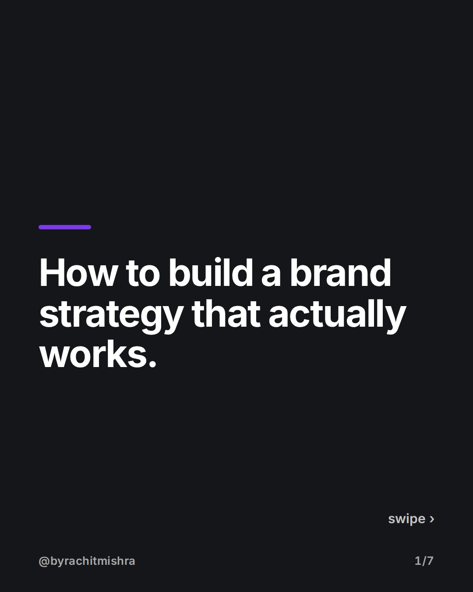
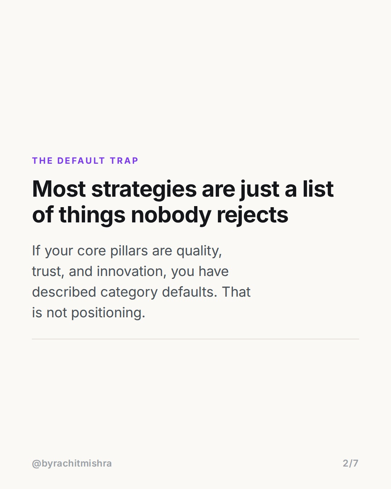
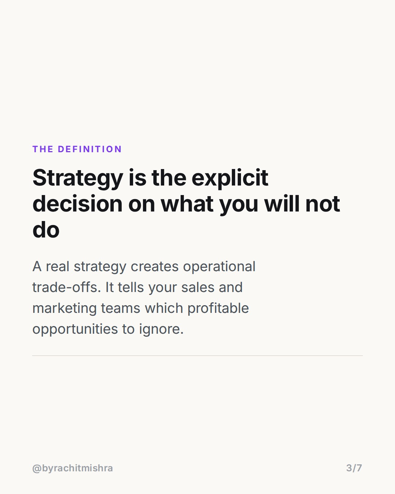
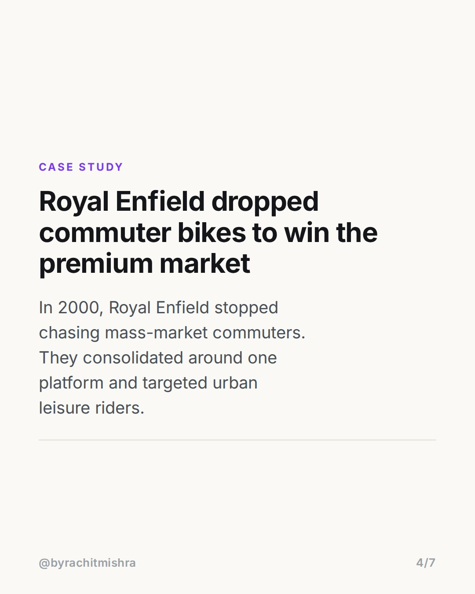
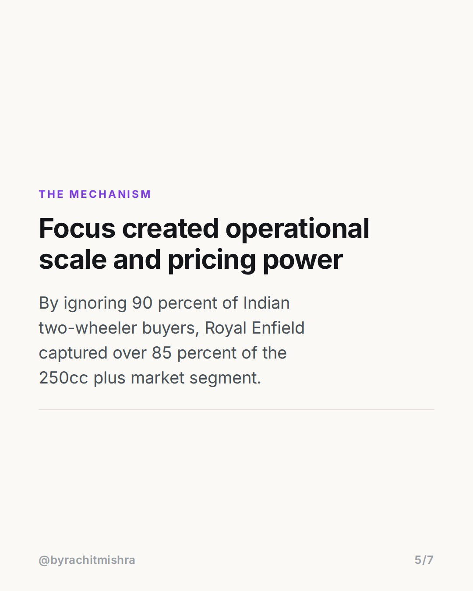
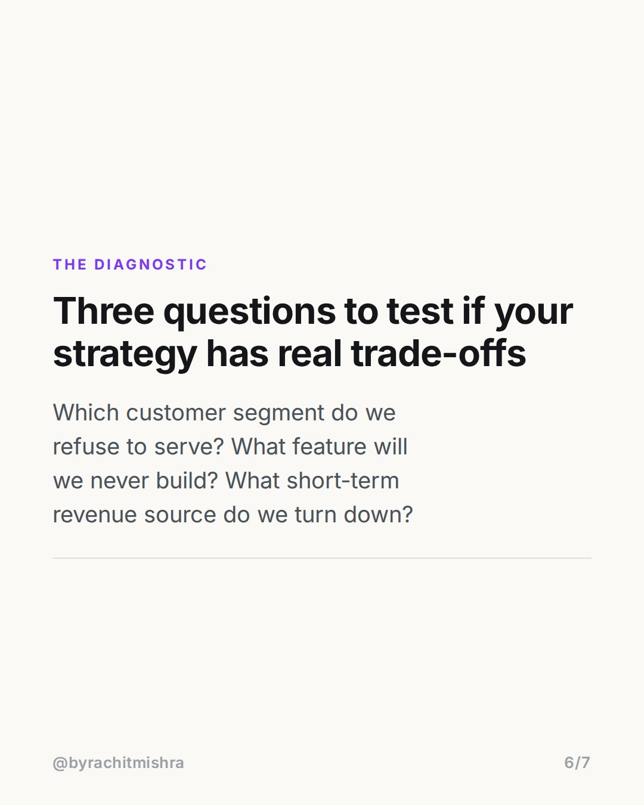
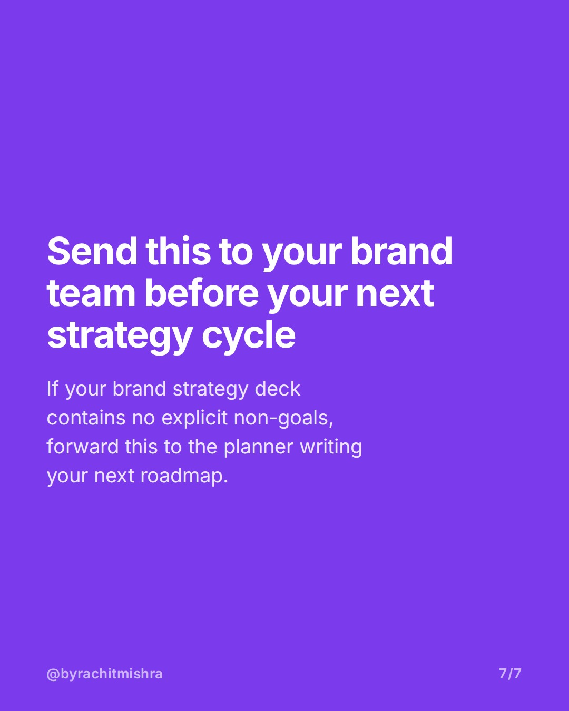

# how_to_build_a_brand_strategy_subtraction

**CAROUSEL** · Brand Strategy · goes live **2026-08-22T10:30:00+05:30**

> Targeting: `how to build a brand strategy`
>
> Claim: A valid brand strategy is defined by the explicit operational sacrifices and customer segments a company chooses to ignore.

## Slides

7 rendered images sit in this folder — upload them in filename order.

**1.** 
### How to build a brand strategy that actually works.



**2.** THE DEFAULT TRAP
### Most strategies are just a list of things nobody rejects
If your core pillars are quality, trust, and innovation, you have described category defaults. That is not positioning.



**3.** THE DEFINITION
### Strategy is the explicit decision on what you will not do
A real strategy creates operational trade-offs. It tells your sales and marketing teams which profitable opportunities to ignore.



**4.** CASE STUDY
### Royal Enfield dropped commuter bikes to win the premium market
In 2000, Royal Enfield stopped chasing mass-market commuters. They consolidated around one platform and targeted urban leisure riders.



**5.** THE MECHANISM
### Focus created operational scale and pricing power
By ignoring 90 percent of Indian two-wheeler buyers, Royal Enfield captured over 85 percent of the 250cc plus market segment.



**6.** THE DIAGNOSTIC
### Three questions to test if your strategy has real trade-offs
Which customer segment do we refuse to serve? What feature will we never build? What short-term revenue source do we turn down?



**7.** 
### Send this to your brand team before your next strategy cycle
If your brand strategy deck contains no explicit non-goals, forward this to the planner writing your next roadmap.



## Caption — copy from here

```
Most teams learning how to build a brand strategy focus on what to say. The real work is deciding what to ignore.

A strategy that tries to appeal to everyone ends up describing category conventions. Quality, customer-centricity, and innovation are baseline expectations, not strategic choices.

When Royal Enfield restructured its positioning in the early 2000s, management stopped trying to compete with mass-market commuter bikes. They cut redundant platforms, concentrated resources around single-engine leisure motorcycles, and walked away from 90% of total two-wheeler volume.

The addressable market shrank on paper. In practice, operational focus drove manufacturing efficiency, margins expanded, and Royal Enfield captured over 85% of the 250cc+ motorcycle segment in India.

Positioning is defined by what you refuse to do. If your deck does not make someone in sales or product uncomfortable, it is not a strategy.

Forward this post to your brand manager or strategy team before your next quarterly planning session.

#brandstrategy #brandpositioning #marketingstrategy #brandbuilding #positioning
```

## Alt text

```
Carousel explaining how to build a brand strategy through non-goals and strategic tradeoffs.
```

## How this post could fail

The post could be dismissed as overly familiar by senior strategists who already know the Royal Enfield turn, or readers might mistake the focus on subtraction as a push to shrink market size prematurely.
