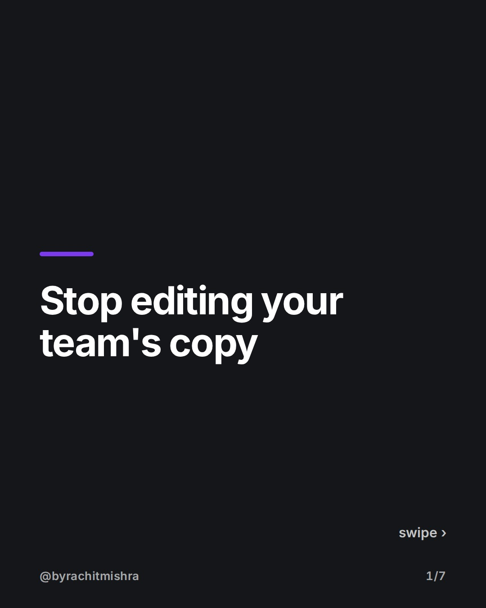
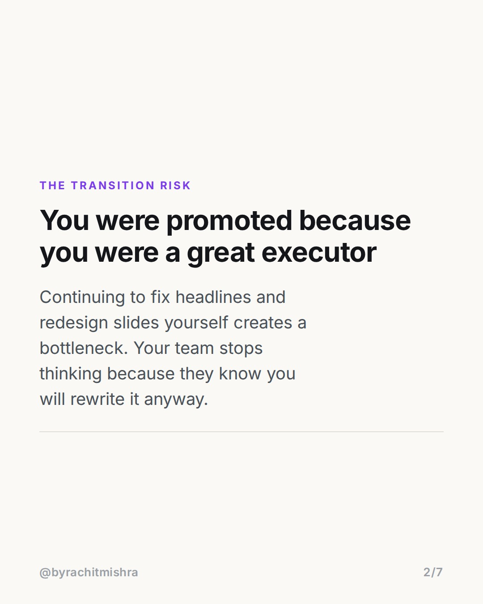
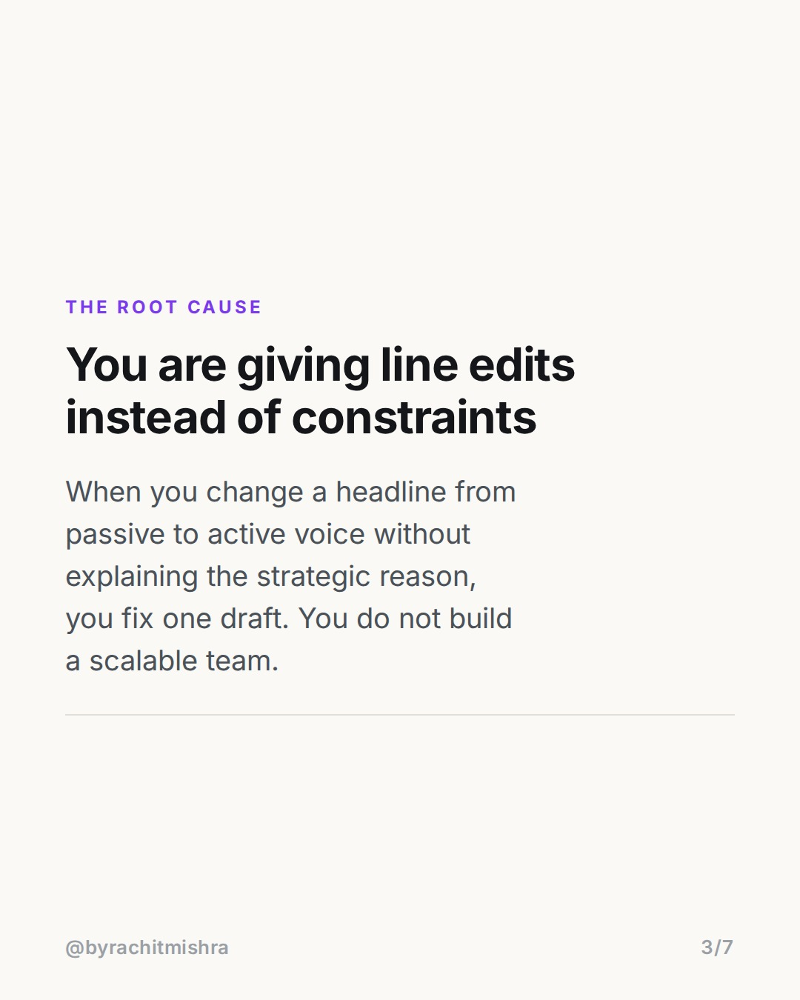
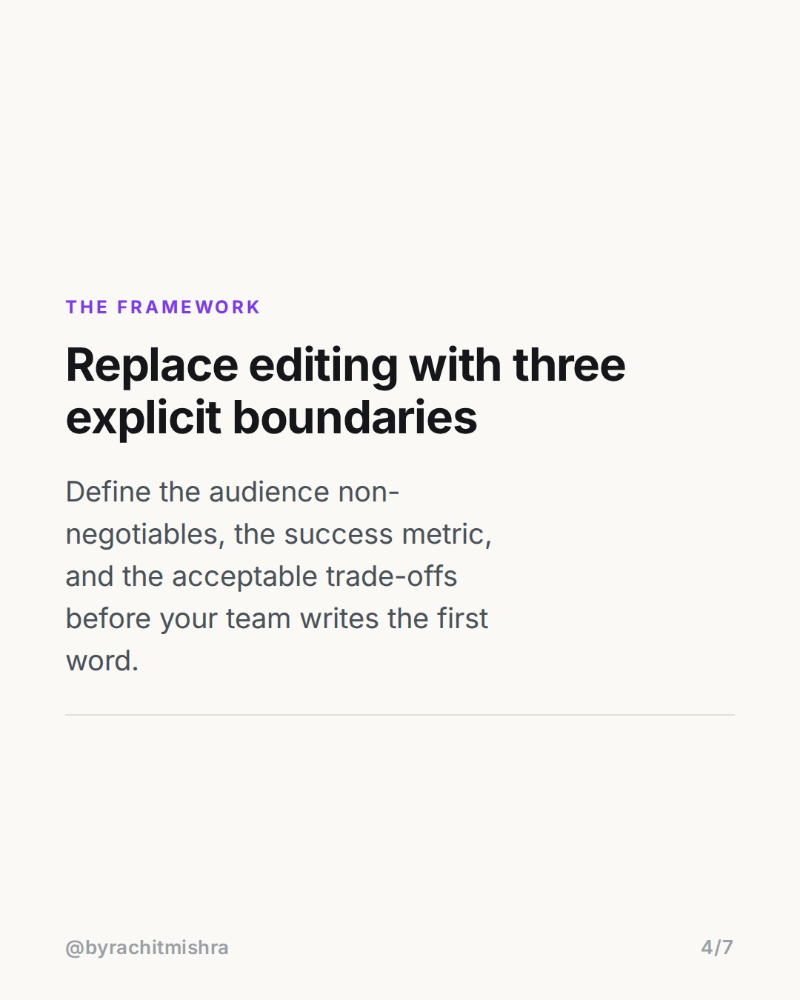
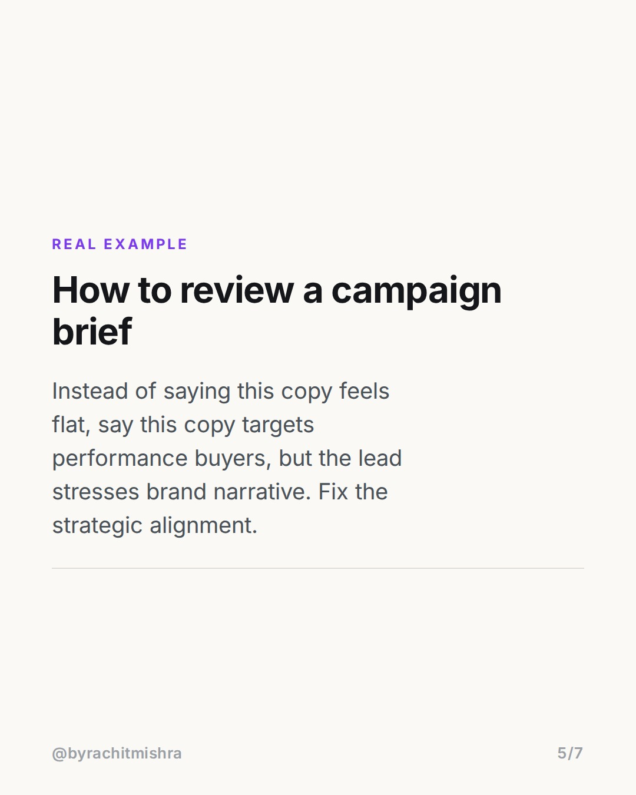
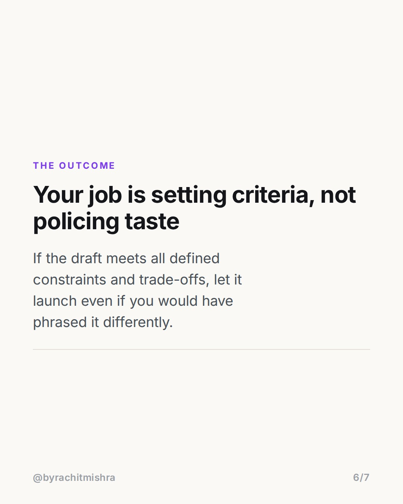

# firsttimemanagertips

**CAROUSEL** · Leadership · goes live **2026-08-20T09:30:00+05:30**

> Targeting: `first time manager tips`
>
> Claim: First-time marketing managers slow down output by acting as copy editors rather than establishing clear decision criteria.

## Slides

7 rendered images sit in this folder — upload them in filename order.

**1.** 
### Stop editing your team's copy



**2.** The Transition Risk
### You were promoted because you were a great executor
Continuing to fix headlines and redesign slides yourself creates a bottleneck. Your team stops thinking because they know you will rewrite it anyway.



**3.** The Root Cause
### You are giving line edits instead of constraints
When you change a headline from passive to active voice without explaining the strategic reason, you fix one draft. You do not build a scalable team.



**4.** The Framework
### Replace editing with three explicit boundaries
Define the audience non-negotiables, the success metric, and the acceptable trade-offs before your team writes the first word.



**5.** Real Example
### How to review a campaign brief
Instead of saying this copy feels flat, say this copy targets performance buyers, but the lead stresses brand narrative. Fix the strategic alignment.



**6.** The Outcome
### Your job is setting criteria, not policing taste
If the draft meets all defined constraints and trade-offs, let it launch even if you would have phrased it differently.



**7.** 
### Scale your marketing team
Send this to a peer who recently stepped into their first marketing management role.


## Caption — copy from here

```
Most first time manager tips tell you to delegate. Few explain why new leads keep rewriting their team's work.

When you step from senior contributor to manager, your instinct is to treat team output like your own draft. You tweak headlines, alter slide layouts, and rewrite copy.

It feels like quality control. In practice, it breaks scale and accountability.

If you edit work without explaining the underlying criteria, your team learns to submit incomplete work because they expect you to rewrite the rest. You become the operational bottleneck.

To fix this, shift from line-editing to setting input constraints:

1. Define the explicit trade-off (e.g., speed over polish for internal docs).
2. Define the target metric before work starts.
3. Pass on subjective preference. If a draft hits the brief and satisfies all constraints, approve it.

Leadership is built on clear decision criteria, not personal taste.

Send this to a colleague who recently stepped into a team lead role.

#marketingleadership #teammanagement #firsttimemanager #careergrowth #leadership
```

## Alt text

```
Carousel slides outlining first time manager tips for leading a marketing team effectively.
```

## How this post could fail

It risks reading as generic management advice if the distinction between subjective line-editing and strategic constraint-setting is not sharp enough for senior marketers.
