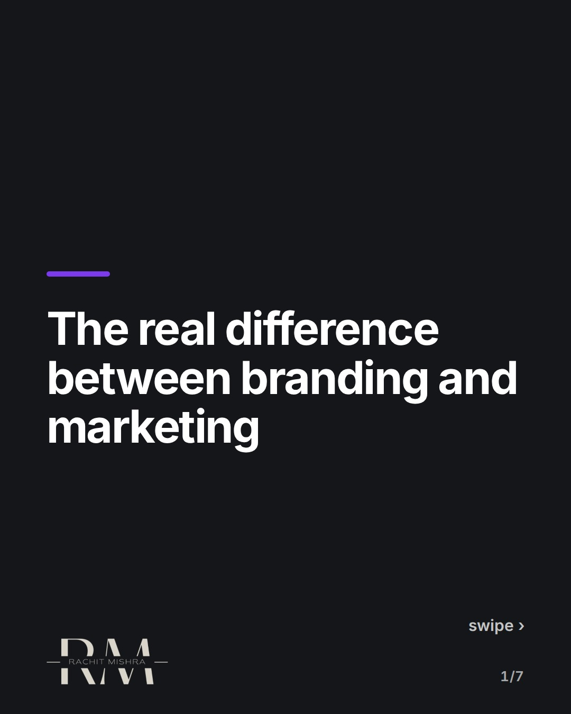
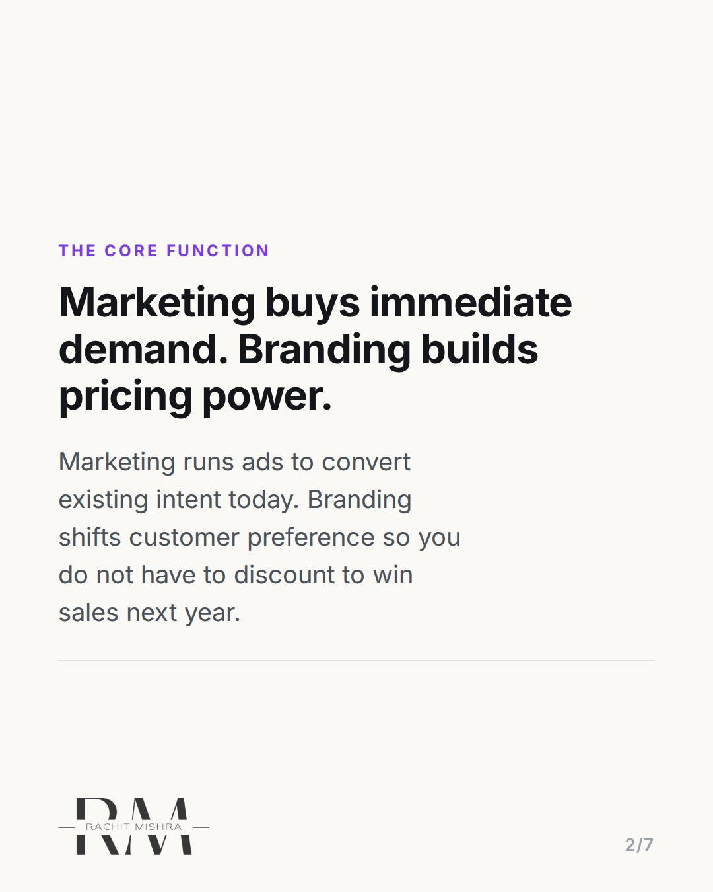
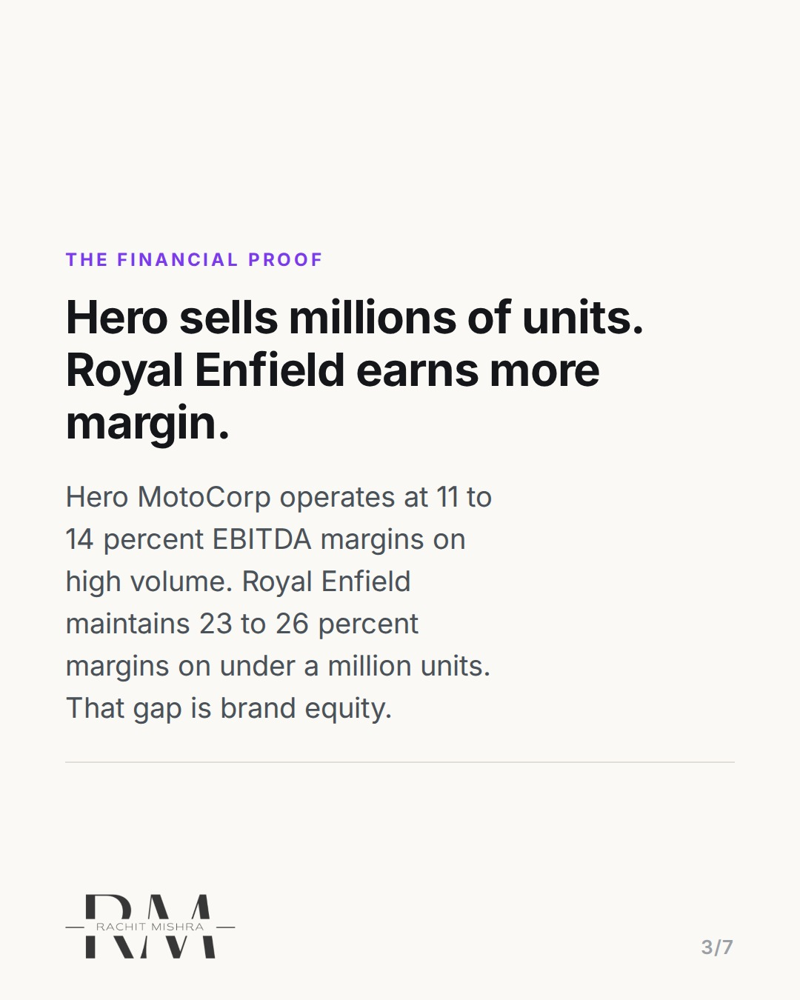
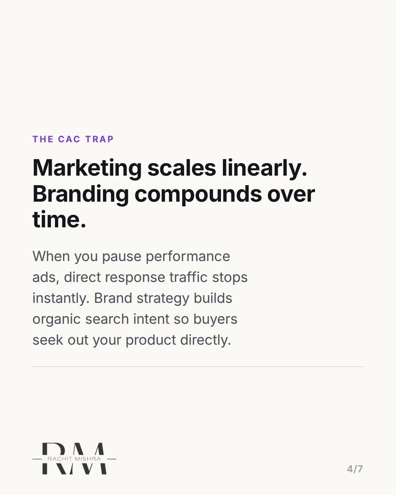
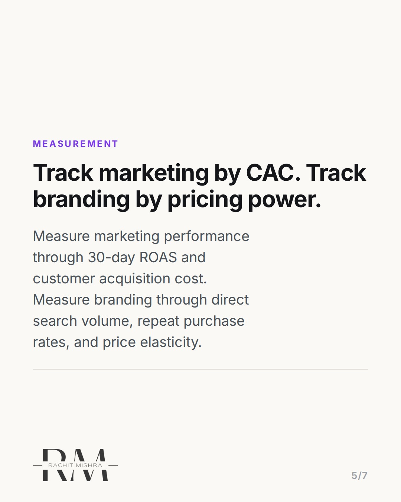
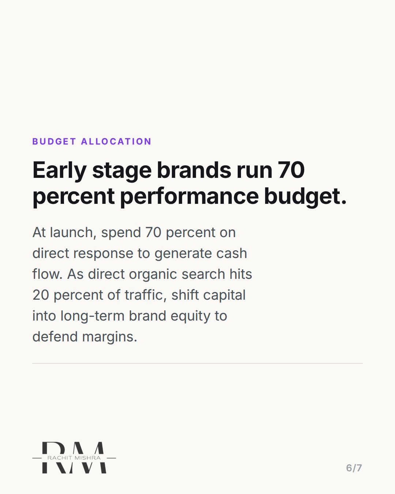

# differencebrandingmarketingmargins

**CAROUSEL** · Brand Strategy · goes live **2026-08-24T08:30:00+05:30**

> Targeting: `difference between branding and marketing`
>
> Claim: Marketing captures short-term demand at a fixed acquisition cost, while branding creates the pricing power that protects long-term gross margins.

## Slides

7 rendered images sit in this folder — upload them in filename order.

**1.** 
### The real difference between branding and marketing



**2.** The Core Function
### Marketing buys immediate demand. Branding builds pricing power.
Marketing runs ads to convert existing intent today. Branding shifts customer preference so you do not have to discount to win sales next year.



**3.** The Financial Proof
### Hero sells millions of units. Royal Enfield earns more margin.
Hero MotoCorp operates at 11 to 14 percent EBITDA margins on high volume. Royal Enfield maintains 23 to 26 percent margins on under a million units. That gap is brand equity.



**4.** The CAC Trap
### Marketing scales linearly. Branding compounds over time.
When you pause performance ads, direct response traffic stops instantly. Brand strategy builds organic search intent so buyers seek out your product directly.



**5.** Measurement
### Track marketing by CAC. Track branding by pricing power.
Measure marketing performance through 30-day ROAS and customer acquisition cost. Measure branding through direct search volume, repeat purchase rates, and price elasticity.



**6.** Budget Allocation
### Early stage brands run 70 percent performance budget.
At launch, spend 70 percent on direct response to generate cash flow. As direct organic search hits 20 percent of traffic, shift capital into long-term brand equity to defend margins.



**7.** 
### Send this to a founder planning their marketing budget
Save this framework for your next quarterly strategy review. Follow @byrachitmishra for strategic teardowns.


## Caption — copy from here

```
The difference between branding and marketing isn't visual design versus copy. It shows up in your gross margin.

Marketing captures existing demand at a fixed customer acquisition cost. When you stop running Meta ads or PPC campaigns, revenue drops instantly. Branding is the long-term positioning work that builds category preference so you do not have to buy every single transaction.

Look at the Indian motorcycle market. Hero MotoCorp sells high volumes at an EBITDA margin around 11 to 14 percent. Royal Enfield sells under a million units annually, but captures a 23 to 26 percent EBITDA margin. That 10 percent margin gap represents the financial value of brand positioning over pure performance distribution.

Track marketing through 30-day ROAS and acquisition costs. Track branding through unprompted search share, direct website traffic, and price elasticity over 12 to 24 months.

If your product cannot hold its sales volume when discount codes expire, you have a performance marketing distribution engine, not a brand.

Send this to a brand manager or founder planning next quarter's budget allocation.

#brandstrategy #brandpositioning #marketingstrategy #brandbuilding #branding
```

## Alt text

```
Carousel slides explaining the difference between branding and marketing using automotive margins.
```

## How this post could fail

The post could be misconstrued as an argument against performance marketing rather than a clarification of how performance marketing and brand positioning work together financially.

## Sources

- [Eicher Motors Annual Report Financial Summary](https://www.eichermotors.com)
- [Hero MotoCorp Financial Results](https://www.heromotocorp.com)
