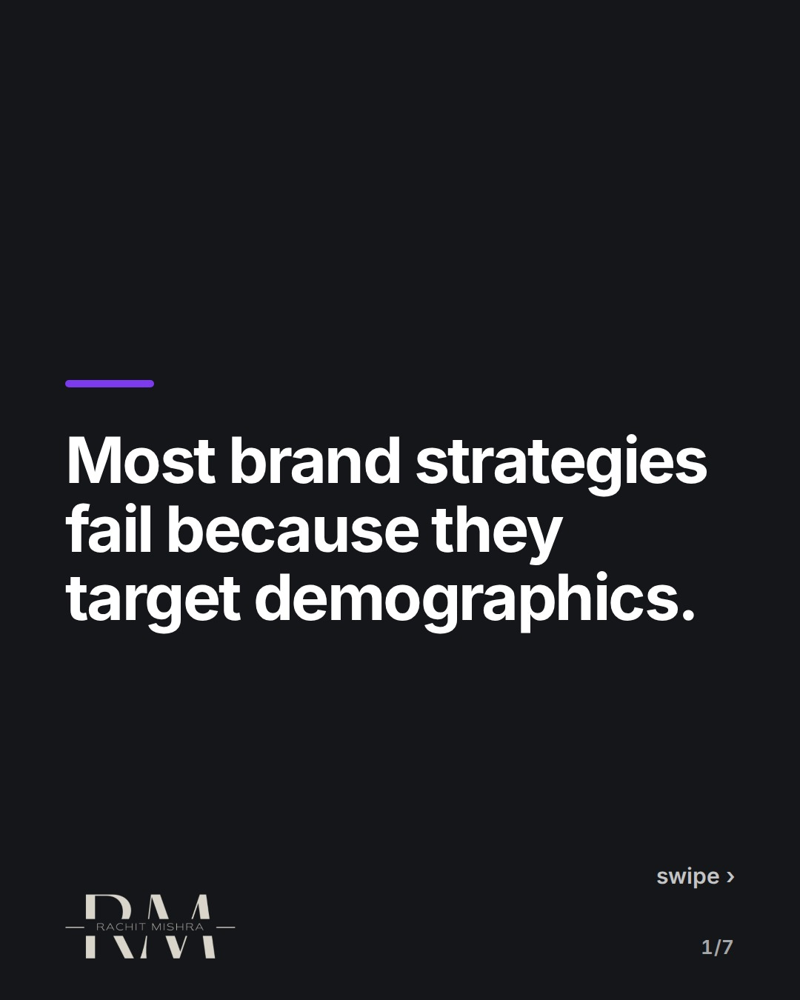
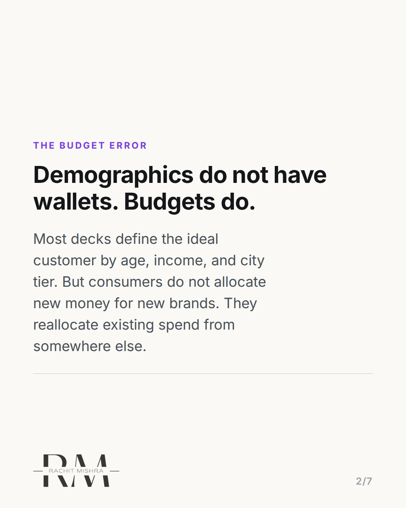
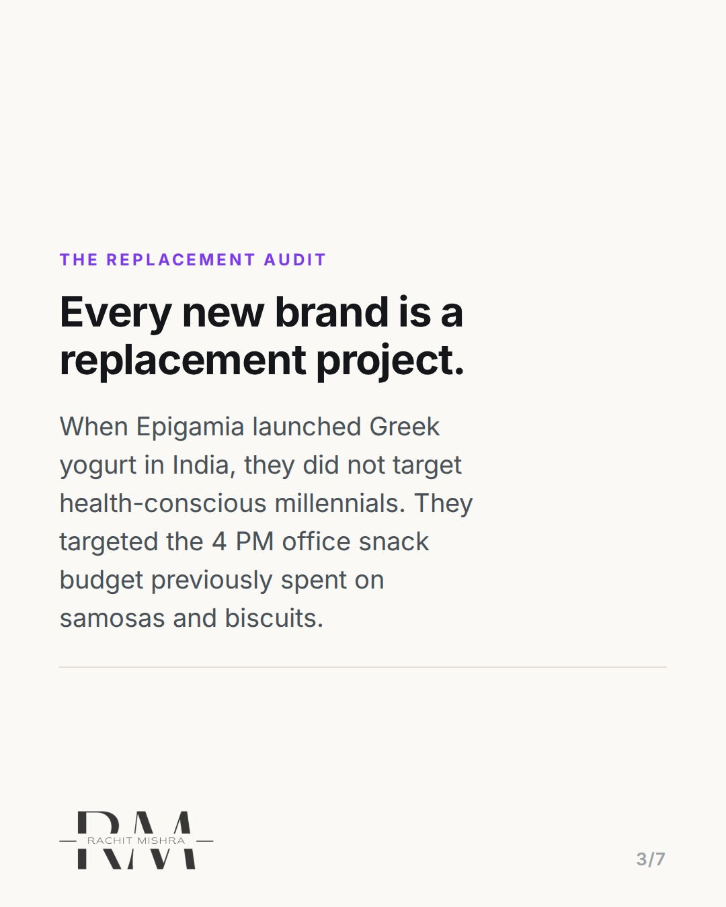
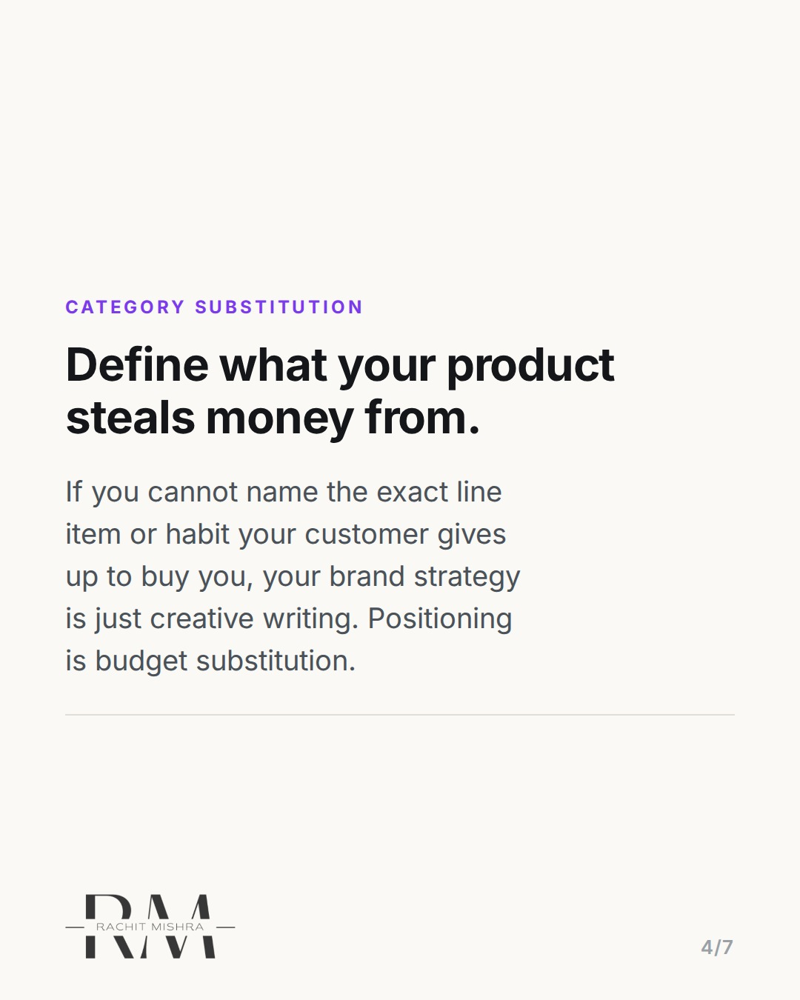
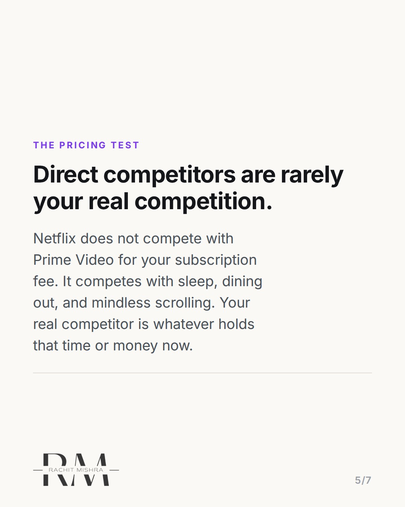
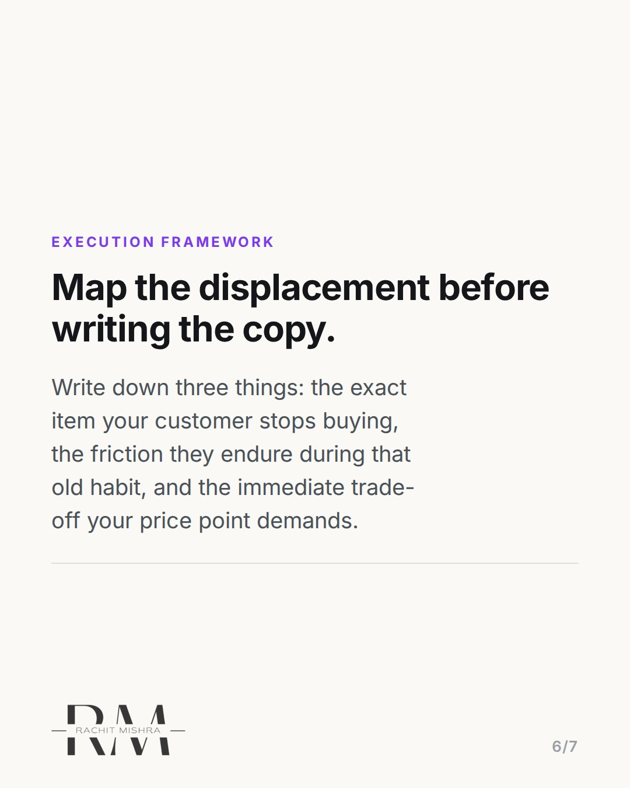
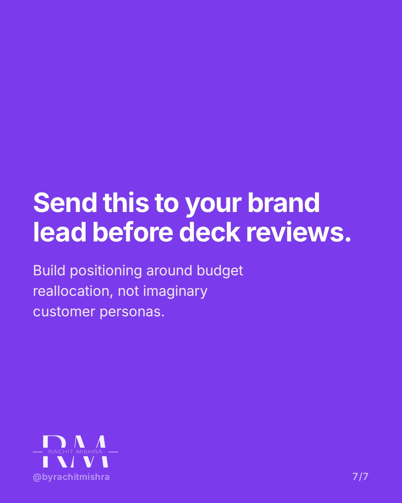

# brandstrategybudgetreallocation

**CAROUSEL** · Brand Strategy · goes live **2026-08-29T10:30:00+05:30**

> Targeting: `brand strategy`
>
> Claim: A brand strategy only succeeds when it identifies the exact existing customer budget or habit it displaces.

## Slides

7 rendered images sit in this folder — upload them in filename order.

**1.** 
### Most brand strategies fail because they target demographics.



**2.** THE BUDGET ERROR
### Demographics do not have wallets. Budgets do.
Most decks define the ideal customer by age, income, and city tier. But consumers do not allocate new money for new brands. They reallocate existing spend from somewhere else.



**3.** THE REPLACEMENT AUDIT
### Every new brand is a replacement project.
When Epigamia launched Greek yogurt in India, they did not target health-conscious millennials. They targeted the 4 PM office snack budget previously spent on samosas and biscuits.



**4.** CATEGORY SUBSTITUTION
### Define what your product steals money from.
If you cannot name the exact line item or habit your customer gives up to buy you, your brand strategy is just creative writing. Positioning is budget substitution.



**5.** THE PRICING TEST
### Direct competitors are rarely your real competition.
Netflix does not compete with Prime Video for your subscription fee. It competes with sleep, dining out, and mindless scrolling. Your real competitor is whatever holds that time or money now.



**6.** EXECUTION FRAMEWORK
### Map the displacement before writing the copy.
Write down three things: the exact item your customer stops buying, the friction they endure during that old habit, and the immediate trade-off your price point demands.



**7.** 
### Send this to your brand lead before deck reviews.
Build positioning around budget reallocation, not imaginary customer personas.



## Caption — copy from here

```
A solid brand strategy does not start with who your customer is. It starts with what existing budget you are stealing.

When Epigamia introduced packaged Greek yogurt to Indian grocery stores, they did not win by pitching protein content to 28-year-old urban professionals. They won by targeting the ₹30 to ₹50 afternoon office snack slot, competing directly against unbranded samosas, chai, and tea biscuits.

Consumers rarely create new budget lines for new brands. They reallocate money they are already spending. If your deck defines your target market as "urban millennials who value wellness," you have written a persona, not a strategy.

Positioning requires naming the exact habit, product, or line item your customer gives up the moment they choose you.

If you are reviewing positioning decks with your team this quarter, forward this to them before the next review.

#brandstrategy #brandpositioning #marketingstrategy #brandbuilding #branding
```

## Alt text

```
Carousel slides on brand strategy explaining budget reallocation using Epigamia as an example.
```

## How this post could fail

The post could be misconstrued as suggesting customer demographics do not matter at all, rather than clarifying that budget displacement is the necessary primary filter for actionable positioning.

## Sources

- [Drums Food International / Epigamia Category Creation Case Study](https://www.epigamia.com)
