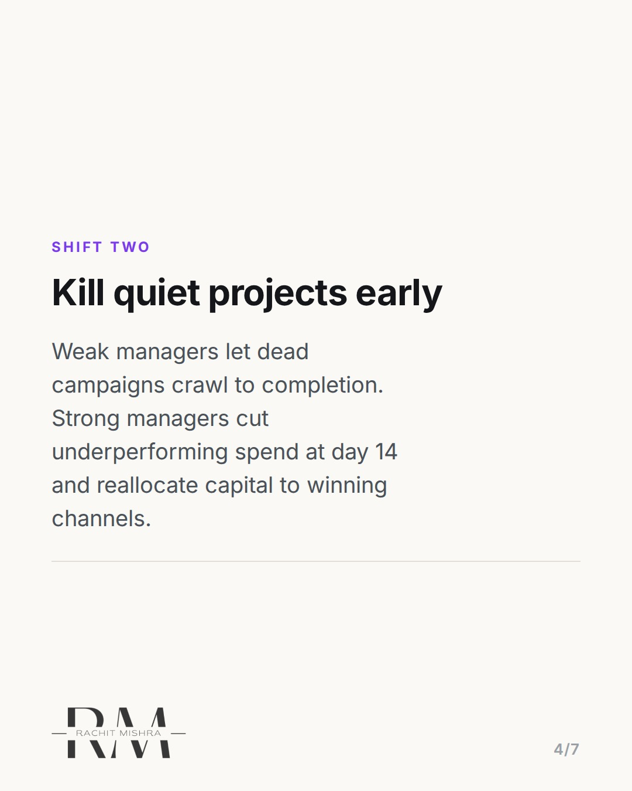
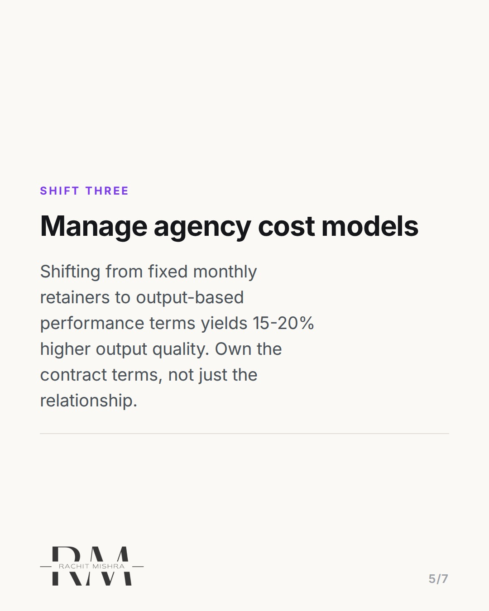
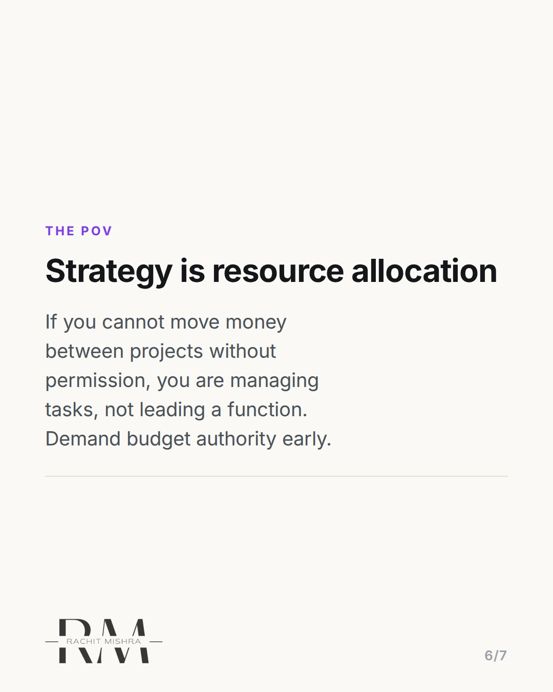

# marketingcareeradvicecapitalallocation

**CAROUSEL** · Leadership · goes live **2026-08-27T09:30:00+05:30**

> Targeting: `marketing career advice`
>
> Claim: Marketers reach leadership by switching their primary focus from creative execution to capital allocation.

## Slides

7 rendered images sit in this folder — upload them in filename order.

**1.** 
### The most overlooked marketing career advice.


**2.** THE TRAP
### Execution earns praise. Capital allocation earns promotions.
Mid-level marketers spend 80% of their time tweaking creatives. Executive marketers spend 80% of their time deciding where the next 50 lakhs goes.


**3.** SHIFT ONE
### Own the P&L, not just the brief
Stop evaluating campaigns on views and CTR alone. Learn how your marketing spend affects gross margins, acquisition costs, and customer LTV.


**4.** SHIFT TWO
### Kill quiet projects early
Weak managers let dead campaigns crawl to completion. Strong managers cut underperforming spend at day 14 and reallocate capital to winning channels.



**5.** SHIFT THREE
### Manage agency cost models
Shifting from fixed monthly retainers to output-based performance terms yields 15-20% higher output quality. Own the contract terms, not just the relationship.



**6.** THE POV
### Strategy is resource allocation
If you cannot move money between projects without permission, you are managing tasks, not leading a function. Demand budget authority early.



**7.** 
### Send this to a colleague moving into management
Save this carousel for your next review. Forward it to a team member stepping into senior brand leadership.


## Caption — copy from here

```
The best marketing career advice is simple: move from managing creative outputs to managing budget allocations.

Most mid-level brand managers get stuck because they focus entirely on perfecting campaign execution. They critique ad copy, adjust color palettes, and track surface metrics like impressions. But senior marketing leaders are evaluated on return on capital.

If you want to move from senior manager to director, start taking three practical actions:
1. Evaluate every spend against gross margin impact, not impression volume.
2. Cut losing campaigns by day 14 instead of letting full budgets burn out.
3. Renegotiate agency contracts from flat monthly retainers to milestone deliverables.

Strategy is not writing slides. Strategy is deciding where capital goes and where it is pulled back.

Forward this to a colleague stepping into a senior brand role this quarter.

#marketingleadership #careergrowth #marketingstrategy #leadership #teamculture
```

## Alt text

```
Carousel slides offering marketing career advice on shifting from execution to budget management.
```

## How this post could fail

Could sound overly corporate or financial if the reader is looking for creative leadership advice rather than general management advice.
