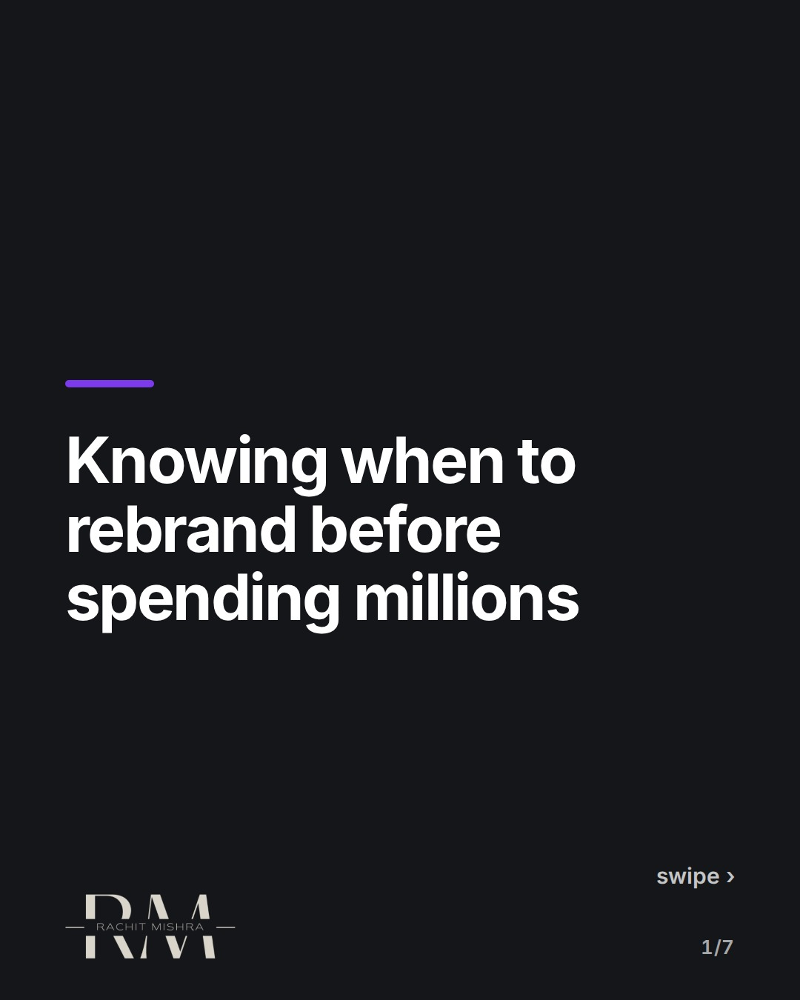
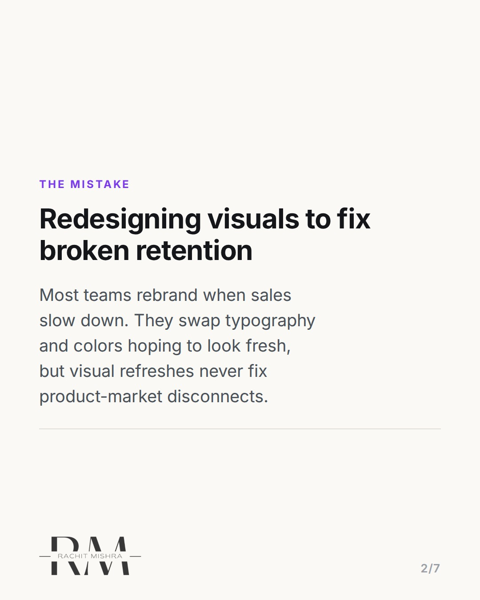
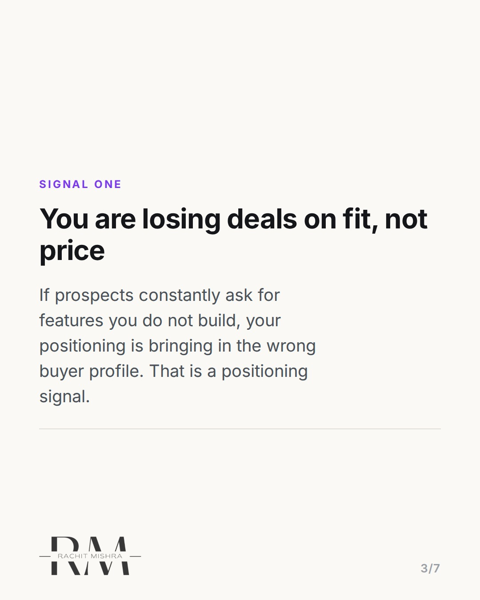
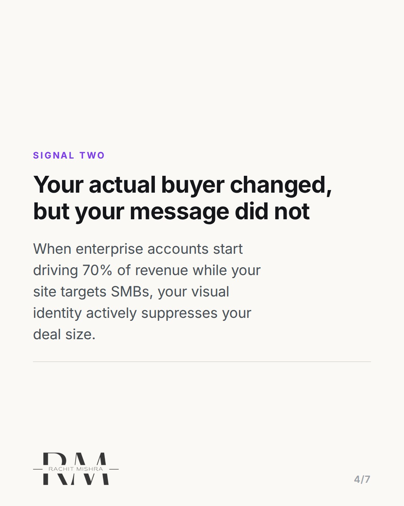
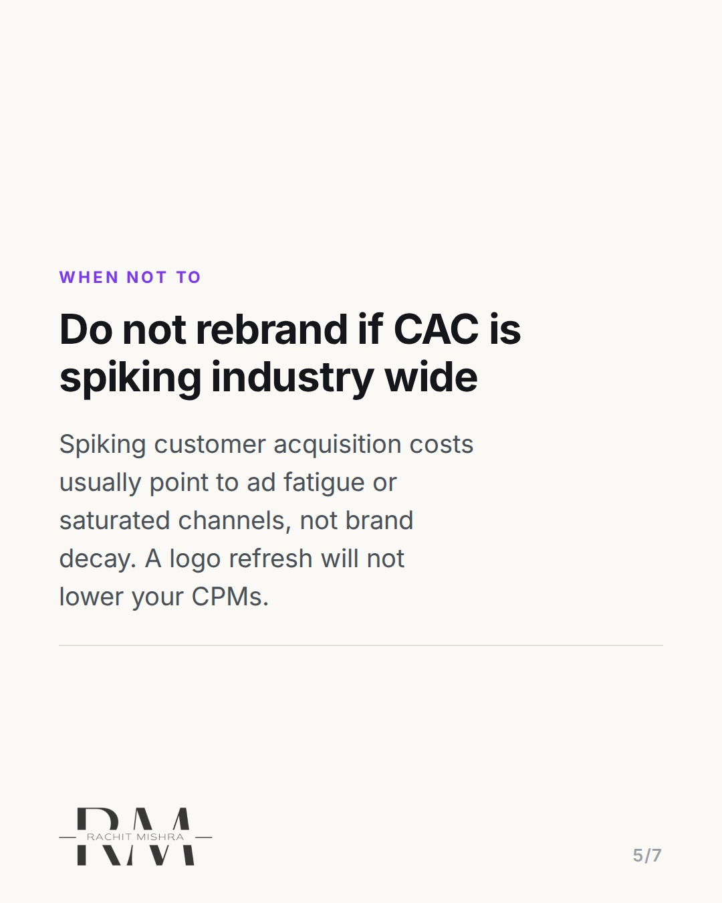
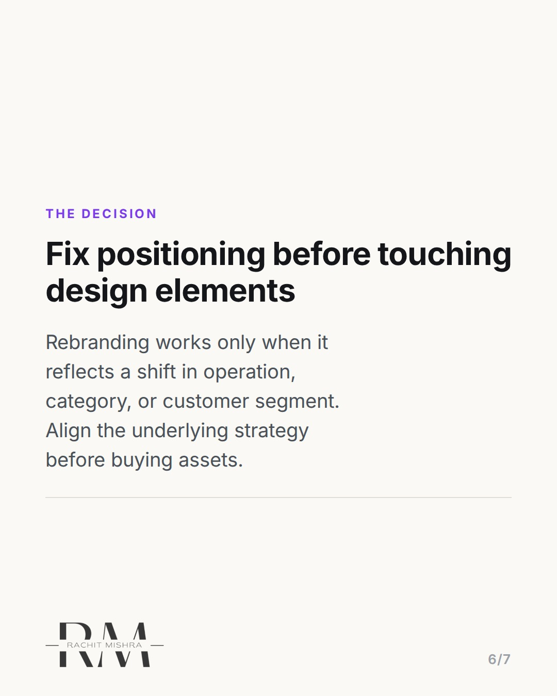

# whentorebrandsignals

**CAROUSEL** · Brand Strategy · goes live **2026-09-05T10:30:00+05:30**

> Targeting: `when to rebrand`
>
> Claim: A rebrand is only justified when a company's target buyer or category positioning shifts, not when conversion rates decline due to distribution issues.

## Slides

7 rendered images sit in this folder — upload them in filename order.

**1.** 
### Knowing when to rebrand before spending millions



**2.** THE MISTAKE
### Redesigning visuals to fix broken retention
Most teams rebrand when sales slow down. They swap typography and colors hoping to look fresh, but visual refreshes never fix product-market disconnects.



**3.** SIGNAL ONE
### You are losing deals on fit, not price
If prospects constantly ask for features you do not build, your positioning is bringing in the wrong buyer profile. That is a positioning signal.



**4.** SIGNAL TWO
### Your actual buyer changed, but your message did not
When enterprise accounts start driving 70% of revenue while your site targets SMBs, your visual identity actively suppresses your deal size.



**5.** WHEN NOT TO
### Do not rebrand if CAC is spiking industry wide
Spiking customer acquisition costs usually point to ad fatigue or saturated channels, not brand decay. A logo refresh will not lower your CPMs.



**6.** THE DECISION
### Fix positioning before touching design elements
Rebranding works only when it reflects a shift in operation, category, or customer segment. Align the underlying strategy before buying assets.



**7.** 
### Send this to a founder planning a rebrand this quarter
Save this checklist for your next brand review. Follow @byrachitmishra for sharp strategy teardowns.


## Caption — copy from here

```
Knowing when to rebrand comes down to whether you are losing deals on price or on customer fit.

A visual overhaul cannot fix a broken business model or a misaligned target market. When teams see declining conversion, the default reaction is often to change the logo, update the color palette, and buy new domain extensions. But if 70% of your current pipeline comes from enterprise buyers while your messaging speaks to early-stage startups, your brand identity is working against your revenue goals.

A true rebrand signals an operational shift: entering a new category, serving a higher tier customer, or changing how you deliver value. If nothing about your underlying product or operational delivery has changed, a rebrand is just expensive decor.

Send this to a brand manager or founder who is contemplating a rebrand this quarter.

#brandstrategy #brandpositioning #marketingstrategy #brandbuilding #branding
```

## Alt text

```
Text graphic outlining when a company should rebrand based on customer acquisition and market fit.
```

## How this post could fail

If the distinction between positioning shifts and visual refreshes isn't razor-sharp, the advice could sound like generic anti-rebrand commentary rather than an actionable strategic audit.
