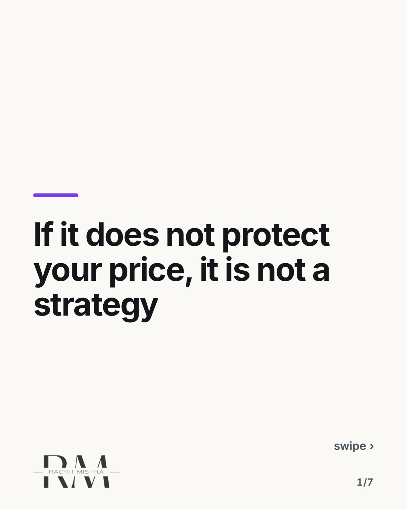
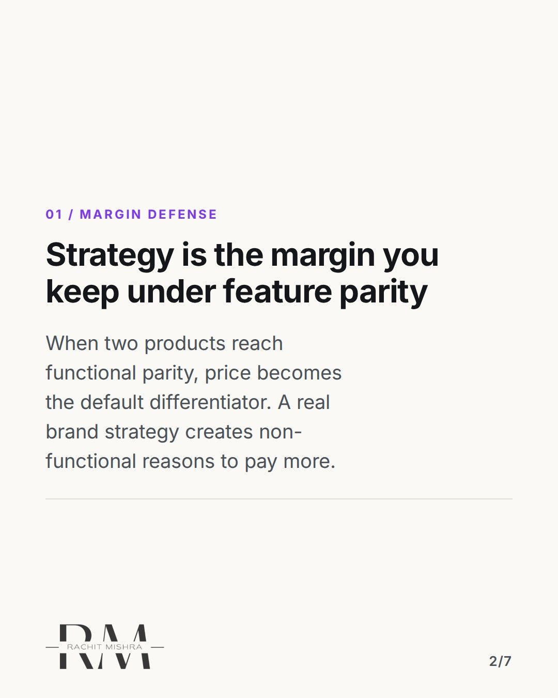
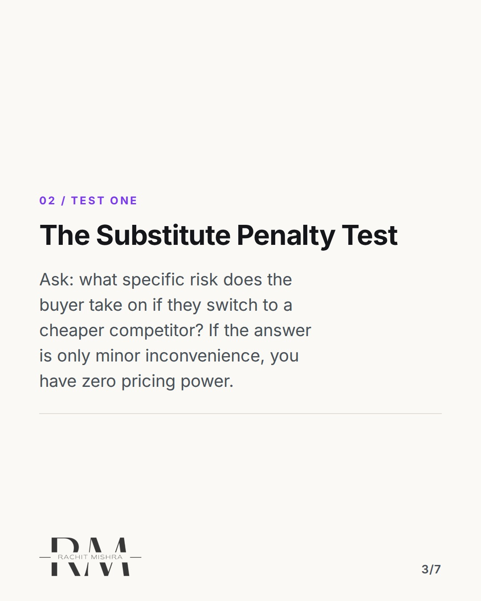
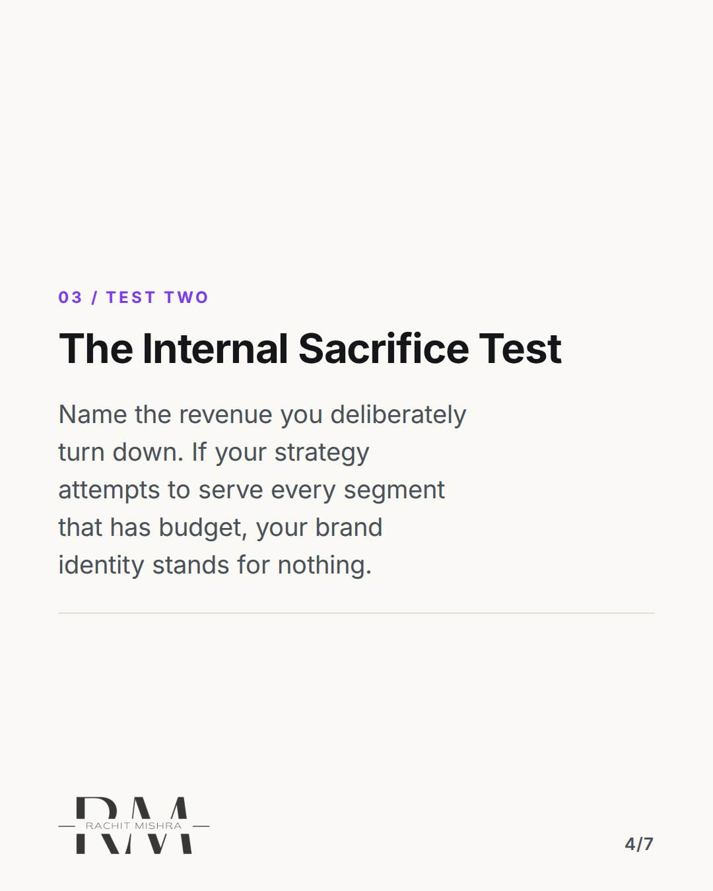
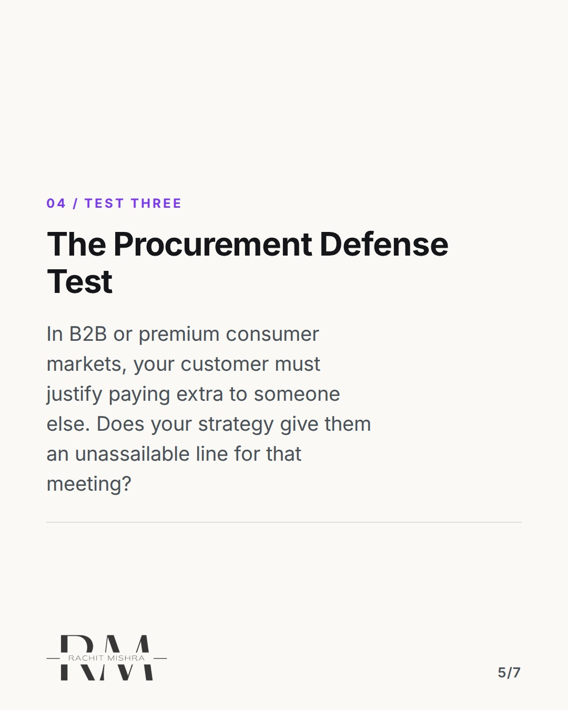
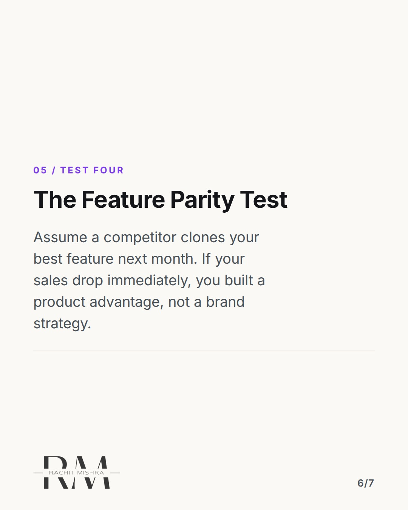
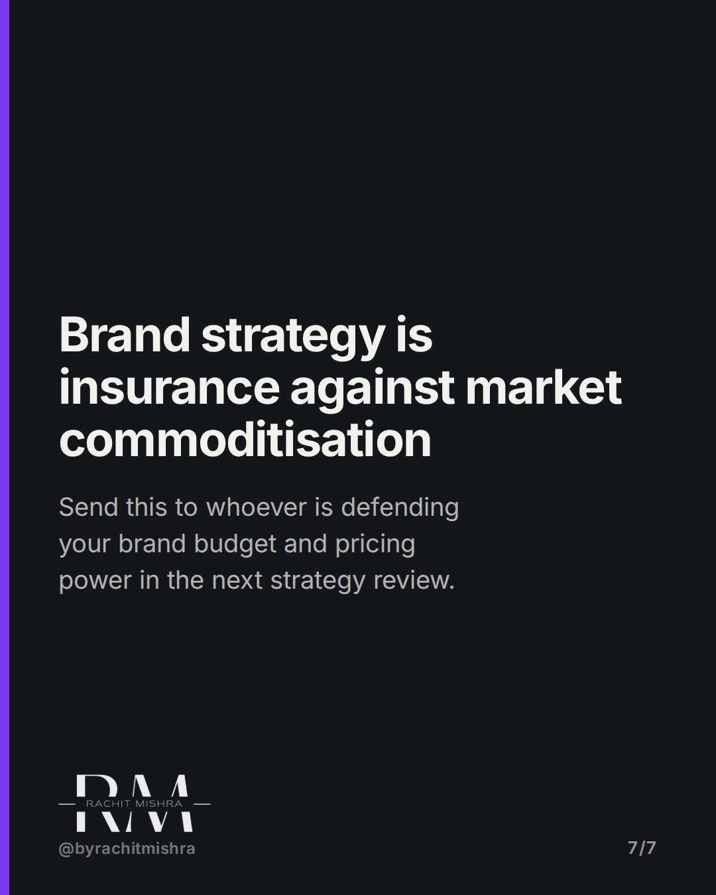

# brand_strategy_framework_pricing_power

**CAROUSEL** · Brand Strategy · goes live **2026-09-12T10:30:00+05:30**

> Targeting: `brand strategy framework`
>
> Claim: A brand strategy only exists if it provides measurable pricing power under feature parity.

## Slides

7 rendered images sit in this folder — upload them in filename order.

**1.** 
### If it does not protect your price, it is not a strategy



**2.** 01 / MARGIN DEFENSE
### Strategy is the margin you keep under feature parity
When two products reach functional parity, price becomes the default differentiator. A real brand strategy creates non-functional reasons to pay more.



**3.** 02 / TEST ONE
### The Substitute Penalty Test
Ask: what specific risk does the buyer take on if they switch to a cheaper competitor? If the answer is only minor inconvenience, you have zero pricing power.



**4.** 03 / TEST TWO
### The Internal Sacrifice Test
Name the revenue you deliberately turn down. If your strategy attempts to serve every segment that has budget, your brand identity stands for nothing.



**5.** 04 / TEST THREE
### The Procurement Defense Test
In B2B or premium consumer markets, your customer must justify paying extra to someone else. Does your strategy give them an unassailable line for that meeting?



**6.** 05 / TEST FOUR
### The Feature Parity Test
Assume a competitor clones your best feature next month. If your sales drop immediately, you built a product advantage, not a brand strategy.



**7.** 
### Brand strategy is insurance against market commoditisation
Send this to whoever is defending your brand budget and pricing power in the next strategy review.



## Caption — copy from here

```
A usable brand strategy framework should test your pricing power, not your choice of adjectives.

Most strategy decks pass internal review because they sound reasonable. Everyone agrees with words like premium and trusted because they cost nothing to say.

The real test happens six months later in a sales conversation when a prospect asks for a 15% discount. If your sales team cannot defend that 15% without escalating to leadership, the deck failed.

A brand strategy is not an internal alignment exercise for marketing. It is a commercial agreement with the market on what risk you absorb so the customer does not have to.

If your strategy cannot defend a price premium, you do not have a strategy. You have expensive messaging.

Send this to whoever is defending your brand budget in the next review.

[brand strategy framework, pricing power, brand positioning, b2b marketing, brand identity]

#brandstrategy #brandpositioning #marketingstrategy
```

## Alt text

```
A 7 slide carousel explaining four tests to evaluate a brand strategy framework and pricing power
```

## How this post could fail

The post could be dismissed as overly focused on high-margin or B2B businesses if readers assume low-margin volume plays do not need brand strategy.
