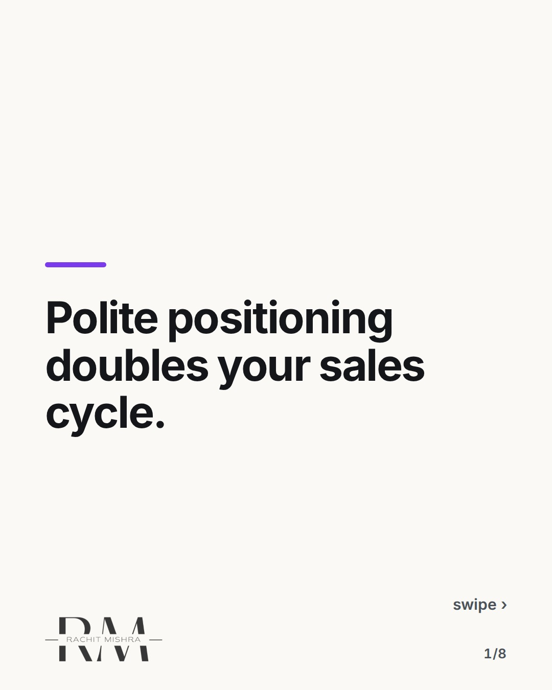
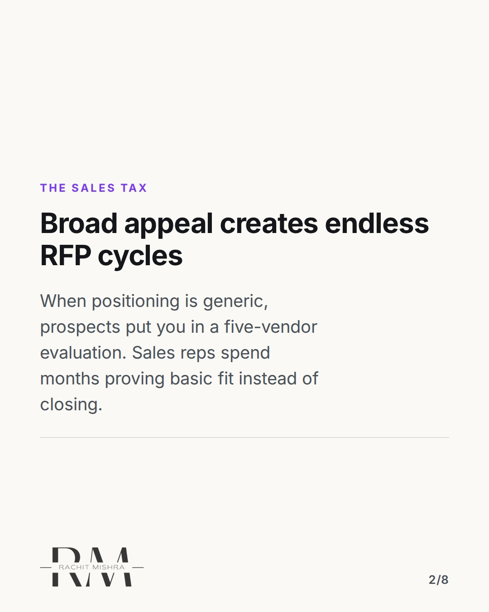
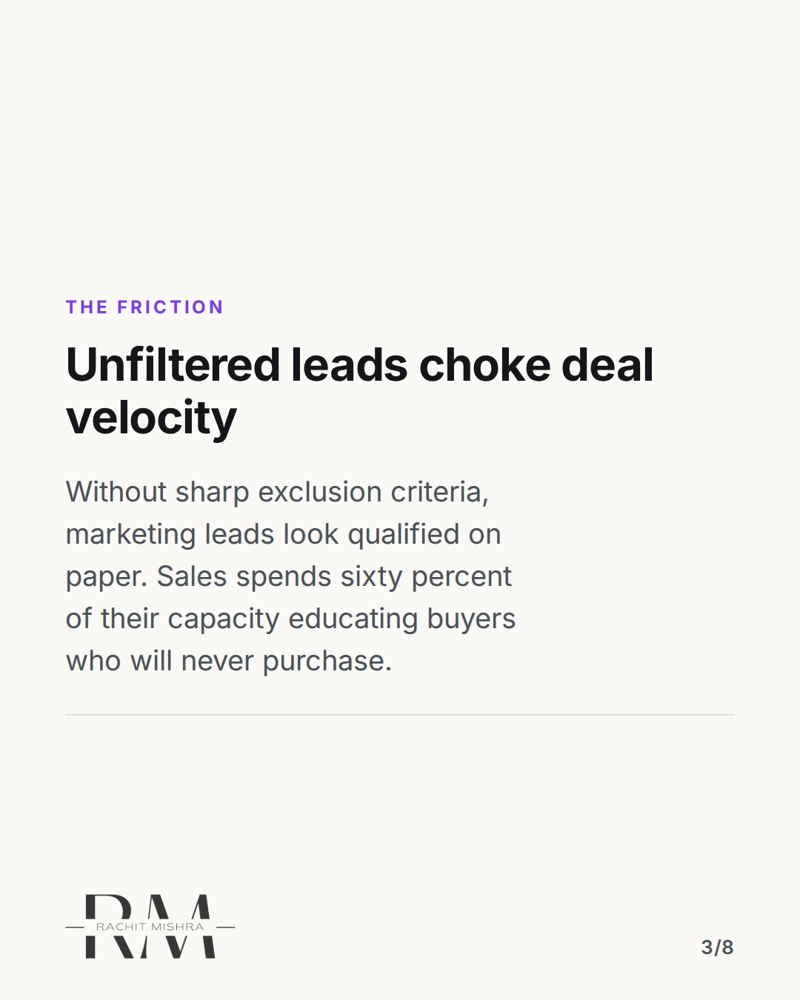
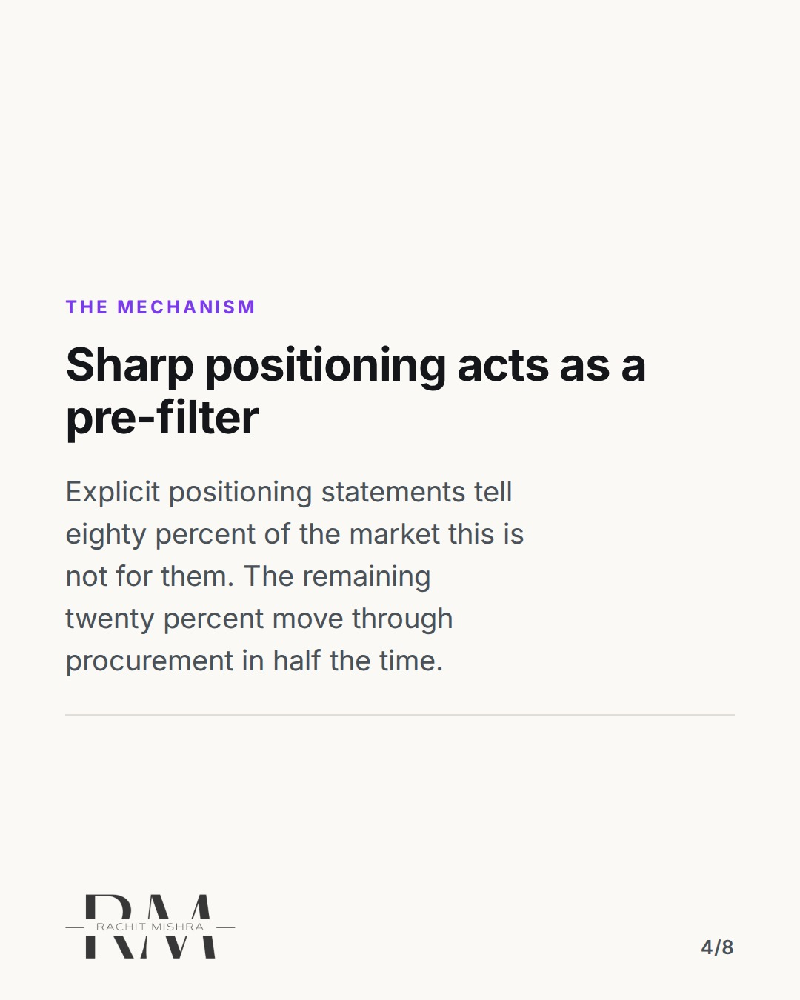
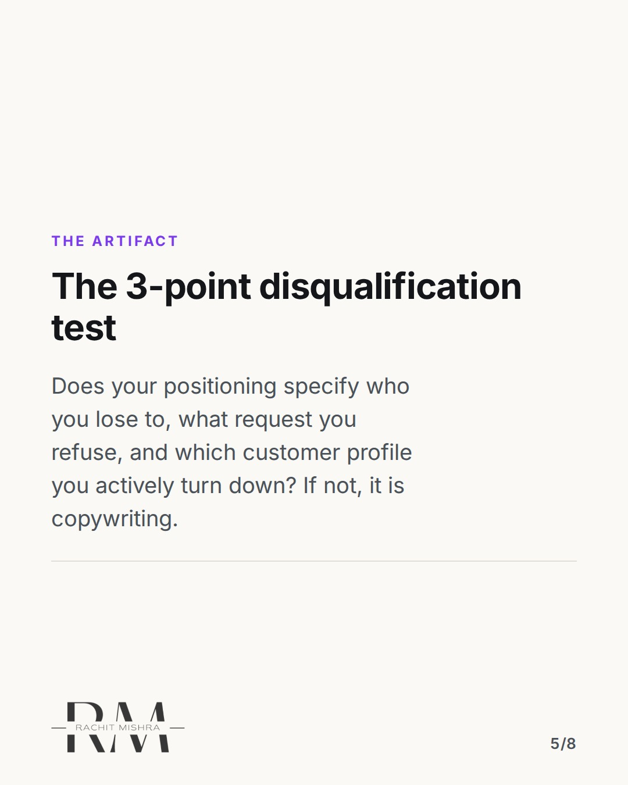
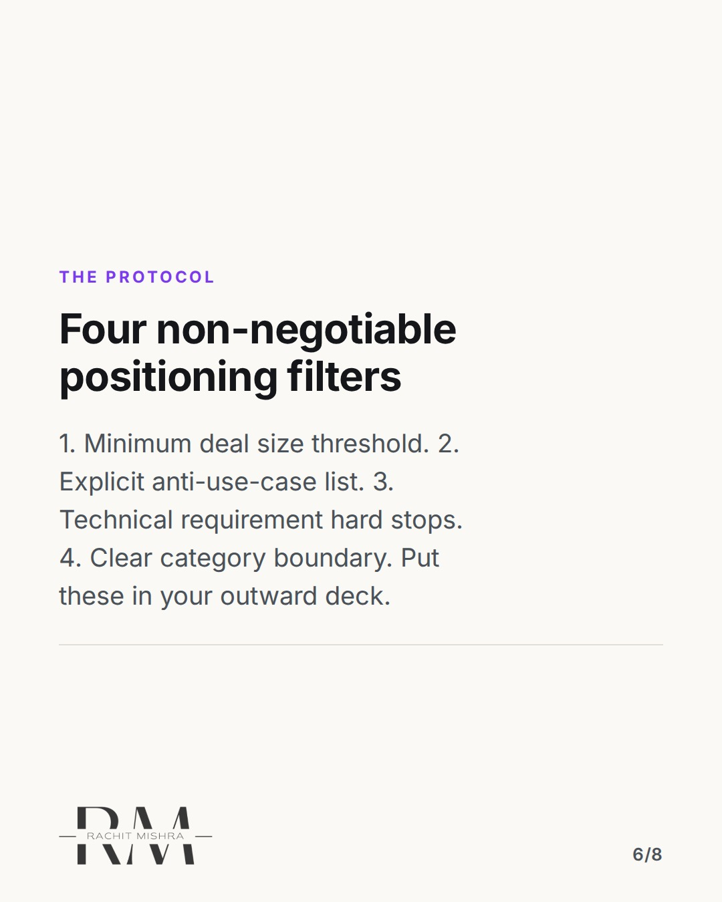
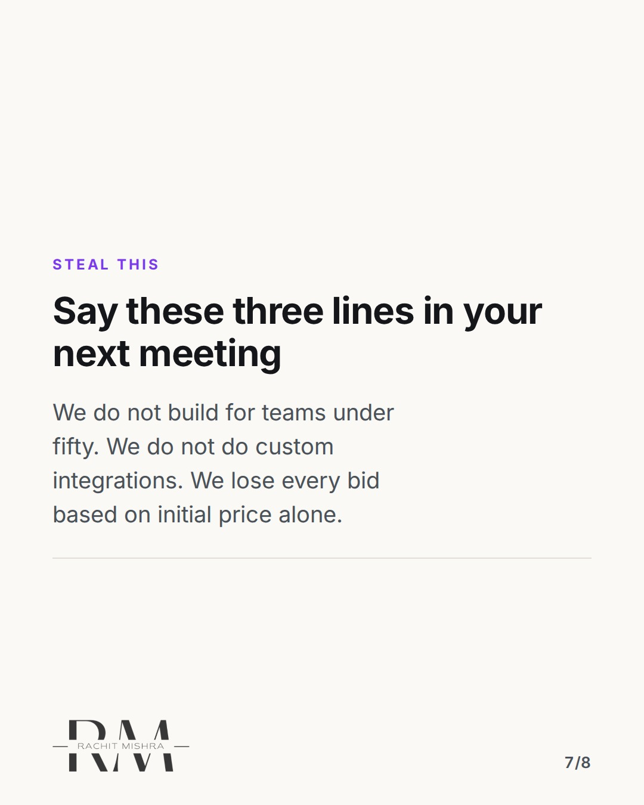
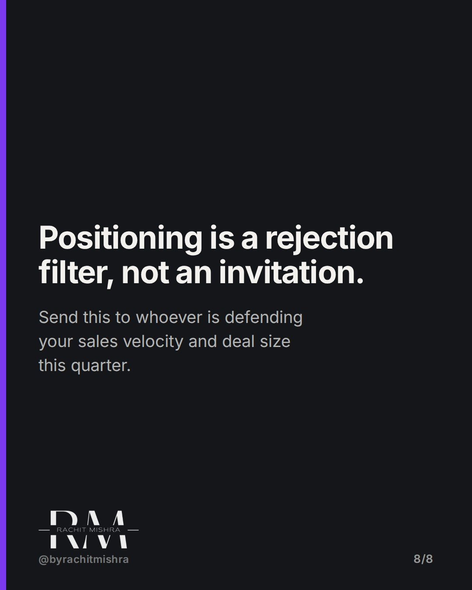

# polite_positioning_sales_cycle

**CAROUSEL** · Brand Strategy · goes live **2026-09-19T10:30:00+05:30**

> Targeting: `brand positioning`
>
> Claim: Polite brand positioning increases sales cycle length by failing to reject bad-fit leads before sales engagement.
>
> Proof (framework): A 4-part positioning filter framework (deal size threshold, anti-use-case list, technical hard stops, category boundary) that pre-qualifies prospects before the first sales conversation.

## Slides

8 rendered images sit in this folder — upload them in filename order.

**1.** 
### Polite positioning doubles your sales cycle.



**2.** THE SALES TAX
### Broad appeal creates endless RFP cycles
When positioning is generic, prospects put you in a five-vendor evaluation. Sales reps spend months proving basic fit instead of closing.



**3.** THE FRICTION
### Unfiltered leads choke deal velocity
Without sharp exclusion criteria, marketing leads look qualified on paper. Sales spends sixty percent of their capacity educating buyers who will never purchase.



**4.** THE MECHANISM
### Sharp positioning acts as a pre-filter
Explicit positioning statements tell eighty percent of the market this is not for them. The remaining twenty percent move through procurement in half the time.



**5.** THE ARTIFACT
### The 3-point disqualification test
Does your positioning specify who you lose to, what request you refuse, and which customer profile you actively turn down? If not, it is copywriting.



**6.** THE PROTOCOL
### Four non-negotiable positioning filters
1. Minimum deal size threshold. 2. Explicit anti-use-case list. 3. Technical requirement hard stops. 4. Clear category boundary. Put these in your outward deck.



**7.** STEAL THIS
### Say these three lines in your next meeting
We do not build for teams under fifty. We do not do custom integrations. We lose every bid based on initial price alone.



**8.** THE TAKEAWAY
### Positioning is a rejection filter, not an invitation.
Send this to whoever is defending your sales velocity and deal size this quarter.



## Caption — copy from here

```
Polite positioning doubles your sales cycle.

When your brand positioning tries to appeal to everyone, your sales team pays for it in drawn-out RFP cycles.

Marketing teams often measure success by lead volume. But when positioning lacks sharp trade-offs, sales receives leads that take three months just to qualify.

The cost is not just wasted sales hours. It leads to custom proposals for bad-fit buyers, discounted pricing to salvage deals, and churn six months after onboarding.

A clear strategy creates productive rejection. It tells wrong-fit buyers to move on before they ever fill out a form.

If your positioning does not actively turn away at least half the market, it is not doing any strategic work.

Send this to whoever is looking at sales cycle lengths and conversion rates this quarter.

[brand positioning, sales friction, brand strategy framework, lead qualification, deal velocity]

#brandpositioning #brandstrategy #marketingstrategy
```

## Alt text

```
Text graphic breaking down how sharp brand positioning speeds up sales cycles by rejecting bad fits.
```

## How this post could fail

If the post reads as sales advice rather than positioning strategy, brand managers will dismiss it as an account executive problem.
