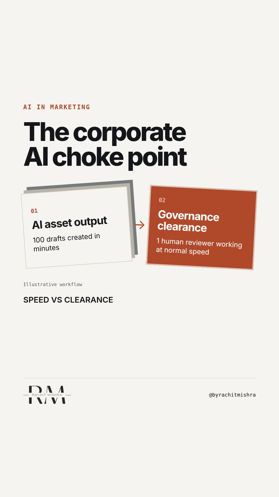

# aioutcomesversusoutputs

**REEL** · ai_marketing · goes live **2026-09-25T08:30:00+05:30**

> Targeting: `AI adoption in a large company`
>
> Claim: AI implementation in enterprise marketing is bottle-necked by approval volume rather than content generation speed.
>
> Proof (practitioner_observation): Observed review cycles in governed corporate marketing teams where generating ten draft options took minutes, but routing a single asset for legal, compliance, and corporate affairs clearance took seven working days.

## Cover



## Reel script

`reel.mp4` has been generated from this script and will publish automatically. To use your own footage instead, replace that file and delete `.generated-reel` from this folder.

| Time | On screen | Voiceover | Direction |
|---|---|---|---|
| 0:00-0:03 | **Your AI tools do not solve the bottleneck.** | Your AI tools do not solve the bottleneck. Most plans for AI adoption in a large company focus entirely on creation speed. | Rachit stands in a neutral workspace, speaking directly to the camera with a serious, unhurried expression. |
| 0:03-0:06 | **Generating drafts is already free.** | But generating drafts is already free. The actual constraint is never how fast your agency or your team can write copy. | He remains on camera, using a quiet hand gesture to emphasise the transition of focus. |
| 0:06-0:10 | **The real work is getting things cleared.** | The real work is getting those pieces cleared. In highly regulated or industrial sectors, a single public claim requires three signatures. | A visual split-screen comparison graphic slides in, illustrating the extreme difference in time taken for creation versus governance. |
| 0:10-0:14 | **Legal and compliance do not scale with AI.** | Legal, compliance, and corporate affairs do not scale with AI. If your generation capacity goes up tenfold, your approvals simply stall. | The screen transitions to a bottleneck graphic, visually mapping out where the workflow queues pile up. |
| 0:14-0:18 | **The Three-Gate Clearance Check** | Before you invest in more production tools, run your process through this three-gate clearance check to find the real friction. | A clean checklist graphic appears on screen, replacing the previous bottleneck visualization. |
| 0:18-0:22 | **Scale your governance, not your assets.** | Scale your governance mechanism, not your asset volume. If you do not change the clearance process, you are just building a larger backlog. | The checklist slides away, returning the focus entirely to Rachit for the final direct delivery. |

## Caption — copy from here

```
Your AI tools do not solve the bottleneck.

Most discussions about AI adoption in a large company focus on production speed. Teams boast about generating fifty variations of an asset in seconds.

But in enterprise brand management, production was never the slow part. 

The real constraint is governance. A draft cannot go public without clearing technical, legal, and regulatory reviews. 

If you multiply your content output by ten without changing your clearance workflow, you do not get ten times the business results. You just get a massive queue of unapproved assets waiting for a human reviewer who still has only eight hours a day.

True marketing efficiency is a pipeline problem, not a writing problem.

Send this to whoever is designing your marketing technology stack this quarter.

[ai adoption in a large company, marketing technology, ai governance, brand management]

#aimarketing #martech #marketingtechnology
```

## Alt text

```
Split-screen graphic showing the mismatch between fast draft production and slow human clearance.
```

## How this post could fail

If the visual elements look like generic tech mockups instead of realistic process bottlenecks, the enterprise audience will dismiss this as basic advice.
