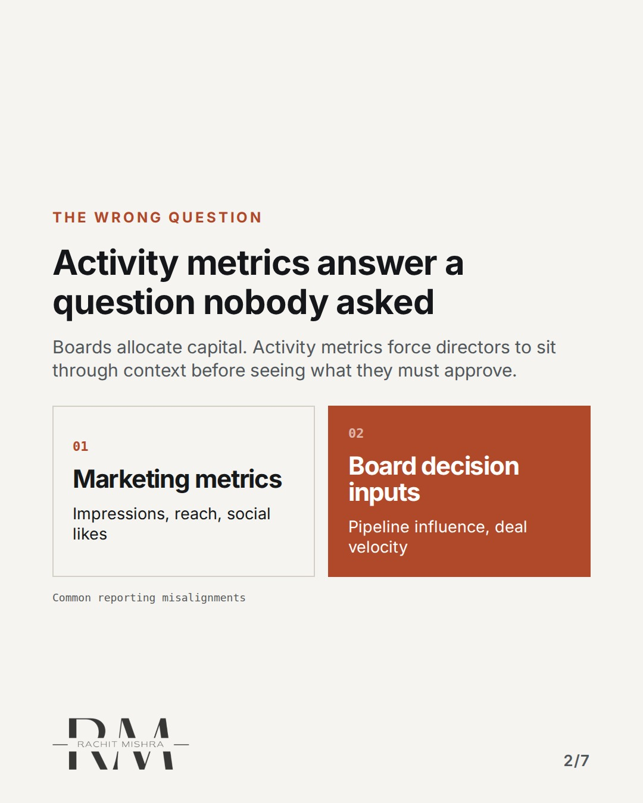
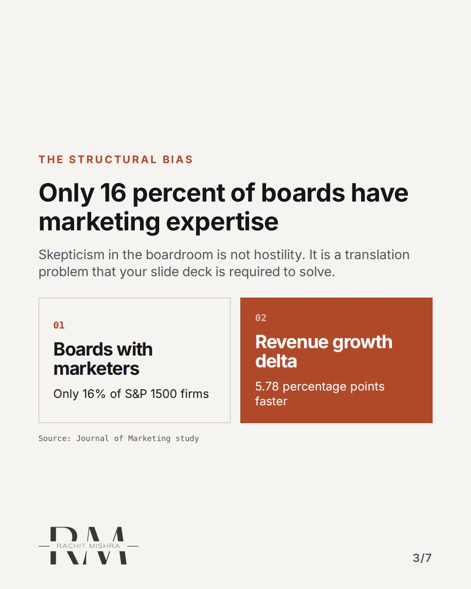
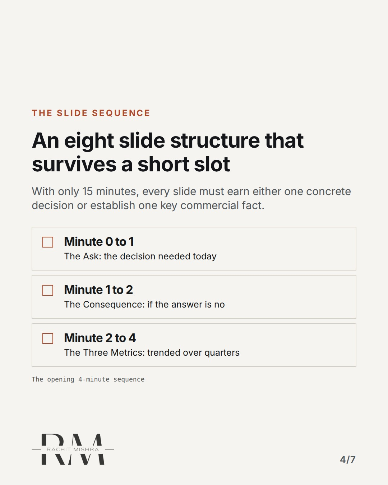
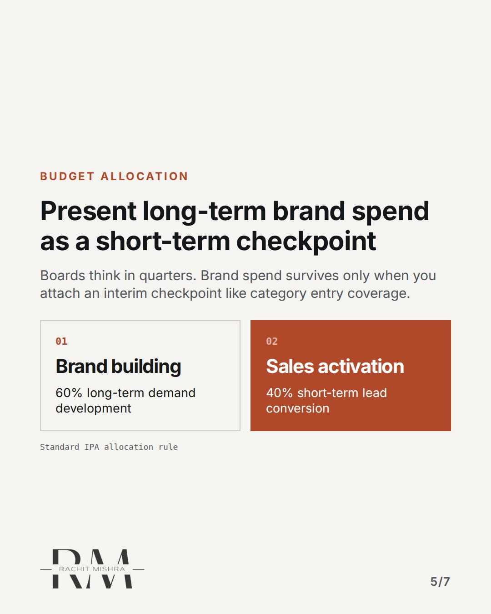
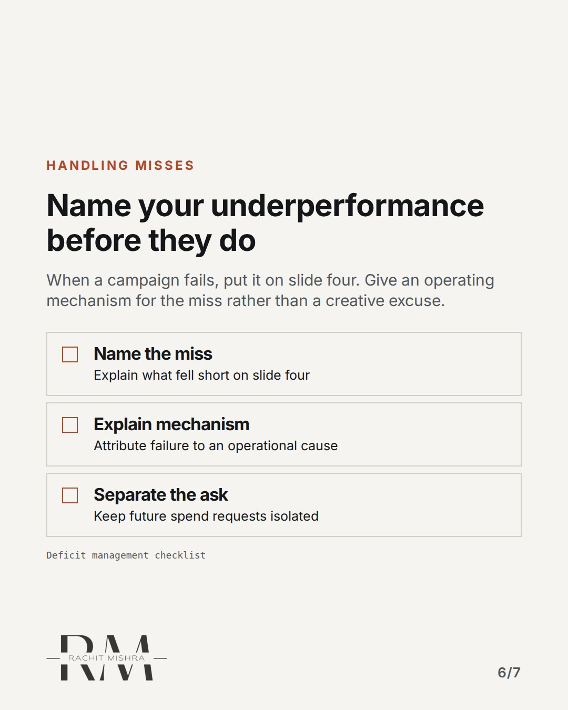
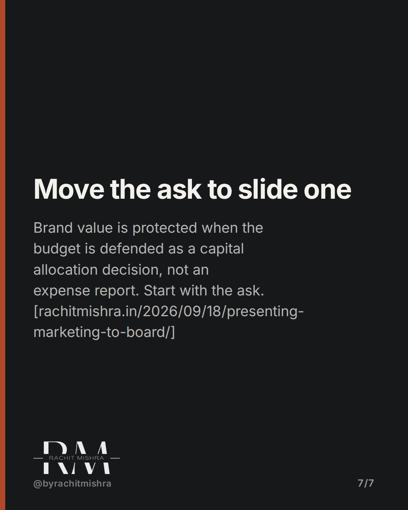

# presentingmarketingtoboard

**CAROUSEL** · ai_in_practice · goes live **2026-09-25T19:00:00+05:30**

> Targeting: `what AI cannot do in brand work`
>
> Claim: Presenting marketing to a board that doubts the numbers works only when the slide pack opens with the decision they must make, not what campaign activities occurred.
>
> Proof (source): Deloitte Digital's survey found 61% of marketing budgets are pre-decided based on revenue or prior spend rather than a fresh case, meaning board presentations must target resource allocation Decisions over campaign highlights.
> Source: https://www.rachitmishra.in/2026/09/18/presenting-marketing-to-board/
>
> Source preflight: reachable (HTTP 200)

## Slides

7 rendered images sit in this folder — upload them in filename order.

**1.** 
### Your board pack fails before slide two


**2.** The wrong question
### Activity metrics answer a question nobody asked
Boards allocate capital. Activity metrics force directors to sit through context before seeing what they must approve.



**3.** The structural bias
### Only 16 percent of boards have marketing expertise
Skepticism in the boardroom is not hostility. It is a translation problem that your slide deck is required to solve.



**4.** The slide sequence
### An eight slide structure that survives a short slot
With only 15 minutes, every slide must earn either one concrete decision or establish one key commercial fact.



**5.** Budget allocation
### Present long-term brand spend as a short-term checkpoint
Boards think in quarters. Brand spend survives only when you attach an interim checkpoint like category entry coverage.



**6.** Handling misses
### Name your underperformance before they do
When a campaign fails, put it on slide four. Give an operating mechanism for the miss rather than a creative excuse.



**7.** 
### Move the ask to slide one
Brand value is protected when the budget is defended as a capital allocation decision, not an expense report. Start with the ask. [rachitmishra.in/2026/09/18/presenting-marketing-to-board/]



## Caption — copy from here

```
Your board pack fails before slide two.

Understanding what AI cannot do in brand work starts with how you defend your budget in front of directors who think in quarters.

I learned this in an engineering-led company. After missing a target, I stood up with a standard deck full of activities. By the time I reached the ask, the room had already written down marketing as the soft target to cut. 

I never did it again. The fix was moving the ask to slide one. 

No board wants a lecture on impressions or how many campaigns you launched. They want to know the capital decision they are making, the consequence of saying no, and three trended metrics they can actually act on.

If you hide underperforming lines behind creative summaries, you lose credibility. Name the miss first, explain the mechanism, and keep the strategic allocation separate.

Read the complete operational layout at: https://www.rachitmishra.in/2026/09/18/presenting-marketing-to-board/

[b2b branding, marketing operations, brand governance, enterprise ai adoption]

#aimarketing #martech #b2bmarketing

#aimarketing #martech #b2bmarketing
```

## Alt text

```
Slide presentation showing sequence comparison of marketing activity versus board decision metrics.
```

## How this post could fail

If the reader believes this is generic management advice rather than a specific translation guide for industrial marketers facing procurement-minded boards.

## Sources

- [Presenting Marketing to a Board That Doesn’t Trust It](https://www.rachitmishra.in/2026/09/18/presenting-marketing-to-board/)
