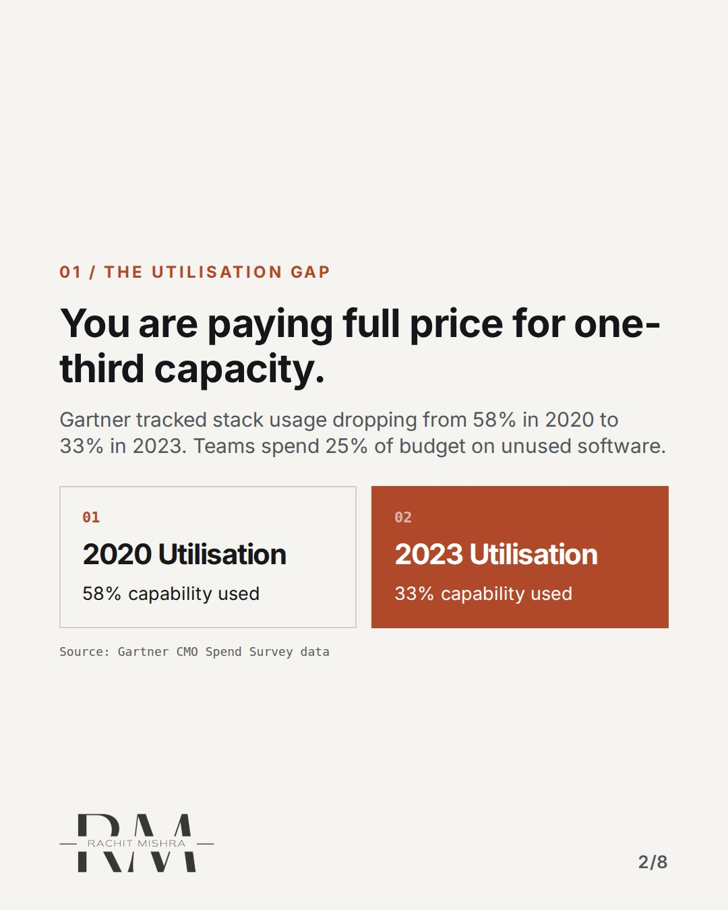
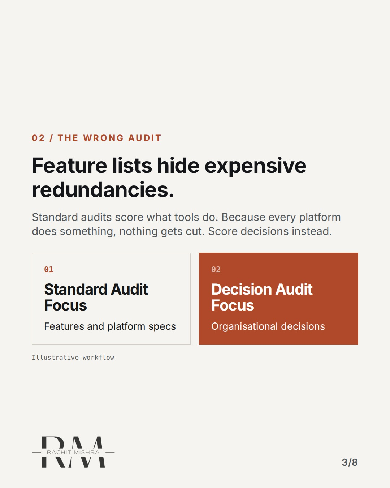
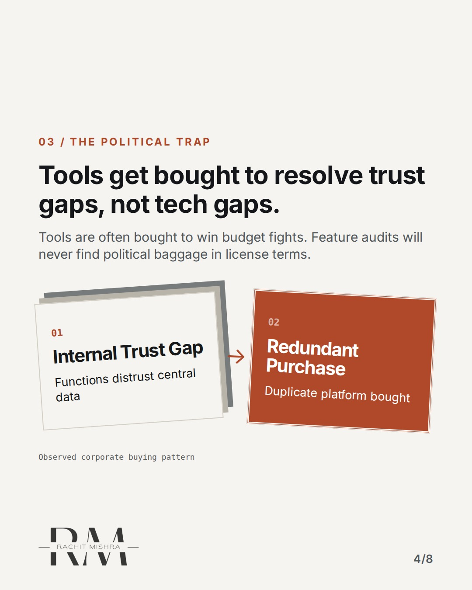
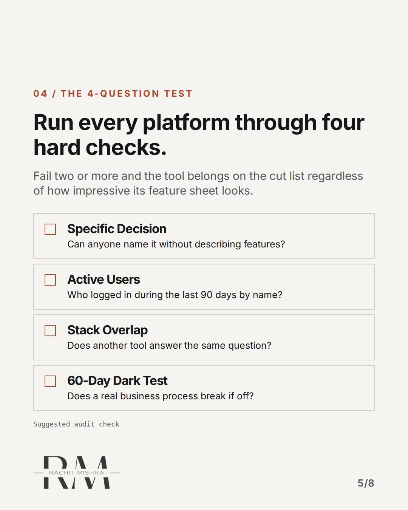
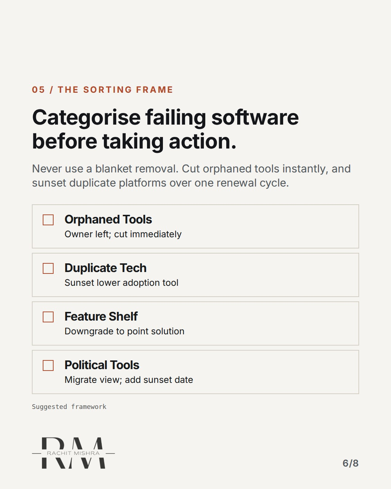
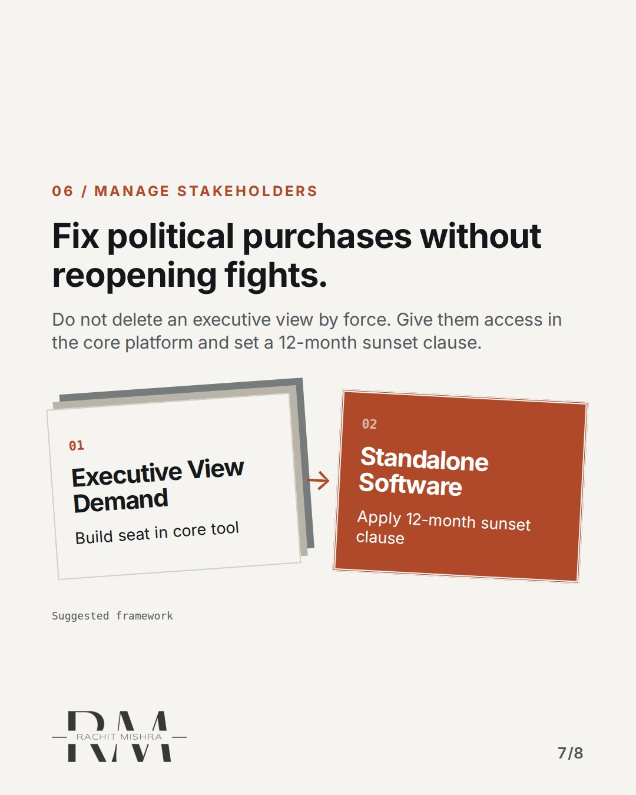
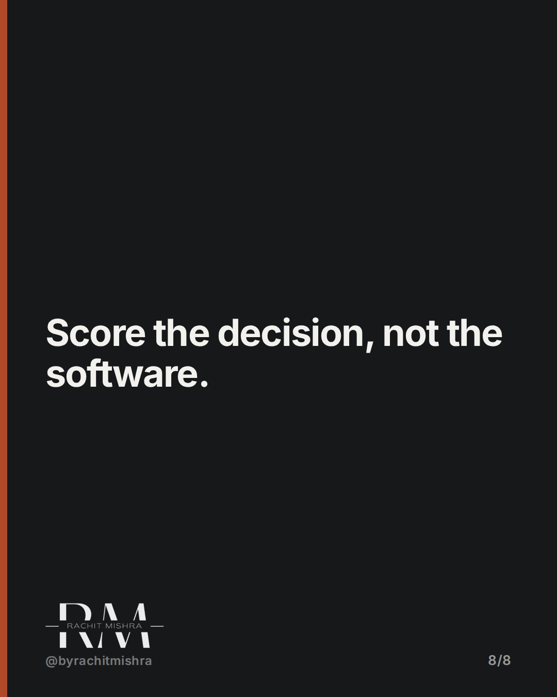

# martechstackaudit2026

**CAROUSEL** · b2b_brand · goes live **2026-09-21T19:00:00+05:30**

> Targeting: `martech stack audit`
>
> Claim: Martech audits fail because they score tool features instead of the organisational decisions those tools were bought to settle.
>
> Proof (source): Gartner survey data showed average martech stack capability utilization falling from 58% in 2020 down to 33% in 2023, while absorbing 25.4% of marketing budgets.
> Source: https://www.rachitmishra.in/2026/09/20/martech-stack-audit/
>
> Source preflight: reachable (HTTP 200)

## Slides

8 rendered images sit in this folder — upload them in filename order.

**1.** 
### Most martech audits fail to cut a single tool.


**2.** 01 / THE UTILISATION GAP
### You are paying full price for one-third capacity.
Gartner tracked stack usage dropping from 58% in 2020 to 33% in 2023. Teams spend 25% of budget on unused software.



**3.** 02 / THE WRONG AUDIT
### Feature lists hide expensive redundancies.
Standard audits score what tools do. Because every platform does something, nothing gets cut. Score decisions instead.



**4.** 03 / THE POLITICAL TRAP
### Tools get bought to resolve trust gaps, not tech gaps.
Tools are often bought to win budget fights. Feature audits will never find political baggage in license terms.



**5.** 04 / THE 4-QUESTION TEST
### Run every platform through four hard checks.
Fail two or more and the tool belongs on the cut list regardless of how impressive its feature sheet looks.



**6.** 05 / THE SORTING FRAME
### Categorise failing software before taking action.
Never use a blanket removal. Cut orphaned tools instantly, and sunset duplicate platforms over one renewal cycle.



**7.** 06 / MANAGE STAKEHOLDERS
### Fix political purchases without reopening fights.
Do not delete an executive view by force. Give them access in the core platform and set a 12-month sunset clause.



**8.** 
### Score the decision, not the software.



## Caption — copy from here

```
Most martech audits fail to cut a single tool.

Conducting a martech stack audit usually ends in frustration because teams evaluate platform capabilities instead of operational decisions.

When you score software by its feature list, every enterprise tool passes. They all do something. But Gartner data shows average stack capability utilization fell to just 33% while absorbing a quarter of marketing budgets.

The hardest software to cut isn't technical; it is political. Tools bought to give a regional leader their own analytics view exist to solve an internal trust gap, not a capability gap. Switching them off without replacing that visibility just reopens the original argument.

Run your stack against decisions, not spec sheets. The redundant software will reveal itself.

Full analysis and audit steps on my blog: https://www.rachitmishra.in/2026/09/20/martech-stack-audit/

Send this to whoever is defending the marketing technology budget this quarter.

[martech stack audit, b2b branding, industrial marketing, brand governance, marketing budget]

#b2bmarketing #industrialmarketing #b2bbranding
```

## Alt text

```
Carousel slides outlining how to execute a martech stack audit by scoring decisions over features.
```

## How this post could fail

If the audience views this as generic IT procurement advice rather than a strategic brand governance issue, it risks losing resonance with comms leaders.

## Sources

- [Martech Stack Audit: What to Cut in 2026](https://www.rachitmishra.in/2026/09/20/martech-stack-audit/)
