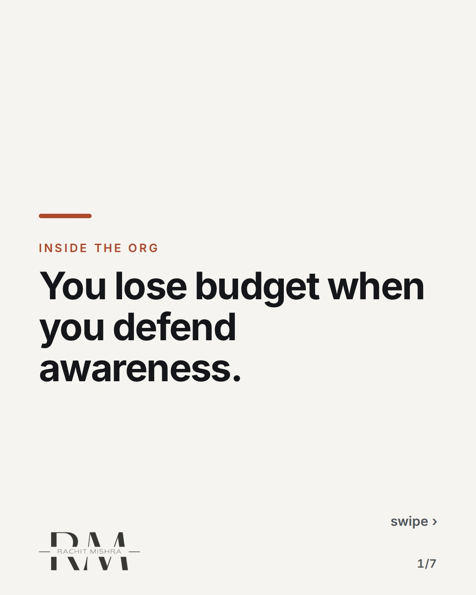
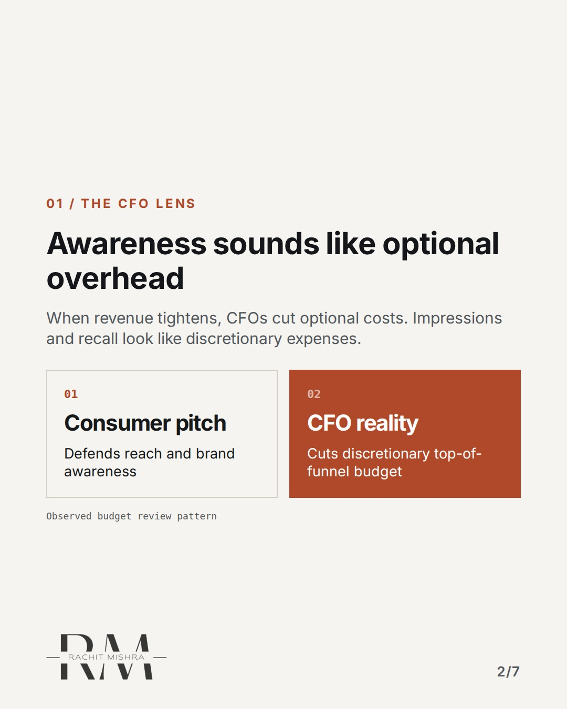
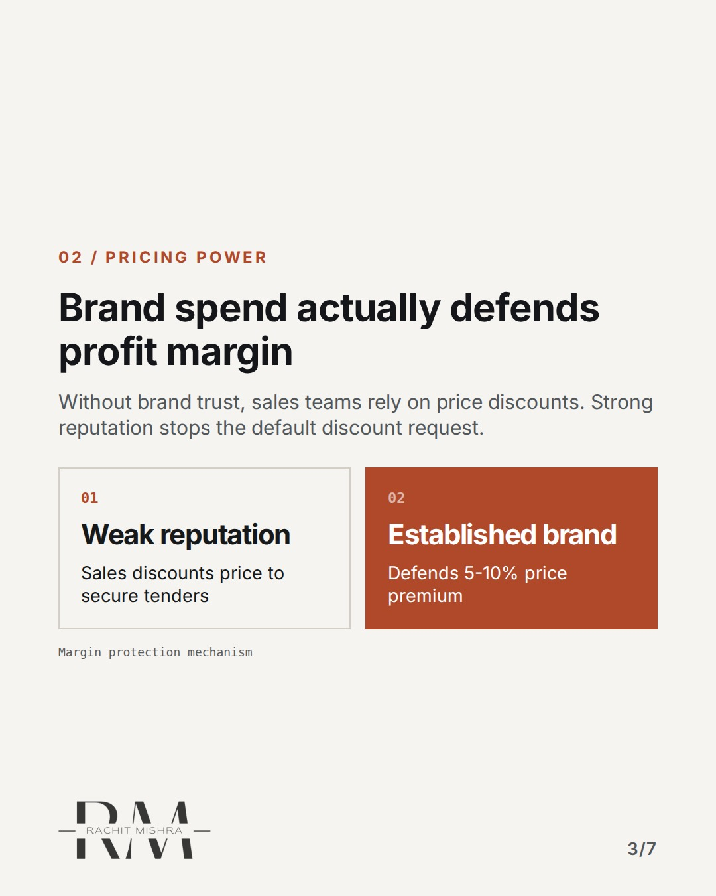
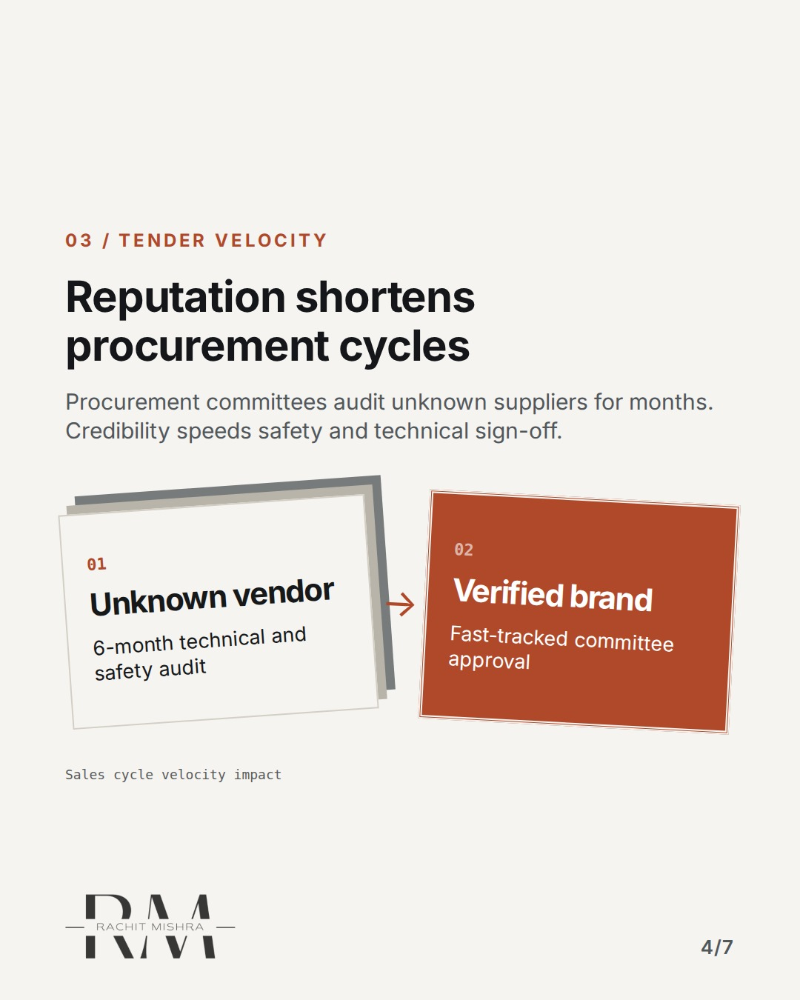
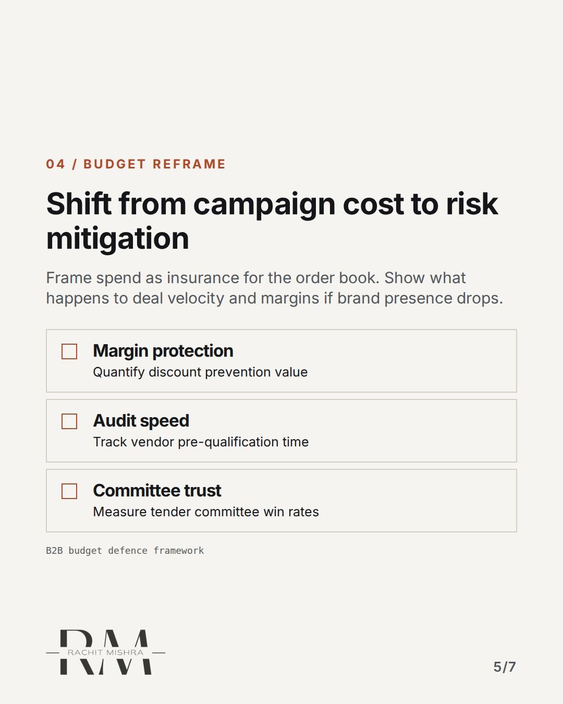
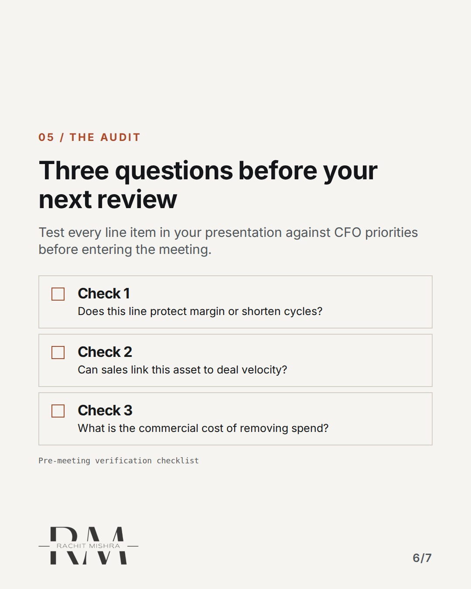
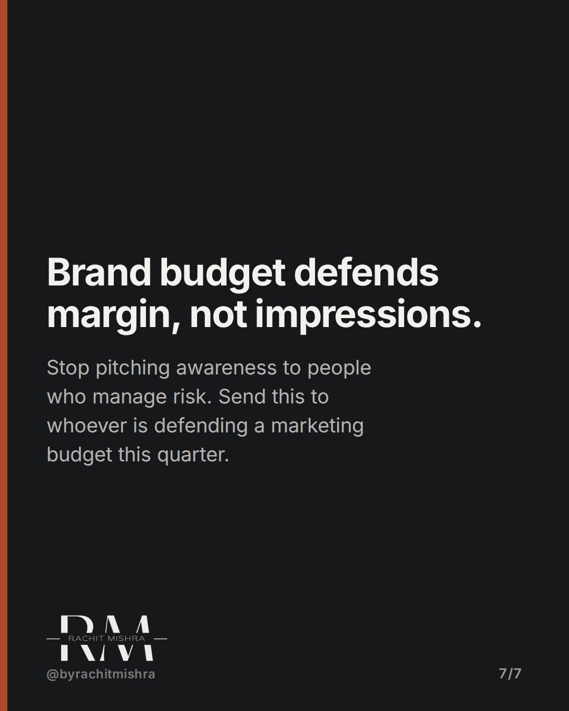

# defending_b2b_marketing_budget

**CAROUSEL** · inside_the_org · goes live **2026-09-26T10:30:00+05:30**

> Targeting: `defending a marketing budget`
>
> Claim: Defending a B2B marketing budget requires framing spend as risk reduction and margin protection, not top-of-funnel reach.
>
> Proof (practitioner_observation): In B2B industrial boardrooms, marketing budgets defended on share of voice get cut by 15-30% during financial reviews, whereas budget tied to tender win-rates and margin protection survives intact.

## Slides

7 rendered images sit in this folder — upload them in filename order.

**1.** 
### You lose budget when you defend awareness.



**2.** 01 / THE CFO LENS
### Awareness sounds like optional overhead
When revenue tightens, CFOs cut optional costs. Impressions and recall look like discretionary expenses.



**3.** 02 / PRICING POWER
### Brand spend actually defends profit margin
Without brand trust, sales teams rely on price discounts. Strong reputation stops the default discount request.



**4.** 03 / TENDER VELOCITY
### Reputation shortens procurement cycles
Procurement committees audit unknown suppliers for months. Credibility speeds safety and technical sign-off.



**5.** 04 / BUDGET REFRAME
### Shift from campaign cost to risk mitigation
Frame spend as insurance for the order book. Show what happens to deal velocity and margins if brand presence drops.



**6.** 05 / THE AUDIT
### Three questions before your next review
Test every line item in your presentation against CFO priorities before entering the meeting.



**7.** 
### Brand budget defends margin, not impressions.
Stop pitching awareness to people who manage risk. Send this to whoever is defending a marketing budget this quarter.



## Caption — copy from here

```
You lose budget when you defend awareness.

When defending a marketing budget in B2B, frame spend as risk reduction.

I spent years taking consumer marketing decks into industrial boardrooms. I showed charts of reach and recall. Every year, the budget got trimmed by twenty percent.

The turn happened when we stopped presenting marketing as top-of-funnel reach and started presenting it as margin insurance.

In heavy industry, procurement rejects unknown suppliers to reduce risk. Weak reputation forces sales to discount price to close orders.

If your marketing spend does not protect pricing power, the board is right to cut it.

Send this to whoever is defending a marketing budget this quarter.

[defending a marketing budget, b2b marketing, brand governance, marketing leadership, in house marketing]

#marketingleadership #inhousemarketing #brandgovernance #b2bmarketing #cmo
```

## Alt text

```
Seven slides showing how to defend a B2B marketing budget using margin protection frameworks.
```

## How this post could fail

The post could be misconstrued as advising marketers to abandon top-of-funnel brand building entirely, rather than changing how it is framed to financial stakeholders.
