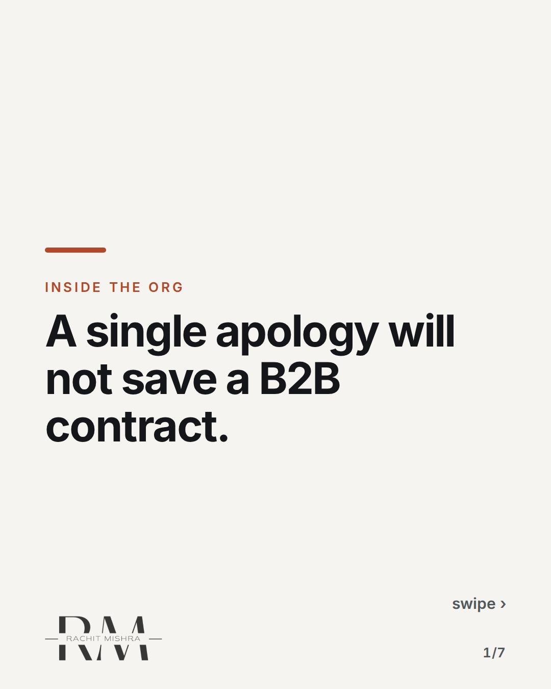
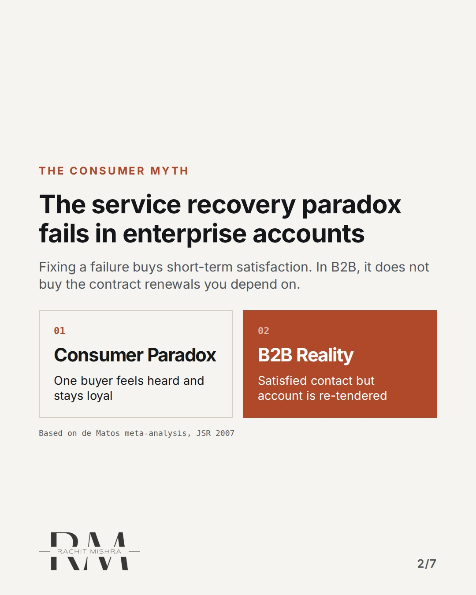
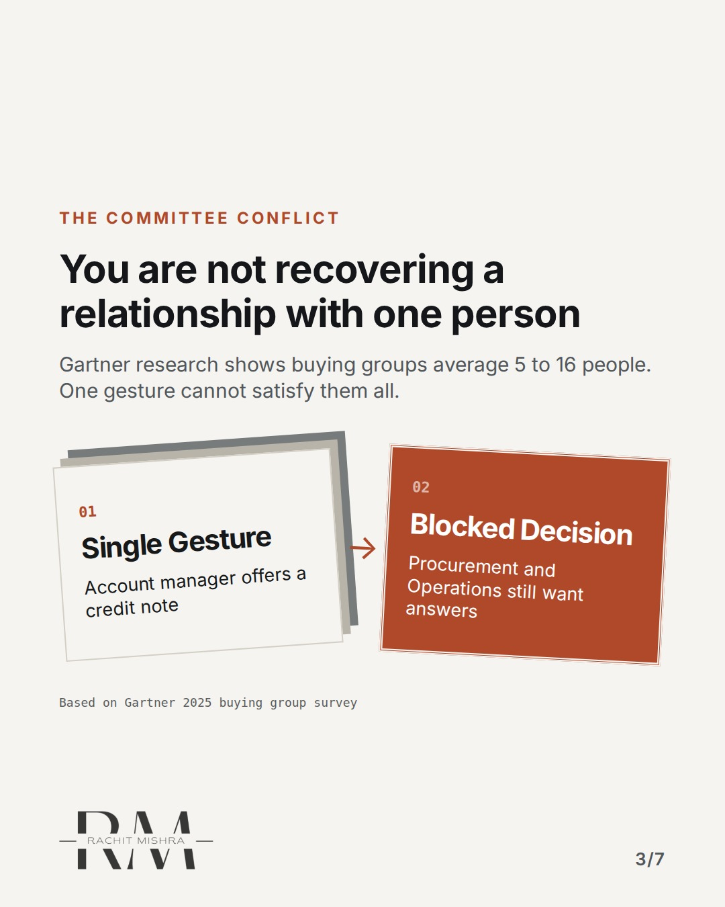
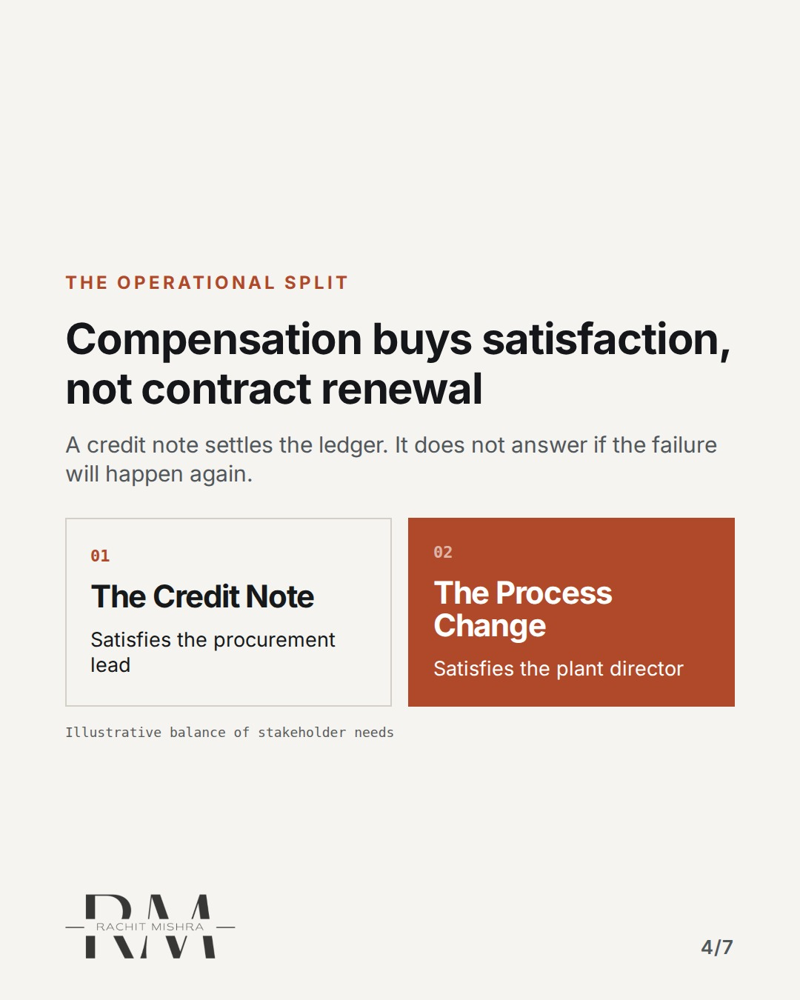
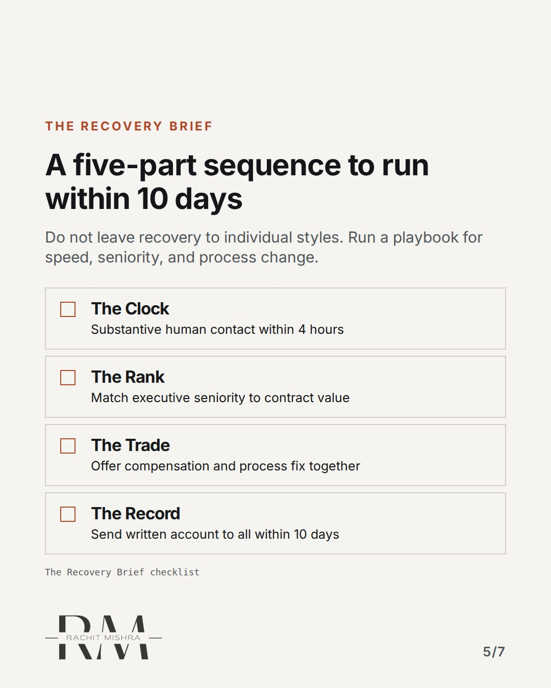
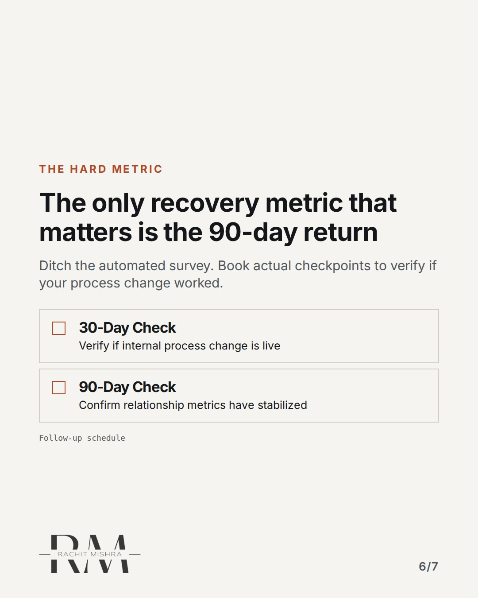
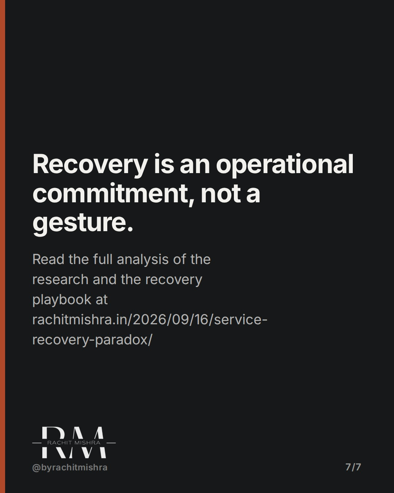

# service_recovery_paradox_b2b

**CAROUSEL** · inside_the_org · goes live **2026-09-27T10:30:00+05:30**

> Targeting: `brand governance`
>
> Claim: B2B service recovery cannot be designed for a single buyer; it must resolve conflicts across a buying committee of five to sixteen people.
>
> Proof (source): Gartner's 2025 survey of 632 B2B buyers found that buying groups average five to sixteen people, meaning a service recovery attempt must resolve different, competing functional interests to secure a renewal.
> Source: https://www.rachitmishra.in/2026/09/16/service-recovery-paradox/
>
> Source preflight: reachable (HTTP 200)

## Slides

7 rendered images sit in this folder — upload them in filename order.

**1.** 
### A single apology will not save a B2B contract.



**2.** The Consumer Myth
### The service recovery paradox fails in enterprise accounts
Fixing a failure buys short-term satisfaction. In B2B, it does not buy the contract renewals you depend on.



**3.** The Committee Conflict
### You are not recovering a relationship with one person
Gartner research shows buying groups average 5 to 16 people. One gesture cannot satisfy them all.



**4.** The Operational Split
### Compensation buys satisfaction, not contract renewal
A credit note settles the ledger. It does not answer if the failure will happen again.



**5.** The Recovery Brief
### A five-part sequence to run within 10 days
Do not leave recovery to individual styles. Run a playbook for speed, seniority, and process change.



**6.** The Hard Metric
### The only recovery metric that matters is the 90-day return
Ditch the automated survey. Book actual checkpoints to verify if your process change worked.



**7.** 
### Recovery is an operational commitment, not a gesture.
Read the full analysis of the research and the recovery playbook at rachitmishra.in/2026/09/16/service-recovery-paradox/



## Caption — copy from here

```
A single apology will not save a B2B contract.

Good brand governance is about managing the entire buying group, not just making a single contact happy after a operational failure.

When a shipment is late or a system goes down, we tend to treat it as a customer service problem. We send a credit note and issue an apology.

But in enterprise accounts, a missed delivery lands inside a committee of five to sixteen stakeholders. The procurement lead wants the billing sorted, but the plant director wants to know why the line stopped. A generic gesture aimed at one looks like negligence to the other.

Satisfaction is not the same as retention. A customer can rate your crisis response highly on an email survey and still quietly sign with your competitor at the next quarterly review.

True service recovery is a sequence of operational commitments, not a series of polite emails.

Read the full research breakdown and get the step-by-step checklist on my site: https://www.rachitmishra.in/2026/09/16/service-recovery-paradox/

Send this to whoever is responsible for managing client retention in your enterprise accounts this quarter.

[brand governance, marketing leadership, b2b marketing, stakeholder management]

#brandgovernance #b2bmarketing #marketingleadership
```

## Alt text

```
A carousel detailing why consumer-style service recovery fails in complex B2B buying committees.
```

## How this post could fail

If the reader does not understand that B2B accounts have multiple functional buyers, the distinction between a credit note and a process change might feel like unnecessary bureaucracy instead of strategic account preservation.

## Sources

- [Service Recovery Paradox: Making the Worst Moment Stick](https://www.rachitmishra.in/2026/09/16/service-recovery-paradox/)
