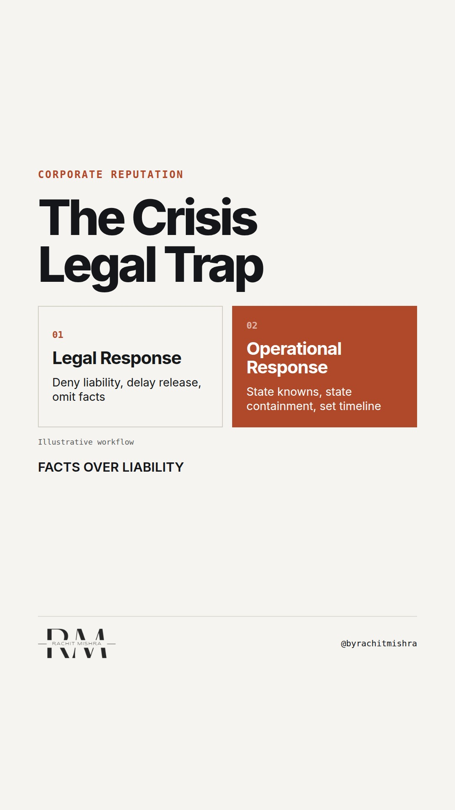

# crisiscommunicationmistakes

**REEL** · reputation · goes live **2026-09-24T17:00:00+05:30**

> Targeting: `crisis communication mistakes`
>
> Claim: In a corporate crisis, legal statements designed to minimize liability actively destroy trust by failing to disclose operational facts.
>
> Proof (practitioner_observation): Observed corporate crisis response sequences where legal counsel delays public disclosure to limit financial liability, resulting in regulator intervention and double-digit trust metrics decline before facts are established.

## Cover



## Reel script

`reel.mp4` has been generated from this script and will publish automatically. To use your own footage instead, replace that file and delete `.generated-reel` from this folder.

| Time | On screen | Voiceover | Direction |
|---|---|---|---|
| 0:00-0:03 | **Legal statements destroy trust in a crisis** | Legal statements destroy trust in a crisis when they prioritize liability over facts. | Dark background with plain bold white text displaying the opening claim. |
| 0:03-0:07 | **Lawyers write to minimize legal liability** | When an operational incident occurs, legal teams instinctively draft holding text to protect against litigation. | Text changes to highlight the tension between legal safety and operational transparency. |
| 0:07-0:12 | **Regulators and public demand facts** | But stakeholders do not evaluate liability. They evaluate whether you understand what broke inside your facility. | Text updates to show stakeholder expectations during an industrial incident. |
| 0:12-0:18 | **Four rules for crisis holding text** | To prevent crisis communication mistakes, run your holding statement through this four-part checklist before release. | Graphic transitions to a structured checklist layout. |
| 0:18-0:23 | **Silence is read as admission of fault** | If you withhold known physical facts while lawyers polish phrases, the public assumes the worst possible cause. | Graphic shows the contrast between legal drafting time and public narrative control. |
| 0:23-0:28 | **Facts build trust. Adjectives destroy it.** | Facts build trust. Adjectives destroy it. State what is verified, state what is unknown, and state when you return. | Final summary card displaying the named principle. |

## Caption — copy from here

```
Legal statements destroy trust in a crisis.

Most crisis communication mistakes start with legal delay. Counsel solves for litigation three years away. Communications solves for market reaction in thirty minutes.

In an industrial site incident, legal filler signals zero operational control.

Your first statement needs verified physical facts: site, time, containment step, and next update window.

Facts build trust. Adjectives destroy it.

Send this to the head of corporate affairs or legal counsel preparing your emergency response playbook.

[crisis communication mistakes, corporate communications, corporate reputation, crisis management, reputation risk]

#corporatecommunications #reputation #crisiscommunication
```

## Alt text

```
Text graphic listing four rules for corporate crisis response during industrial incidents.
```

## How this post could fail

Could sound like generic anti-lawyer complaining if it does not give a concrete operational rule for balancing legal holding text with public facts.
