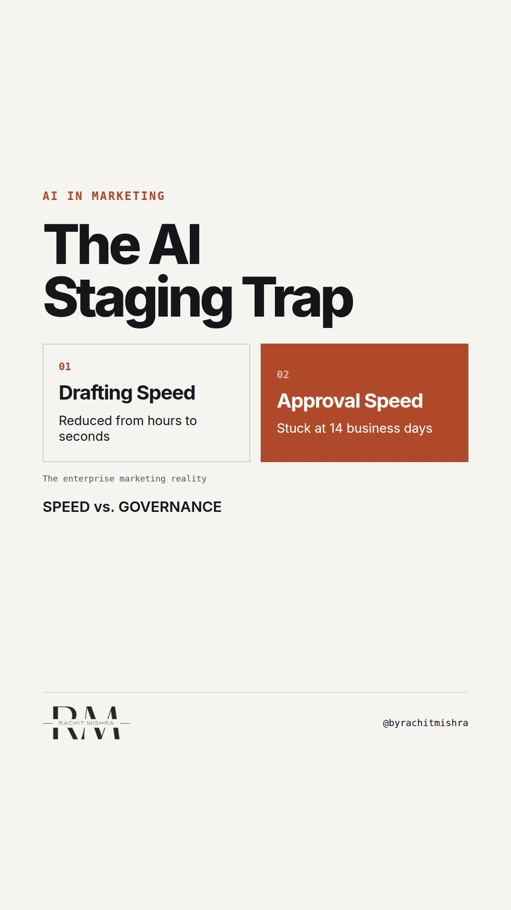

# aicontentbottleneck

**REEL** · ai_marketing · goes live **2026-09-22T19:00:00+05:30**

> Targeting: `AI adoption in a large company`
>
> Claim: Scaling content generation with AI without scaling approval capacity creates an operational bottleneck that slows down campaign launch velocity.
>
> Proof (framework): A three-part content staging review protocol designed to match draft output with existing compliance and legal team SLA capacities.

## Cover



## Reel script

`reel.mp4` has been generated from this script and will publish automatically. To use your own footage instead, replace that file and delete `.generated-reel` from this folder.

| Time | On screen | Voiceover | Direction |
|---|---|---|---|
| 0:00-0:03 | **AI drafts fast. Compliance approvals do not.** | AI drafts fast. Compliance approvals do not. That is the real bottleneck. | Clean, high-contrast text card on a dark industrial background. |
| 0:03-0:08 | **The content flood** | When an industrial firm deploys generative tools, draft volume spikes. But the review team remains the same size. | Diagram of a wide funnel narrowing sharply to a tiny pipe, representing review capacity. |
| 0:08-0:14 | **The compliance wall** | In heavily governed sectors, every line must pass legal, technical, and regulatory checks. Those teams do not use AI to read your drafts. | Close-up of a document with technical redlines and corrections. |
| 0:14-0:21 | **The operational drag** | Instead of launching faster, your campaign velocity drops because senior reviewers are wading through high-volume noise. | A calendar split-screen showing review cycles expanding from days to weeks. |
| 0:21-0:28 | **The 3-point queue test** | Before you scale production, run this content gate test with your legal and technical leads. | A checklist graphic appearing on screen item by item. |
| 0:28-0:35 | **Scale the bottleneck first** | If you do not scale your review capacity before you scale your writing, you are just building a faster way to wait. | Text card displaying the final portable principle. |

## Caption — copy from here

```
AI drafts fast. Compliance approvals do not.

This is the hardest lesson of AI adoption in a large company. In heavy industry, the cost of an incorrect claim is measured in regulatory audits and lost commercial trust. Draft speed was never your real operational bottleneck. Sign-off capacity is.

Adding generative tools to your marketing technology stack sounds like an easy win for productivity. But if you triple your output without changing your governance process, you just create a massive backlog for your technical reviewers.

Do not automate production until you have resourced the sign-off queue.

Send this to the lead currently managing your marketing technology stack.

[AI adoption in a large company, marketing technology stack, B2B marketing, marketing governance, enterprise AI]

#aimarketing #martech #b2bmarketing
```

## Alt text

```
Text card showing AI drafts fast compliance approvals do not over a dark background.
```

## How this post could fail

The post could read as too generic if it doesn't ground the compliance tension in the specific reality of technical and legal reviews common to industrial sectors.
