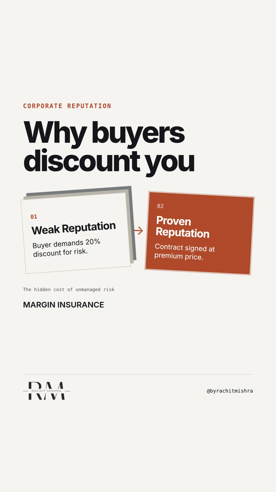

# reputationriskpricing

**REEL** · reputation · goes live **2026-09-23T08:30:00+05:30**

> Targeting: `corporate reputation management`
>
> Claim: Corporate reputation is a commercial risk pricing mechanism, not a sentiment metric.
>
> Proof (framework): A commercial risk framework that treats corporate reputation as an insurance premium. In industrial procurement, a buyer does not choose a vendor based on liking them; they discount vendors with weak reputations to cover the professional risk of the vendor failing.

## Cover



## Reel script

`reel.mp4` has been generated from this script and will publish automatically. To use your own footage instead, replace that file and delete `.generated-reel` from this folder.

| Time | On screen | Voiceover | Direction |
|---|---|---|---|
| 0:00-0:05 | **Reputation is just unpaid risk.** | Reputation is just unpaid risk. When you work in heavy industries like manufacturing, logistics, or infrastructure, people do not buy from you because they like your corporate reputation management efforts. | Rachit at his desk, speaking directly to camera. Hard cut to a close-up of a contract paper being signed. |
| 0:05-0:12 | **Procurement is risk management.** | Your buyer is a procurement committee. Their chief objective is not to find the most exciting partner. Their chief objective is not to get fired if a delivery fails or a regulator steps in. | Text overlays onto b-roll footage of a steel warehouse. The visual checklist of buyer risks appears on screen. |
| 0:12-0:20 | **Weak reputation is discounted.** | If your reputation is unproven or volatile, the buyer does not simply say no. They price that risk into their negotiation. They demand a steep discount to cover the professional exposure of choosing you. | Rachit back on screen, holding up a physical notebook to ground the explanation. |
| 0:20-0:28 | **Strong reputation is a premium.** | A strong corporate reputation is not about warm feelings. It is an insurance policy for the buyer. They pay your premium because it protects them from internal scrutiny. | Hard cut to a split screen showing two generic industrial bids side by side. |
| 0:28-0:36 | **The cost of anonymity is margin.** | When your technical capability is identical to your competitor's, reputation is the only variable that cannot be easily matched. Anonymity is simply a tax you pay on every deal. | Medium shot of Rachit talking directly to the camera, emphasizing the commercial trade-off. |
| 0:36-0:45 | **Reputation protects margins.** | Do not defend your communications budget with sentiment scores or media impressions. Show how reputation protects your margins in the final round of bidding. | Close-up of Rachit speaking with emphasis. Natural lighting. |

## Caption — copy from here

```
Reputation is just unpaid risk.

In industrial procurement, corporate reputation management is not an exercise in getting people to like you. Nobody on a heavy engineering or steel procurement committee is buying because of a warm sentiment score.

They are managing professional exposure.

When your brand has a weak or volatile reputation, the buying committee does not always walk away. Instead, they discount you. They demand a lower price to justify the internal career risk of choosing an unproven partner.

Your reputation is the insurance premium they pay to sleep at night.

Stop defending your communications budget with media impressions. Show how reputation protects margins when the commercial negotiation gets tough.

[corporate reputation management, corporate communications, b2b branding, risk mitigation, industrial marketing]

#corporatecommunications #reputation #publicrelations
```

## Alt text

```
Text on screen explaining why industrial buyers discount unproven vendors to manage internal risk.
```

## How this post could fail

It might read as too theoretical if the viewer does not work in high-value, long-cycle B2B environments where procurement committees exist.
