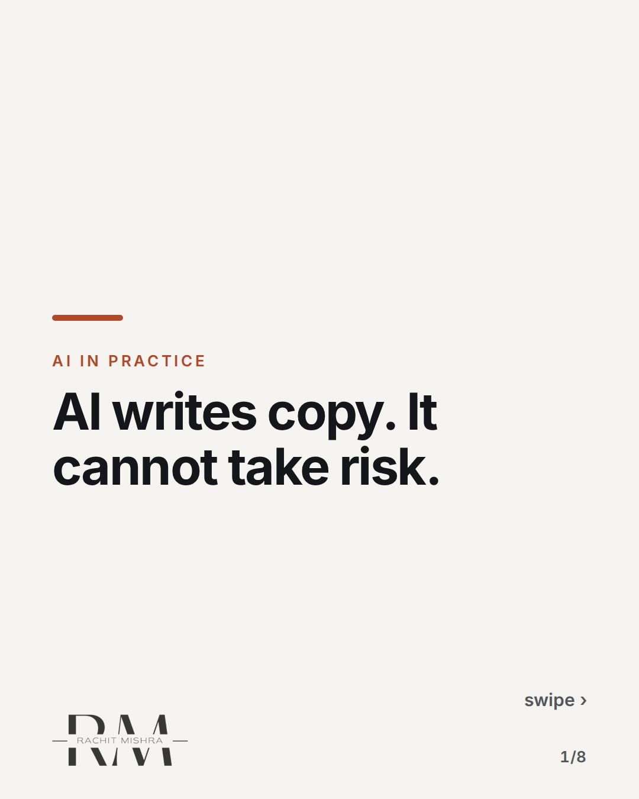
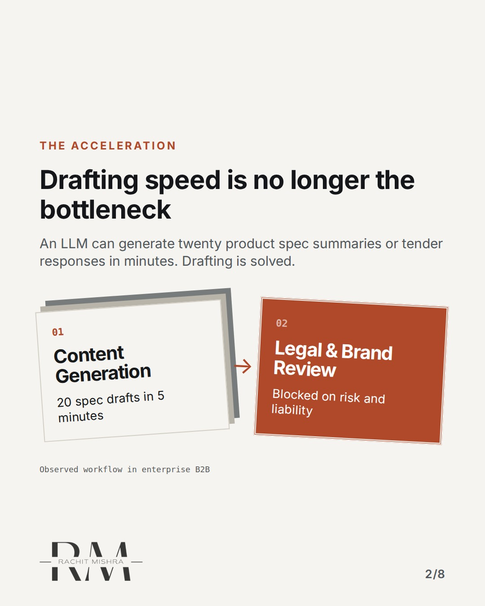
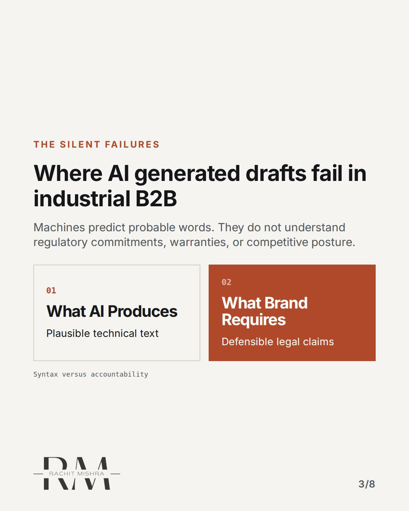
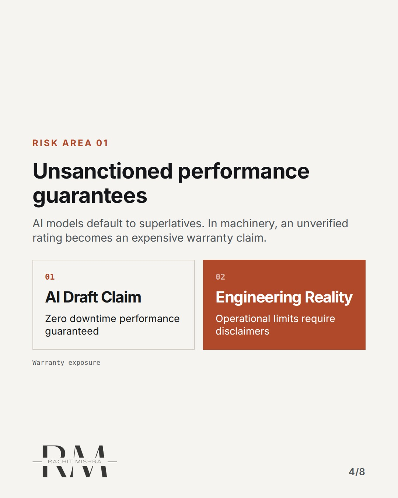
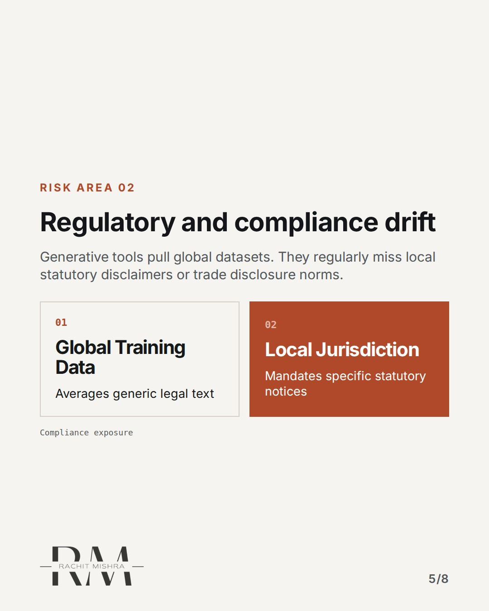
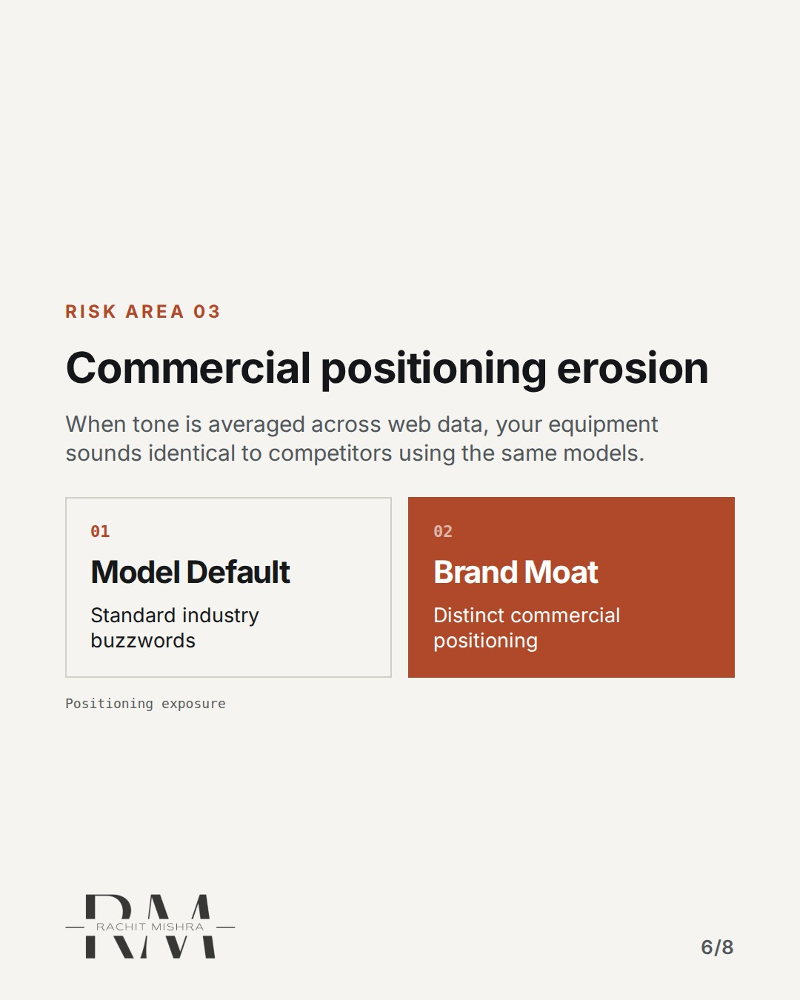
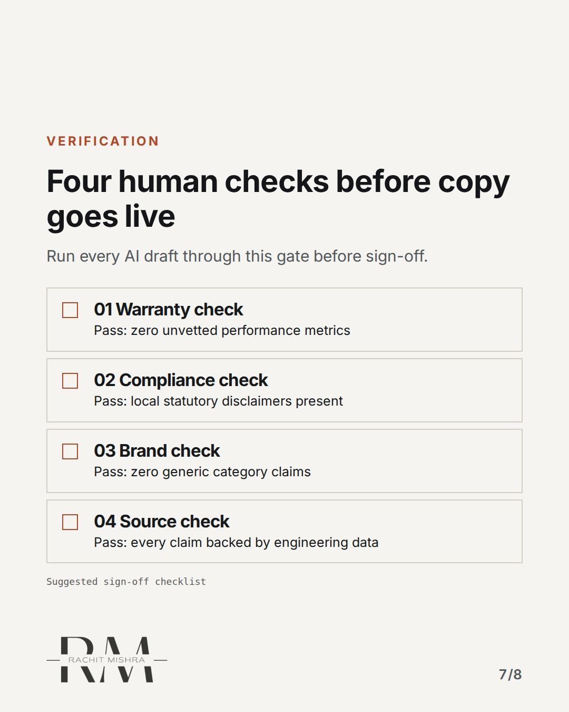
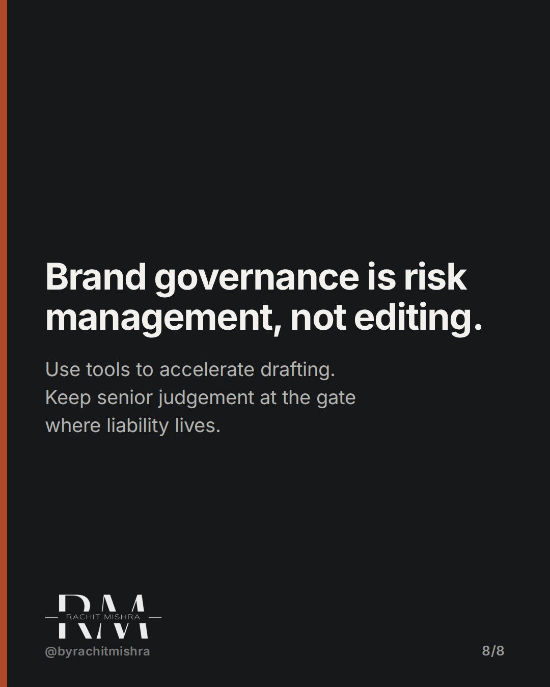

# what_ai_cannot_do_in_brand_work

**CAROUSEL** · ai_in_practice · goes live **2026-09-23T20:00:00+05:30**

> Targeting: `what AI cannot do in brand work`
>
> Claim: AI can draft industrial marketing collateral quickly, but human brand governance must handle commercial risk, statutory disclaimers, and legal liability.
>
> Proof (framework): A four-point verification gate for AI-assisted enterprise collateral designed to intercept unvetted performance claims and statutory omissions.

## Slides

8 rendered images sit in this folder — upload them in filename order.

**1.** 
### AI writes copy. It cannot take risk.



**2.** THE ACCELERATION
### Drafting speed is no longer the bottleneck
An LLM can generate twenty product spec summaries or tender responses in minutes. Drafting is solved.



**3.** THE SILENT FAILURES
### Where AI generated drafts fail in industrial B2B
Machines predict probable words. They do not understand regulatory commitments, warranties, or competitive posture.



**4.** RISK AREA 01
### Unsanctioned performance guarantees
AI models default to superlatives. In machinery, an unverified rating becomes an expensive warranty claim.



**5.** RISK AREA 02
### Regulatory and compliance drift
Generative tools pull global datasets. They regularly miss local statutory disclaimers or trade disclosure norms.



**6.** RISK AREA 03
### Commercial positioning erosion
When tone is averaged across web data, your equipment sounds identical to competitors using the same models.



**7.** VERIFICATION
### Four human checks before copy goes live
Run every AI draft through this gate before sign-off.



**8.** 
### Brand governance is risk management, not editing.
Use tools to accelerate drafting. Keep senior judgement at the gate where liability lives.



## Caption — copy from here

```
AI writes copy. It cannot take risk.

Understanding what AI cannot do in brand work protects industrial marketing teams from hidden legal exposure.

The operating mistake is treating LLMs like junior writers who just need better prompts. That misses where the risk lives.

A junior writer knows when they are uncertain. An LLM outputs thermal specs, payload limits, and statutory claims with equal confidence whether accurate or invented.

When generation speeds up tenfold, the bottleneck shifts to risk review. Ungoverned speed simply generates liability faster.

Efficiency is worthless if legal withdraws your spec sheet three weeks after launch.

Send this to whoever is setting up your team's AI guidelines this quarter.

[what ai cannot do in brand work, b2b marketing, enterprise ai adoption, brand governance]

#aimarketing #marketingoperations #aigovernance
```

## Alt text

```
Carousel showing what AI cannot do in brand work and a 4-point risk review gate.
```

## How this post could fail

Could be misread as anti-technology resistance if the distinction between generation speed and legal risk management is not sharply maintained.
