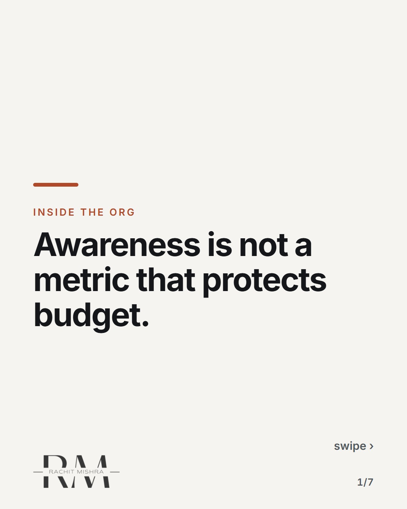
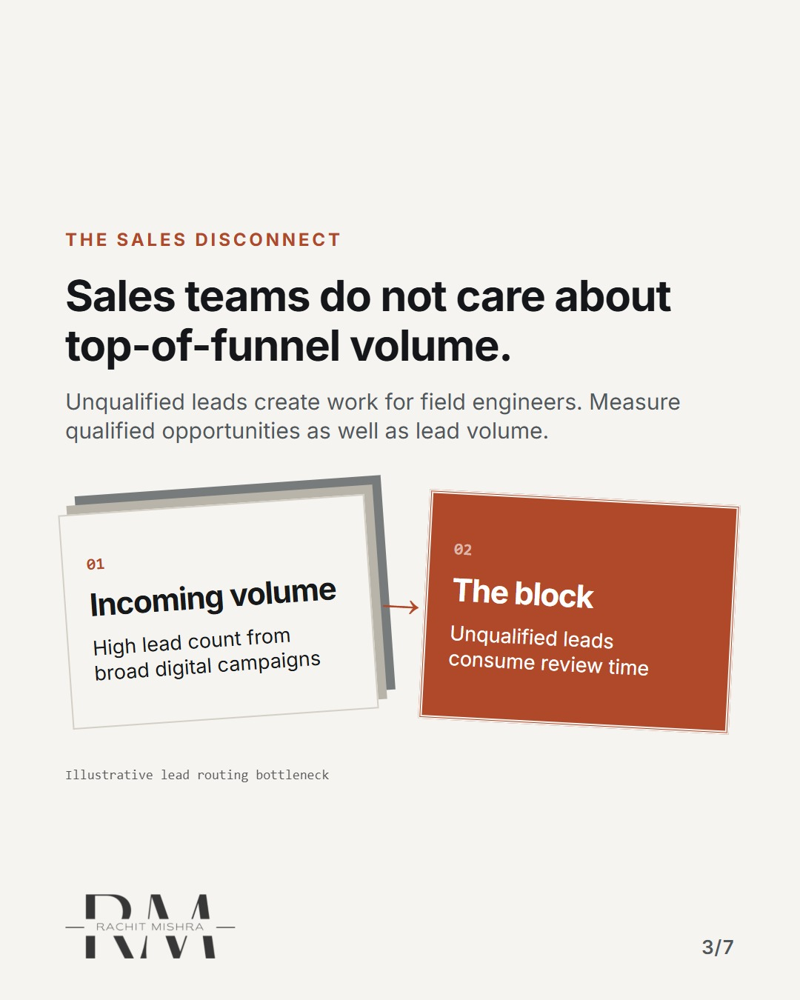
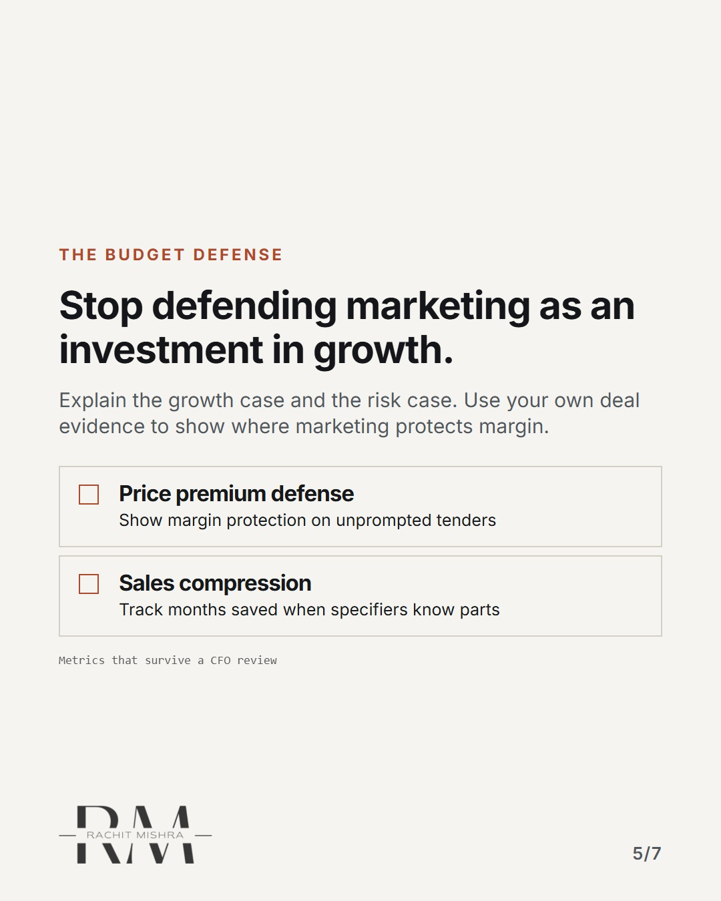
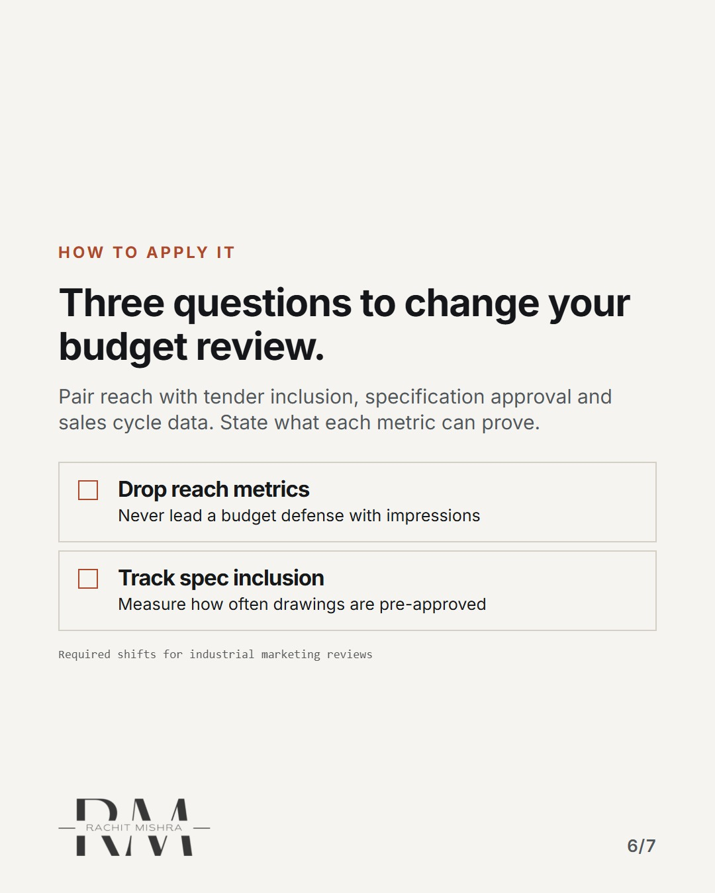
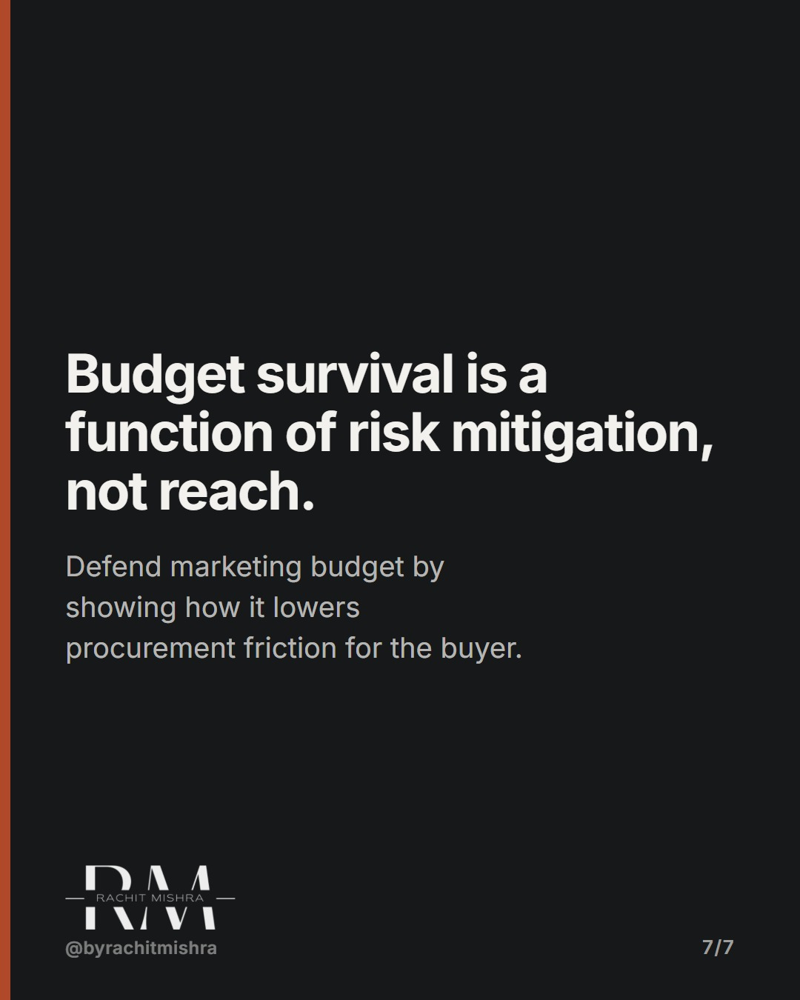

# defending a marketing budget

**CAROUSEL** · inside_the_org · goes live **2026-10-10T10:30:00+05:30**

> Targeting: `defending a marketing budget`
>
> Claim: You lose budget when you defend awareness because procurement and sales measure pipeline speed, not reach.
>
> Proof (practitioner_observation): Observed across industrial capital goods sales cycles where marketing requests are routinely cut during flat quarters because awareness metrics cannot be linked to tender movement.
>
> Rendered infographics: 5 — comparison, bottleneck, comparison, checklist, checklist

## Slides

7 rendered images sit in this folder — upload them in filename order.

**1.** 
### Awareness is not a metric that protects budget.



**2.** The finance translation
### Reach cannot be converted into cash flow on demand.
Connect awareness to commercial outcomes. Reach alone cannot explain cash flow or protect a budget.


**3.** The sales disconnect
### Sales teams do not care about top-of-funnel volume.
Unqualified leads create work for field engineers. Measure qualified opportunities as well as lead volume.



**4.** The pivot
### Tie your brand spend to procurement risk reduction.
Show how your work helps buyers assess compliance, delivery reliability and vendor risk.


**5.** The budget defense
### Stop defending marketing as an investment in growth.
Explain the growth case and the risk case. Use your own deal evidence to show where marketing protects margin.



**6.** How to apply it
### Three questions to change your budget review.
Pair reach with tender inclusion, specification approval and sales cycle data. State what each metric can prove.



**7.** 
### Budget survival is a function of risk mitigation, not reach.
Defend marketing budget by showing how it lowers procurement friction for the buyer.



## Caption — copy from here

```
Awareness is not a metric that protects budget.

Defending a marketing budget means connecting activity to commercial outcomes.

Most in-house marketers lose their allocation during lean quarters because they report impressions to a committee that only tracks working capital and tender conversion.

Use reach to explain exposure. Use deal and customer evidence to explain commercial impact.

Send this to whoever is defending the brand budget this quarter.

#marketingleadership #inhousemarketing #brandgovernance
```

## Alt text

```
Carousel slides explaining why awareness metrics fail to protect B2B marketing budgets.
```

## How this post could fail

Could be read as generic advice about proving ROI if readers do not connect it specifically to industrial procurement cycles.
