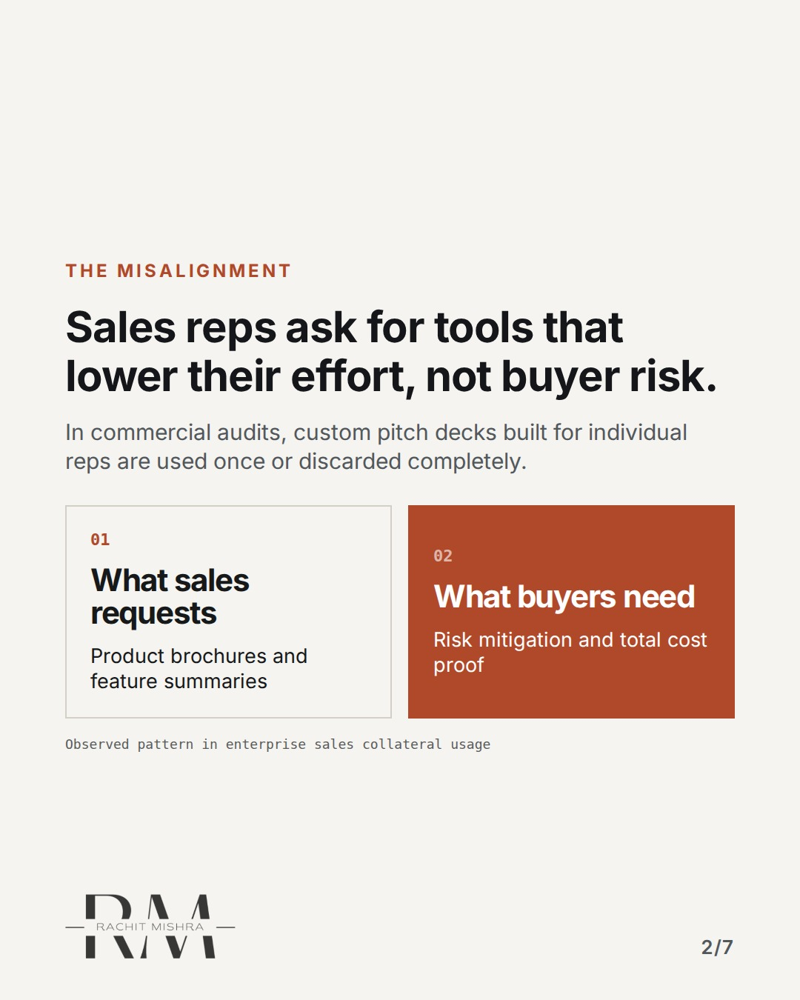
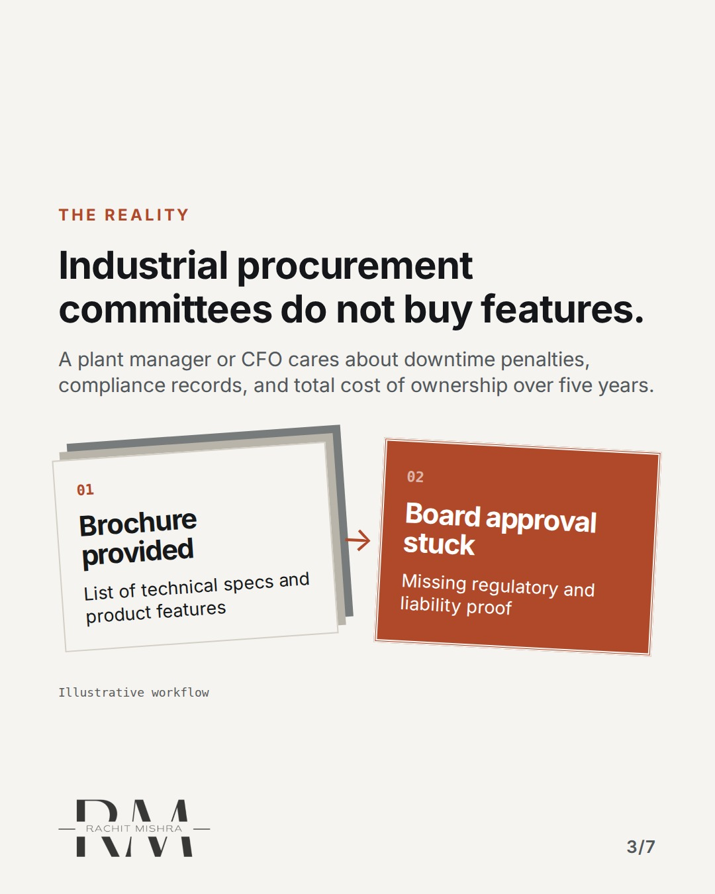
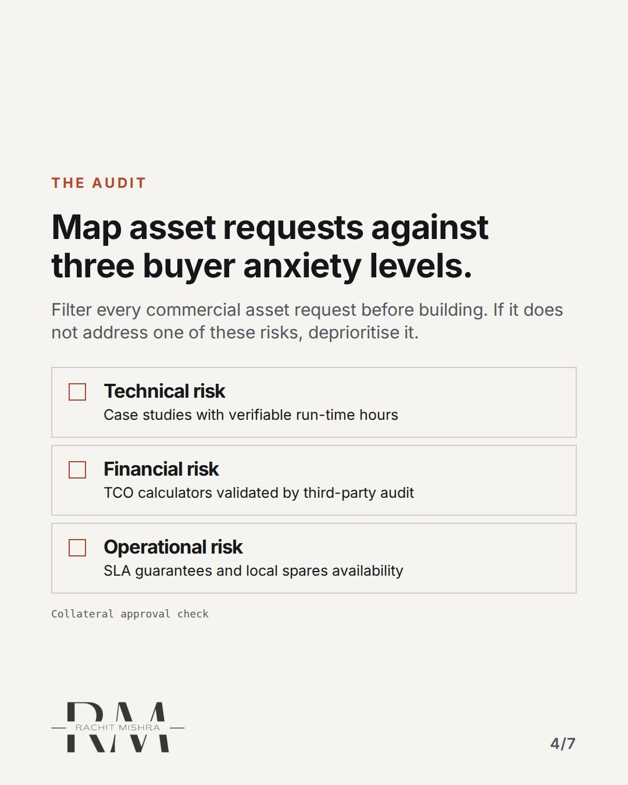
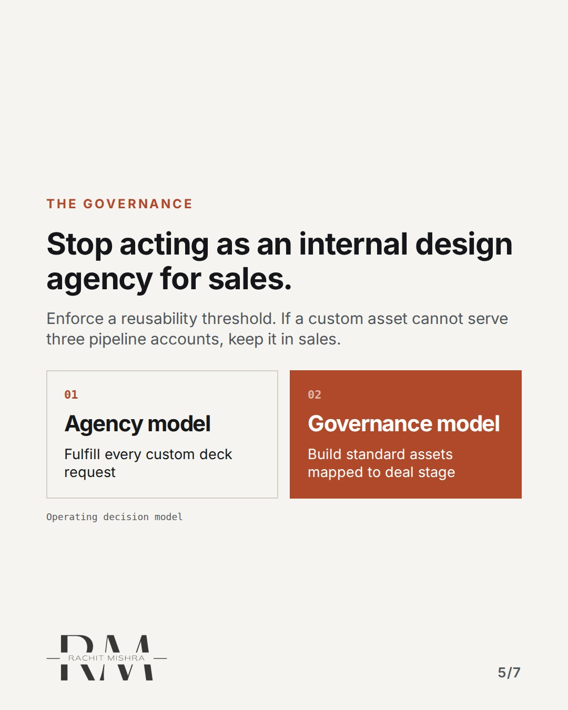
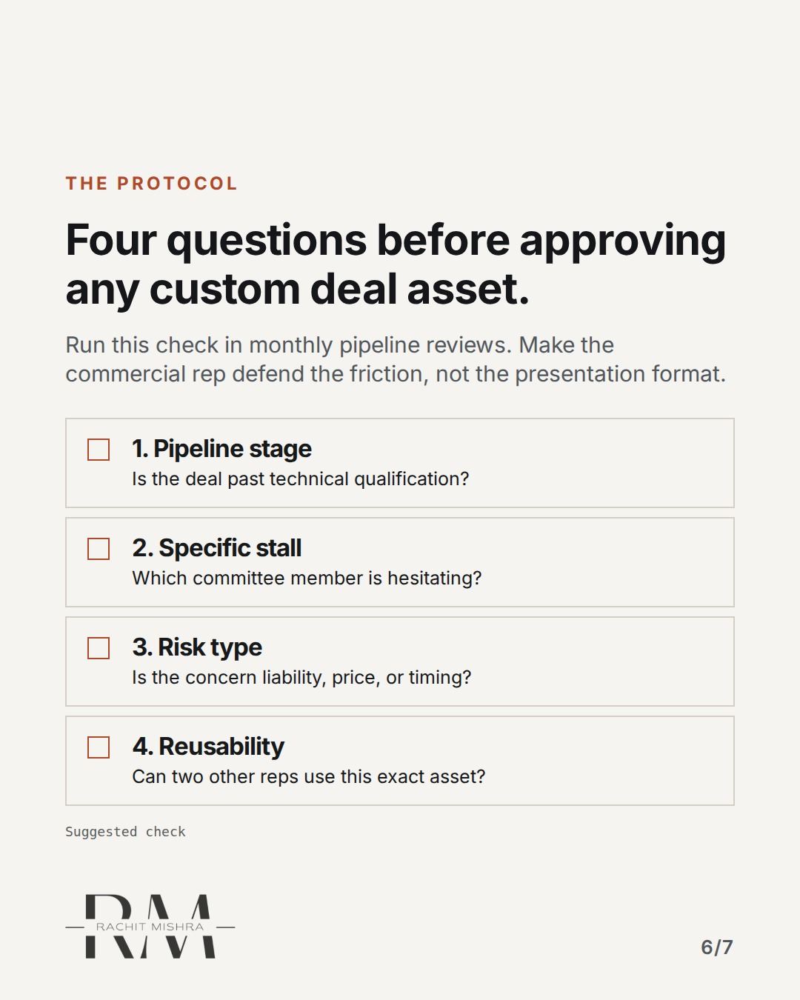

# salescollateralgovernance

**CAROUSEL** · inside_the_org · goes live **2026-10-11T10:30:00+05:30**

> Targeting: `working with sales as a marketer`
>
> Claim: Marketing collateral fails when designed to reduce sales effort instead of buyer risk.
>
> Proof (framework): A collateral governance protocol that audits sales asset requests against procurement risk levels rather than rep formatting preferences.
>
> Rendered infographics: 5 — comparison, bottleneck, checklist, comparison, checklist

## Slides

7 rendered images sit in this folder — upload them in filename order.

**1.** 
### Sales collateral almost never closes B2B deals.


**2.** THE MISALIGNMENT
### Sales reps ask for tools that lower their effort, not buyer risk.
In commercial audits, custom pitch decks built for individual reps are used once or discarded completely.



**3.** THE REALITY
### Industrial procurement committees do not buy features.
A plant manager or CFO cares about downtime penalties, compliance records, and total cost of ownership over five years.



**4.** THE AUDIT
### Map asset requests against three buyer anxiety levels.
Filter every commercial asset request before building. If it does not address one of these risks, deprioritise it.



**5.** THE GOVERNANCE
### Stop acting as an internal design agency for sales.
Enforce a reusability threshold. If a custom asset cannot serve three pipeline accounts, keep it in sales.



**6.** THE PROTOCOL
### Four questions before approving any custom deal asset.
Run this check in monthly pipeline reviews. Make the commercial rep defend the friction, not the presentation format.



**7.** 
### Marketing reduces buyer risk, not sales effort.
Send this to whoever is setting the commercial marketing roadmap this quarter.


## Caption — copy from here

```
Sales collateral almost never closes B2B deals.

Working with sales as a marketer starts with the buyer's unanswered questions.

When you ask a commercial head what marketing materials they need, they will usually ask for a fresh brochure or a custom deck for next week's meeting.

Most of those assets die in an inbox. They exist to make the rep feel prepared, not to help the buyer defend a purchase internally.

In heavy equipment and industrial supply, procurement committees care about liability, delivery schedules, and uptime guarantees. A product overview does not help a plant engineer justify your bid to their board.

If marketing functions as an internal design agency for commercial teams, you spend your budget on single-use slides and zero on positioning.

Your job is not to make sales reps feel comfortable in the meeting. It is to make your product easier to defend inside the buyer's organization.

Send this to whoever is setting the commercial marketing roadmap this quarter.

#marketingleadership #inhousemarketing #brandgovernance #cmo #b2bmarketing
```

## Alt text

```
Diagram showing sales collateral approval framework and buyer risk checklist.
```

## How this post could fail

It could be misinterpreted as anti-sales sentiment rather than a governance framework for marketing capacity.
