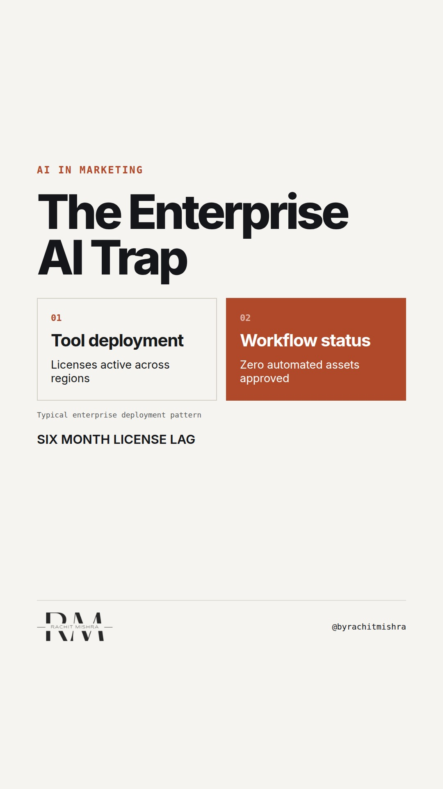

# ai_adoption_in_large_company

**REEL** · ai_marketing · goes live **2026-10-06T19:00:00+05:30**

> Targeting: `AI adoption in a large company`
>
> Claim: AI fails in enterprise marketing because teams buy tools before defining the governance bottleneck.
>
> Proof (practitioner_observation): Observed across multiple enterprise marketing transformations where software licenses outpaced workflow definition by six months, resulting in zero net change to output velocity.
>
> Rendered infographics: 4 — comparison, bottleneck, comparison, checklist
>
> Reel assets: image `ai_marketing-particles.jpg` · music `bed-something (10).mp3`

## Cover



## Reel script

`reel.mp4` has been generated from this script and will publish automatically. To use your own footage instead, replace that file and delete `.generated-reel` from this folder.

| Time | On screen | Voiceover | Direction |
|---|---|---|---|
| 0:00-0:03 | **Buy the tool. Argue later.** | Buy the tool. Argue later. That is how enterprise software deployments start. | Direct cut to text on screen, measured pace. |
| 0:03-0:08 | **The software is fast. The review is dead.** | The software produces assets in seconds. But the review queue still takes three weeks. | Pan slightly, maintaining neutral professional tone. |
| 0:08-0:14 | **Speed is not the bottleneck.** | Speed was never the bottleneck in a governed organisation. Risk was. | Direct address, no filler words. |
| 0:14-0:22 | **Three rules for AI adoption.** | If you lead AI adoption in a large company, stop buying licenses and run this three-step check. | Shift visual cue to framework checklist. |
| 0:22-0:32 | **Map review gates before buying.** | First, map every legal review gate. If it takes ten days, faster generation creates a backlog. | Focus on the first checklist item. |
| 0:32-0:40 | **AI reveals your broken processes.** | AI does not fix a broken approval chain. It just makes the queue twice as long. | Closing summary, steady delivery. |
| 0:40-0:45 | **Software without governance is noise.** | Software without governance is just expensive noise. | Final title card with named principle. |

## Caption — copy from here

```
Buy the tool. Argue later.

AI adoption in a large company stalls not because the models are weak, but because teams treat a governance problem as a procurement problem.

When you introduce generative tools without fixing the review gate, you do not increase output. You just increase the size of the digital dustbin waiting for legal review.

Software without governance is just expensive noise.

Send this to whoever is defending the new software budget this quarter.

#aimarketing #martech #b2bmarketing
```

## Alt text

```
Text overlay on a dark background showing enterprise AI workflow constraints and governance checks
```

## How this post could fail

Readers might view this as anti-technology rather than a critique of procurement sequencing.
