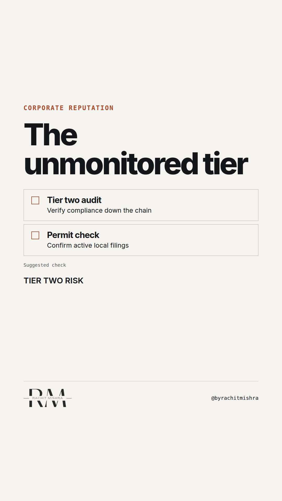

# corporate reputation audit checklist

**REEL** · reputation · goes live **2026-10-07T08:30:00+05:30**

> Targeting: `corporate reputation management`
>
> Claim: Corporate reputation is tested long before a crisis hits, during routine supplier onboarding where compliance checks fail due to administrative drift.
>
> Proof (practitioner_observation): Observed across multi-year industrial supply chains where regulatory clearance slips due to unmonitored sub-tier partner compliance, eroding stakeholder trust before any public incident occurs.
>
> Rendered infographics: 7 — checklist, bottleneck, comparison, checklist, checklist, comparison, bottleneck
>
> Reel assets: image `reputation-reflection.png` · music `bed-something (12).mp3`

## Cover



## Reel script

`reel.mp4` has been generated from this script and will publish automatically. To use your own footage instead, replace that file and delete `.generated-reel` from this folder.

| Time | On screen | Voiceover | Direction |
|---|---|---|---|
| 0:00-0:03 | **Reputation dies in procurement.** | Reputation dies in procurement long before any public crisis makes the front page. | Static shot of an industrial facility entrance with steady movement. |
| 0:03-0:08 | **The vendor nobody audited.** | The vulnerability is rarely the flagship plant. It is the sub-contractor two tiers down who skipped an environmental clearance. | Close up on documentation review. |
| 0:08-0:13 | **Run this four-point test.** | Effective corporate reputation management requires testing your supply chain before regulators do it for you. | Cut to clear text layout. |
| 0:13-0:18 | **Map every active sub-tier.** | Start by mapping every sub-contractor handling materials or waste inside your active project sites. | Showing data flow on screen. |
| 0:18-0:23 | **Verify physical records.** | Never rely on a checked box in a portal. Request the physical, stamped permit from the local authority. | Close up of folders being updated. |
| 0:23-0:28 | **Trust is operational.** | Corporate reputation is not a communications output. It is an operational audit trail. | Return to presenter. |

## Caption — copy from here

```
Reputation dies in procurement.

Corporate reputation management includes the checks behind every supplier approval.

Most industrial firms spend weeks polishing annual sustainability reports while leaving sub-tier supplier onboarding to manual spreadsheets. When a regulatory breach happens two levels down, the press release does not save the contract.

Trust is structural, not rhetorical.

Send this to whoever oversees vendor compliance and risk this quarter.

#corporatecommunications #reputation #publicrelations
```

## Alt text

```
Text overlay reading reputation dies in procurement with supply chain compliance audit checklist.
```

## How this post could fail

Could be dismissed as standard supply chain advice if the link between operational compliance and reputational fallout is not made explicit enough.
