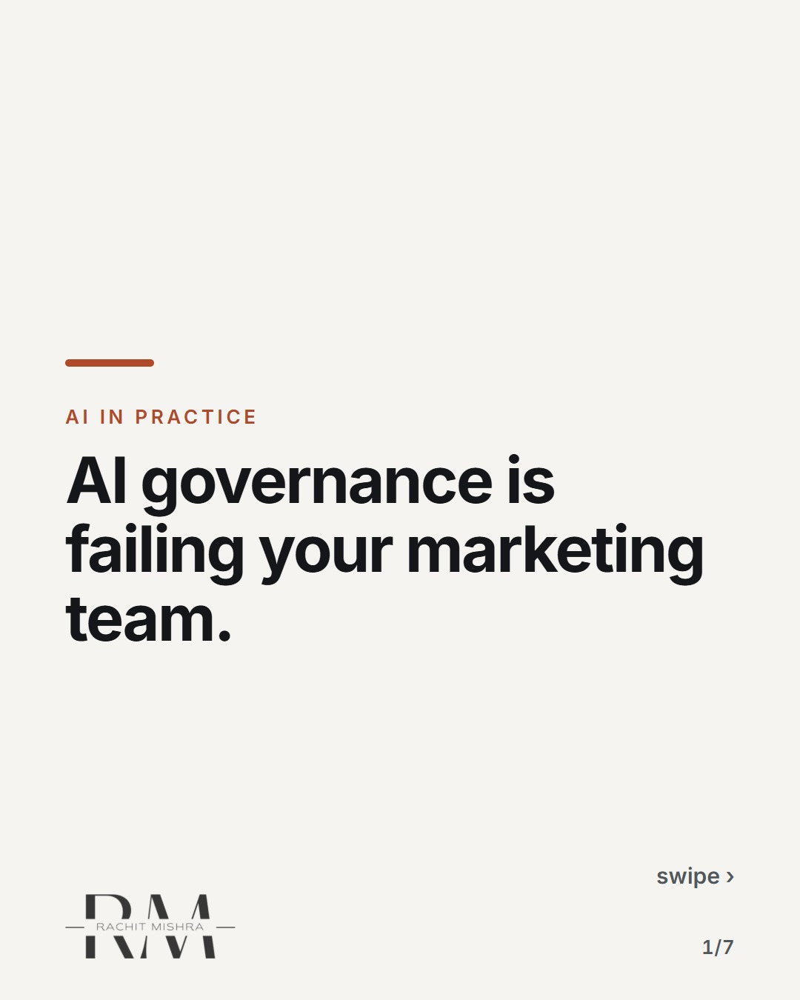
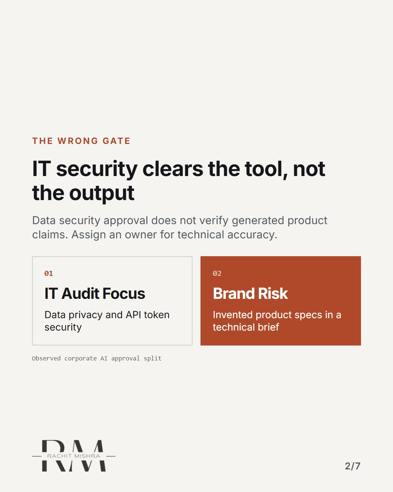
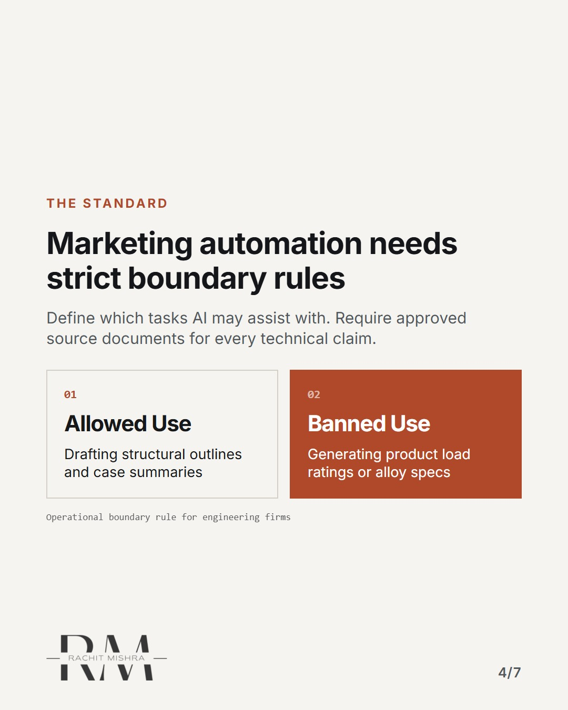
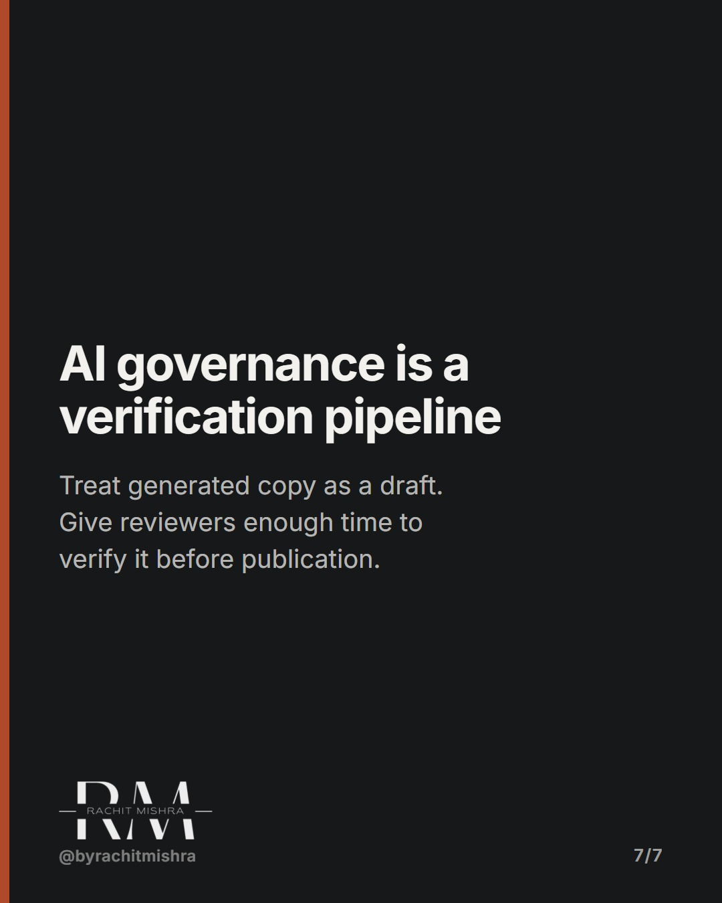

# aigovernanceformarketingteams

**CAROUSEL** · ai_in_practice · goes live **2026-10-07T20:00:00+05:30**

> Targeting: `AI governance for marketing teams`
>
> Claim: AI governance in industrial marketing fails because teams treat it as an IT security audit instead of a brand compliance protocol.
>
> Proof (practitioner_observation): Observed review cycles where enterprise IT cleared AI tools for data security, but left zero protocols for technical accuracy, regulatory claims, or specification drift in heavy industry collateral.
>
> Rendered infographics: 6 — comparison, bottleneck, comparison, checklist, bottleneck, checklist

## Slides

7 rendered images sit in this folder — upload them in filename order.

**1.** 
### AI governance is failing your marketing team.



**2.** The wrong gate
### IT security clears the tool, not the output
Data security approval does not verify generated product claims. Assign an owner for technical accuracy.



**3.** The hazard
### Speed hides specification drift
If draft volume exceeds review capacity, unverified specifications can reach publication. Limit the release rate.


**4.** The standard
### Marketing automation needs strict boundary rules
Define which tasks AI may assist with. Require approved source documents for every technical claim.



**5.** The protocol
### Two checks before any AI copy goes live
Check technical claims against approved documents, then check tone. Record who approved the final draft.


**6.** The threshold
### Governance is a queueing problem
Match publication volume to the time available for technical review. Keep unverified drafts out of the release queue.


**7.** The principle
### AI governance is a verification pipeline
Treat generated copy as a draft. Give reviewers enough time to verify it before publication.



## Caption — copy from here

```
AI governance is failing your marketing team.

AI governance for marketing teams needs an owner for technical accuracy.

Most enterprises treat AI risk as an IT issue. They worry about data privacy while their teams use marketing automation to generate unverified technical specifications for heavy machinery.

When a consumer brand hallucinates a feature, customer support handles it. When an industrial brand hallucinates a load rating, a procurement committee walks away permanently.

Set the boundary rules before you scale the output.

Send this to whoever is defending AI content standards this quarter.

#aimarketing #martech #aigovernance
```

## Alt text

```
Carousel on why AI governance fails when treated as an IT security audit.
```

## How this post could fail

Could be read as generic anti-AI commentary if the distinction between consumer hallucination and industrial liability is not sharp enough.
