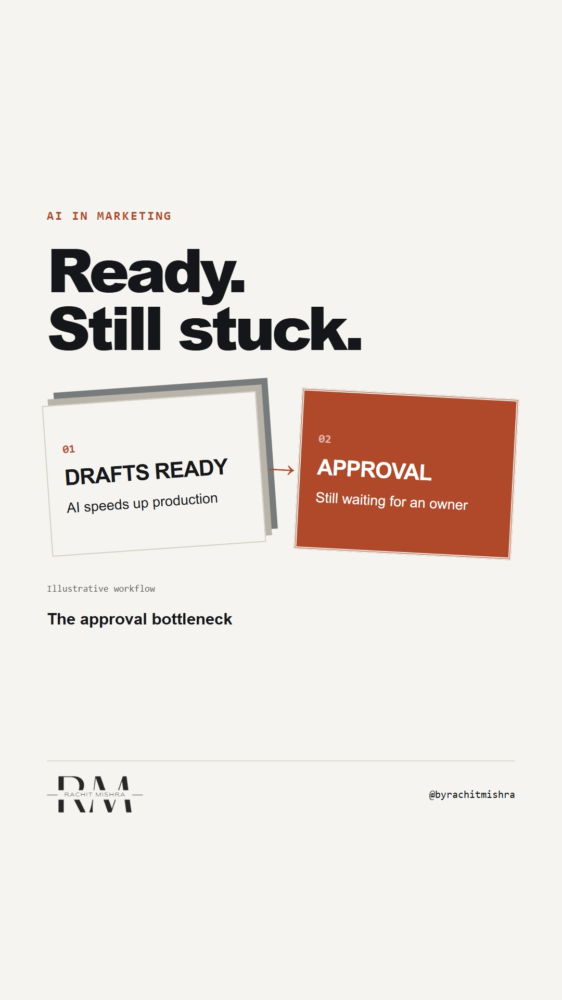

# ai_approval_queue

**REEL** · ai_marketing · goes live **2026-09-16T19:00:00+05:30**

> Targeting: `AI governance`
>
> Claim: Drafting faster cannot remove an approval queue without clear ownership.
>
> Proof (framework): Track drafting and waiting separately; assign an approver, source and escalation route before drafting.

## Cover



## Reel script

`reel.mp4` has been generated from this script and will publish automatically. To use your own footage instead, replace that file and delete `.generated-reel` from this folder.

| Time | On screen | Voiceover | Direction |
|---|---|---|---|
| 0:00-0:05 | **AI drafts faster. Approval still waits.** | AI drafts faster. Approval still waits. | Rendered text and workflow illustration. |
| 0:05-0:10 | **Measure drafting and waiting separately.** | Measure drafting and waiting separately. | Rendered text and workflow illustration. |
| 0:10-0:15 | **A reviewer needs more than clean copy.** | A reviewer needs more than clean copy. | Rendered text and workflow illustration. |
| 0:15-0:20 | **Give every claim a source and an owner.** | Give every claim a source and an owner. | Rendered text and workflow illustration. |
| 0:20-0:25 | **Agree the approval checks before drafting.** | Agree the approval checks before drafting. | Rendered text and workflow illustration. |
| 0:25-0:30 | **Own the queue before scaling the output.** | Own the queue before scaling the output. | Rendered text and workflow illustration. |

## Caption — copy from here

```
AI drafts faster. Approval still waits.

AI governance starts before the copy arrives.

A reviewer who must find the source and locate the decision owner is doing work the brief left unfinished.

Separate drafting time from waiting time. Then agree an approver and escalation route before the next brief.

Extra review can be necessary. An ownerless queue is a different problem.

Send this to whoever owns your content approvals.

[ai governance, enterprise marketing, content approval]

#aigovernance #aimarketing #marketingoperations
```

## Alt text

```
Draft cards waiting at an approval gate; a Reel about AI governance.
```

## How this post could fail

A simplified workflow cannot diagnose a real team's delay; measure it before changing review.
