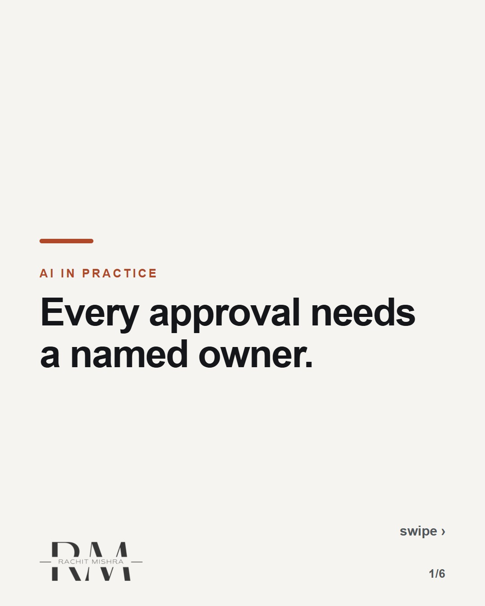
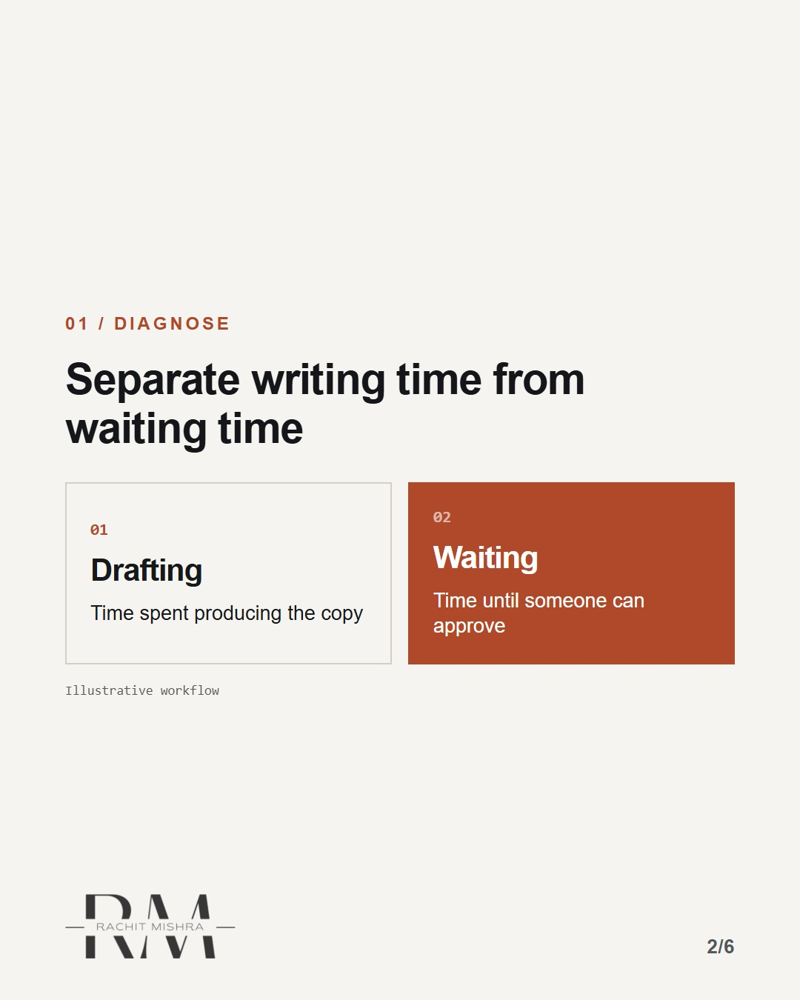
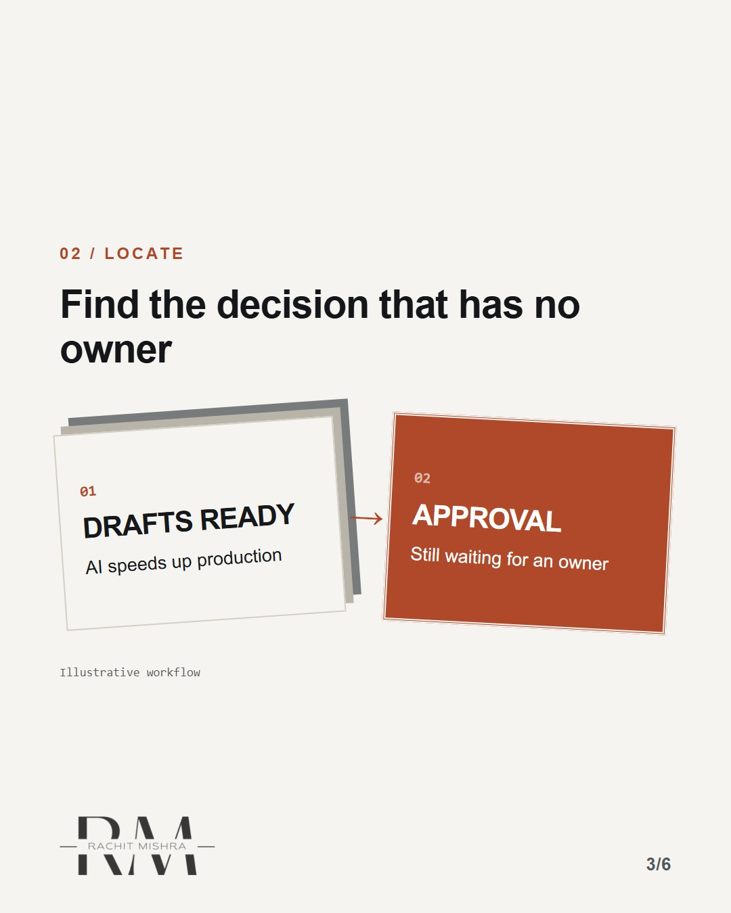
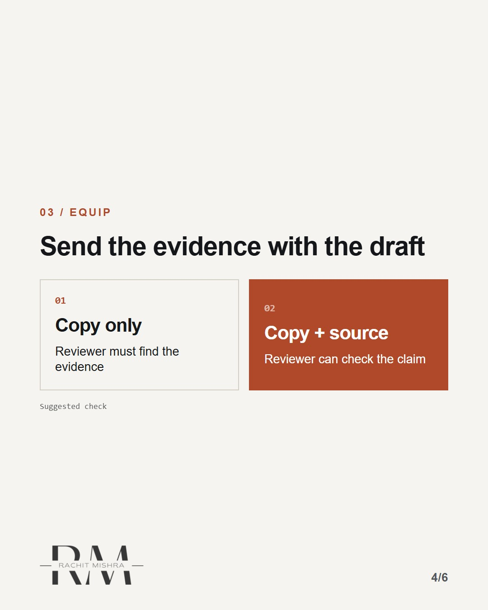
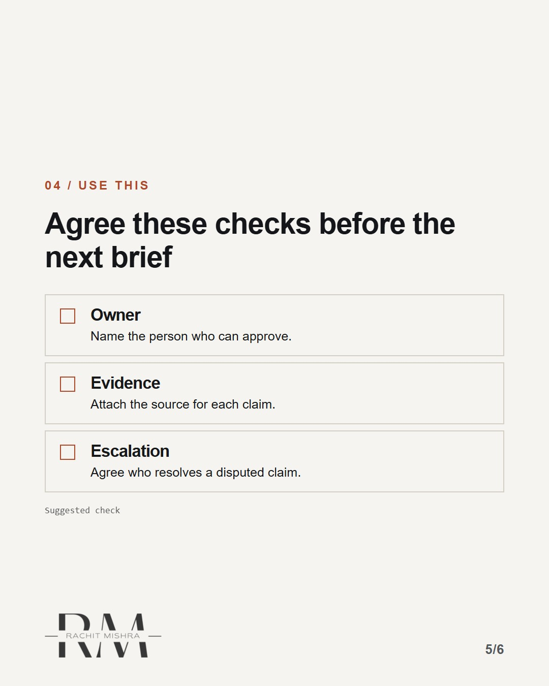
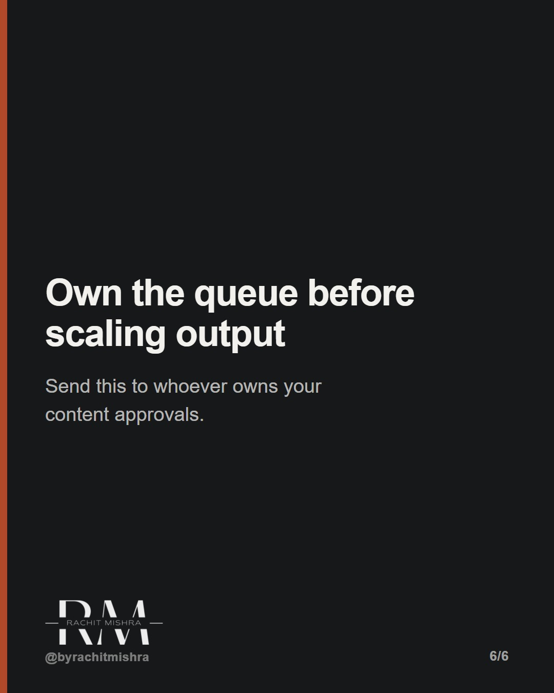

# approval_owner_checklist

**CAROUSEL** · ai_in_practice · goes live **2026-09-18T10:00:00+05:30**

> Targeting: `AI governance`
>
> Claim: Drafting faster cannot remove an approval queue without clear ownership.
>
> Proof (framework): Track drafting and waiting separately; assign an approver, source and escalation route before drafting.

## Slides

6 rendered images sit in this folder — upload them in filename order.

**1.** 
### Every approval needs a named owner.



**2.** 01 / Diagnose
### Separate writing time from waiting time



**3.** 02 / Locate
### Find the decision that has no owner



**4.** 03 / Equip
### Send the evidence with the draft



**5.** 04 / Use this
### Agree these checks before the next brief



**6.** 
### Own the queue before scaling output
Send this to whoever owns your content approvals.



## Caption — copy from here

```
Every approval needs a named owner.

AI governance starts before the copy arrives.

A reviewer who must find the source and locate the decision owner is doing work the brief left unfinished.

Separate drafting time from waiting time. Then agree an approver and escalation route before the next brief.

Extra review can be necessary. An ownerless queue is a different problem.

Send this to whoever owns your content approvals.

[ai governance, enterprise marketing, content approval]

#aigovernance #aimarketing #marketingoperations
```

## Alt text

```
Six slides with an AI governance workflow and an approval checklist.
```

## How this post could fail

A simplified workflow cannot diagnose a real team's delay; measure it before changing review.
