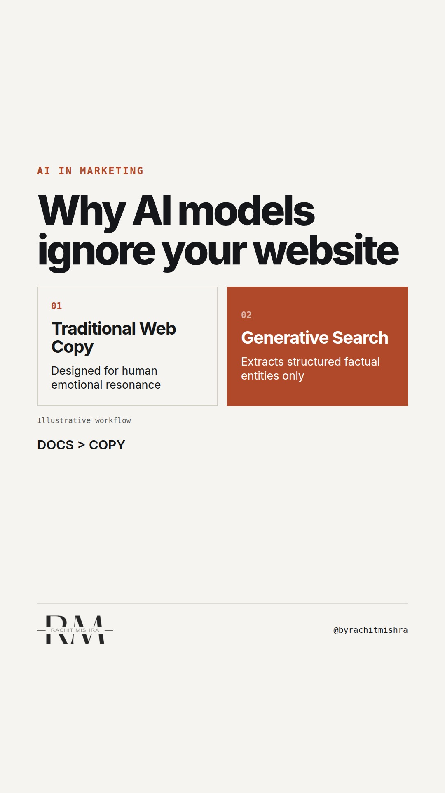

# generative_engine_optimization_b2b

**REEL** · ai_marketing · goes live **2026-10-09T08:30:00+05:30**

> Targeting: `generative engine optimisation for B2B`
>
> Claim: AI search engines evaluate corporate websites on verifiable claims and structured documentation, not marketing copy.
>
> Proof (framework): A three-part audit checklist for corporate sites to pass generative engine optimization (GEO) evaluation.
>
> Rendered infographics: 3 — comparison, comparison, checklist
>
> Reel assets: image `ai_marketing-particles.jpg` · music `bed-something (13).mp3`

## Cover



## Reel script

`reel.mp4` has been generated from this script and will publish automatically. To use your own footage instead, replace that file and delete `.generated-reel` from this folder.

| Time | On screen | Voiceover | Direction |
|---|---|---|---|
| 0:00-0:04 | **AI search does not read your marketing copy.** | AI search does not read your marketing copy. When an enterprise buyer uses AI to research suppliers, the model skips your polished positioning. |  |
| 0:04-0:08 | **LLMs look for verifiable technical facts.** | Generative engine optimisation for B2B works on a different rule. LLMs look for verifiable technical facts, structured data, and third-party validation. |  |
| 0:08-0:14 | **Adjectives get discarded as noise.** | If your site relies on words like reliable, scalable, or market-leading, the parser discards them as noise. | Text display overlay showing data extraction process. |
| 0:14-0:20 | **Three things determine your AI visibility.** | To rank inside generated responses, your technical documentation needs three specific structures. |  |
| 0:20-0:28 | **The GEO B2B Site Checklist** | First, clear metric citations. Second, public API and spec sheets. Third, machine-readable Schema markup for product specs. | Display of explicit audit checklist. |
| 0:28-0:35 | **Clarity for machines beats persuasive prose.** | In B2B purchasing, clarity for machines beats persuasive prose every single time. |  |

## Caption — copy from here

```
AI search does not read your marketing copy.

Generative engine optimisation for B2B requires an entirely different technical setup than traditional web publishing.

When an AI system evaluates your industrial offering against a competitor, it strips away brand adjectives. It looks for entity clarity, un-gated technical documentation, and structured JSON-LD specifications.

If your website relies on high-level assertions rather than verifiable technical parameters, you do not exist in the generated summary.

Marketing copy targets human perception. Machine retrieval requires structured evidence.

Send this to the team managing your website architecture and search strategy.

[generative engine optimisation for b2b, ai in marketing, enterprise martech, b2b search, technical seo]

#aimarketing #martech #b2bmarketing
```

## Alt text

```
Text graphic listing three technical checks for B2B website optimisation for AI search engines.
```

## How this post could fail

Could be misconstrued as general SEO advice if the emphasis on B2B technical documentation and AI parser behavior is not clear.
