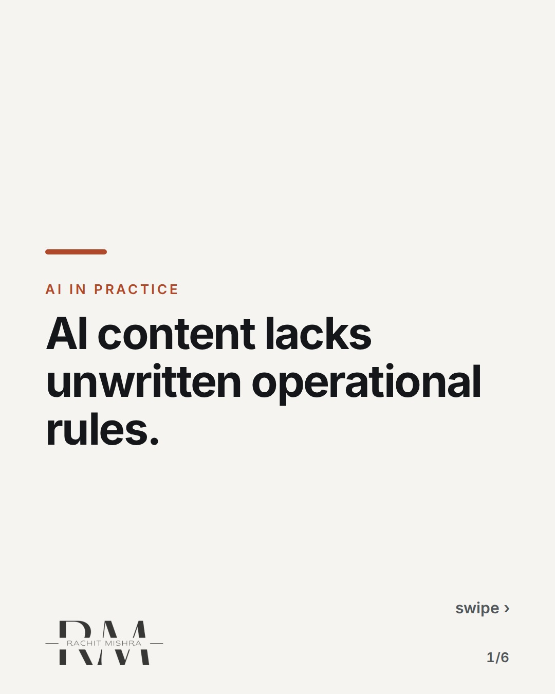
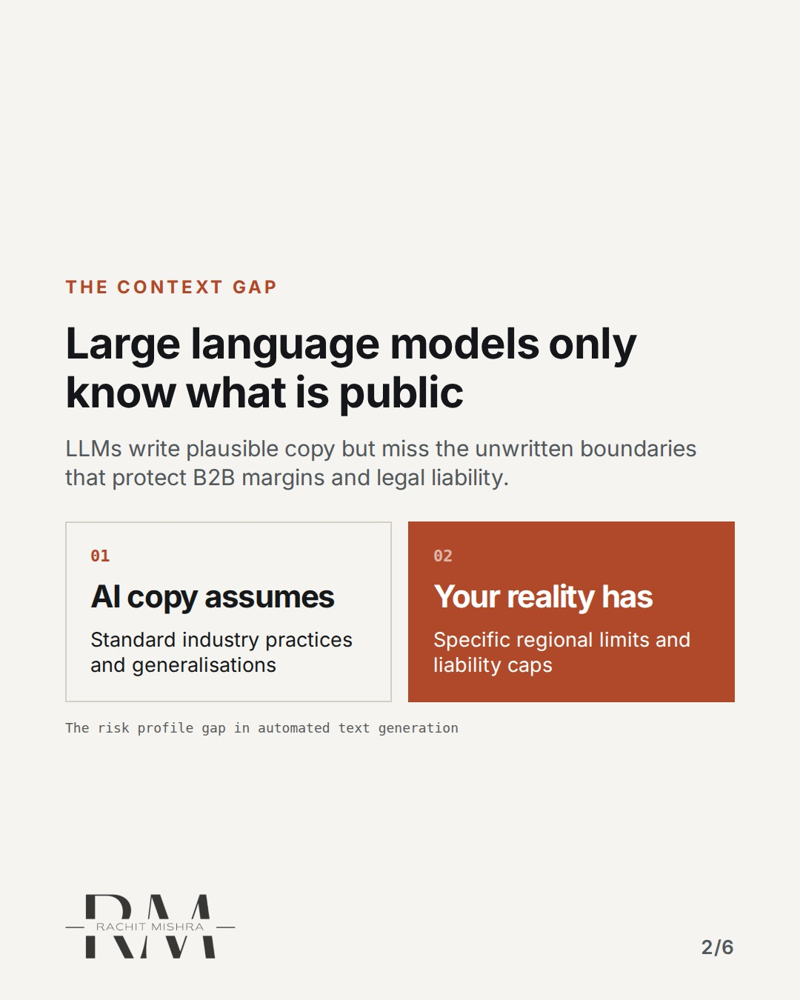
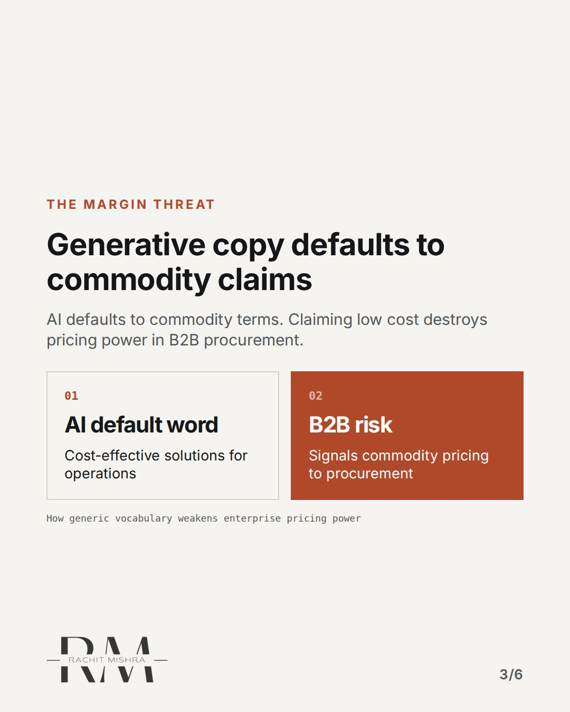
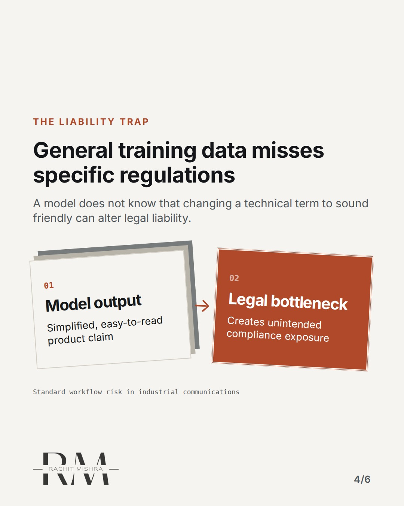
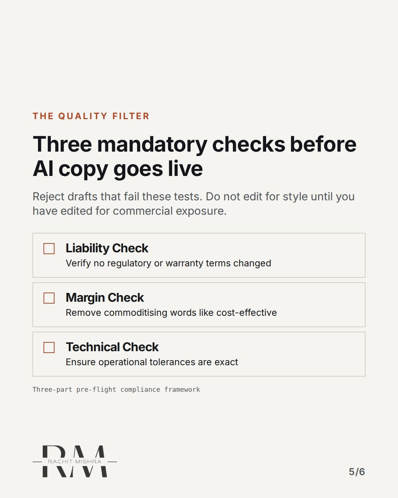
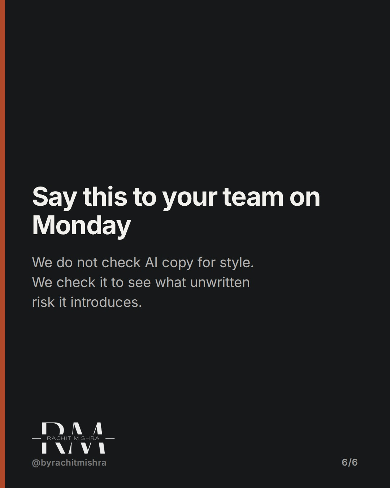

# checksbeforeaicopygoeslive

**CAROUSEL** · ai_in_practice · goes live **2026-10-09T19:00:00+05:30**

> Targeting: `checks before AI copy goes live`
>
> Claim: AI-generated text fails in industrial sectors because it misses the unwritten operating constraints that protect B2B margins and corporate reputation.
>
> Proof (framework): A three-part compliance framework designed to catch regulatory, liability, and positioning errors in AI-generated copy before publication.
>
> Rendered infographics: 5 — comparison, comparison, bottleneck, checklist, checklist

## Slides

6 rendered images sit in this folder — upload them in filename order.

**1.** 
### AI content lacks unwritten operational rules.



**2.** The Context Gap
### Large language models only know what is public
LLMs write plausible copy but miss the unwritten boundaries that protect B2B margins and legal liability.



**3.** The Margin Threat
### Generative copy defaults to commodity claims
AI defaults to commodity terms. Claiming low cost destroys pricing power in B2B procurement.



**4.** The Liability Trap
### General training data misses specific regulations
A model does not know that changing a technical term to sound friendly can alter legal liability.



**5.** The Quality Filter
### Three mandatory checks before AI copy goes live
Reject drafts that fail these tests. Do not edit for style until you have edited for commercial exposure.



**6.** The Next Meeting
### Say this to your team on Monday
We do not check AI copy for style. We check it to see what unwritten risk it introduces.



## Caption — copy from here

```
AI content lacks unwritten operational rules.

Most tools focus on checks before AI copy goes live that look at grammar or tone. But in B2B heavy industry, those are the wrong metrics.

An LLM can write beautifully about logistics, steel, or infrastructure. What it cannot do is know the unwritten commercial parameters of your business.

It does not know that calling a service "cost-effective" gives away your pricing power in a procurement committee.

It does not know that simplifying technical specifications to sound friendly can alter the legal boundaries of your product warranty.

Governance is not about making copy sound human. It is about protecting the margin.

Send this to whoever is setting up your marketing automation workflow this quarter.

[checks before AI copy goes live, AI governance, B2B branding, industrial marketing]

#aigovernance #b2bmarketing #marketingoperations
```

## Alt text

```
Compliance checks required before AI copy goes live in industrial B2B marketing.
```

## How this post could fail

If the checklist feels like generic editing advice rather than high-stakes commercial risk management, the post will lose its senior B2B relevance.
