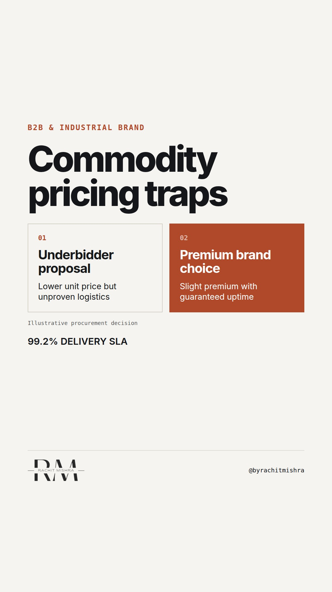

# commoditybrandpremium

**REEL** · b2b_brand · goes live **2026-10-05T08:30:00+05:30**

> Targeting: `how to brand a commodity product`
>
> Claim: Industrial brand premium is built by standardizing operational reliability to lower the buyer's internal risk, not by messaging.
>
> Proof (practitioner_observation): Observed commercial negotiations in cement and bulk chemicals where the brand premium was calculated as a discount against the transaction costs of switching suppliers, not product features.
>
> Rendered infographics: 3 — comparison, bottleneck, checklist
>
> Reel assets: image `b2b_brand-steel-grid.png` · music `bed-something (1).mp3`

## Cover



## Reel script

`reel.mp4` has been generated from this script and will publish automatically. To use your own footage instead, replace that file and delete `.generated-reel` from this folder.

| Time | On screen | Voiceover | Direction |
|---|---|---|---|
| 0:00-0:03 | **Buyers do not pay more for better messaging.** | Buyers do not pay more for better messaging. When you sell a commodity, your brand is not an emotional choice. | Rachit at his desk, speaking directly to camera. |
| 0:03-0:09 | **They pay more to avoid an internal crisis.** | They pay a premium to protect their own operations. Your value is not what your product does; it is what happens if it fails to show up. | Graphic transition displaying a bottleneck breakdown. |
| 0:09-0:15 | **Your real competitor is the buyer's anxiety.** | In industrial procurement, the person who signs your contract has to defend that decision to their own board if something goes wrong. | Transition back to Rachit speaking. |
| 0:15-0:22 | **Run the friction check.** | To build a premium, stop looking at your competitors' ads. Run this friction check on your delivery pipeline instead. | Graphic overlay of a checklist. |
| 0:22-0:30 | **Premium is operational security.** | When your delivery, support, and compliance are consistently predictable, you remove their personal risk. That is why they pay more. | Rachit speaking to camera. |
| 0:30-0:35 | **Brand is risk reduction.** | Brand in B2B is not about making people feel good. It is the cost of buying insurance against operational failure. | Final tight crop on Rachit. |

## Caption — copy from here

```
Buyers do not pay more for better messaging.

When figuring out how to brand a commodity product, many industrial businesses reach for the consumer playbook. They try to find an emotional narrative for steel, bulk chemicals, or logistics.

Your buyer does not care about your narrative. They care about keeping their line running. 

The brand premium in heavy industry is actually a risk discount. The procurement committee is not paying extra because they like your brand guidelines. They are paying extra because your operational predictability protects them from internal blame.

If you want to charge a premium, standardize your operations until your reliability is a bankable asset. 

Marketing gives that operational reality a voice. It cannot replace it.

Send this to whoever is defending your pricing strategy in the commercial review this week.

[how to brand a commodity product, industrial marketing, b2b brand strategy, manufacturing, pricing power]

#b2bmarketing #industrialmarketing #b2bbranding
```

## Alt text

```
Split screen comparing a cheap unproven supplier with a premium reliable brand choice.
```

## How this post could fail

If the viewer expects a creative copywriting hack, they might find the focus on operational SLAs boring, but this is the reality of B2B procurement.
