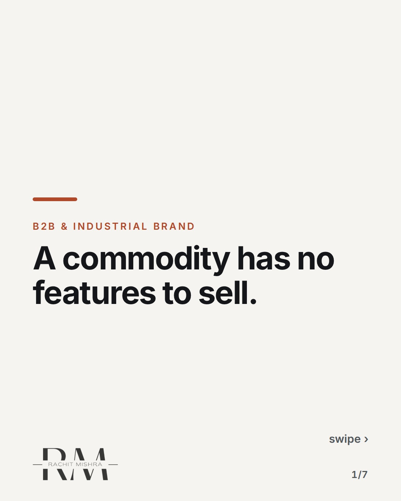
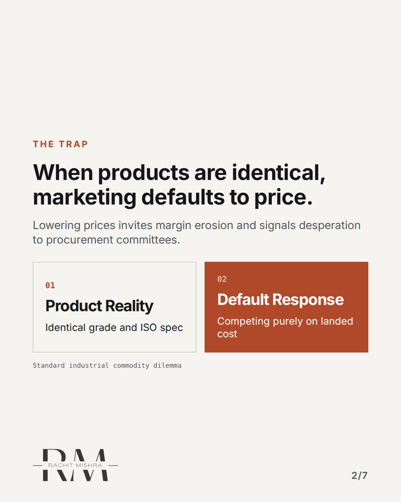
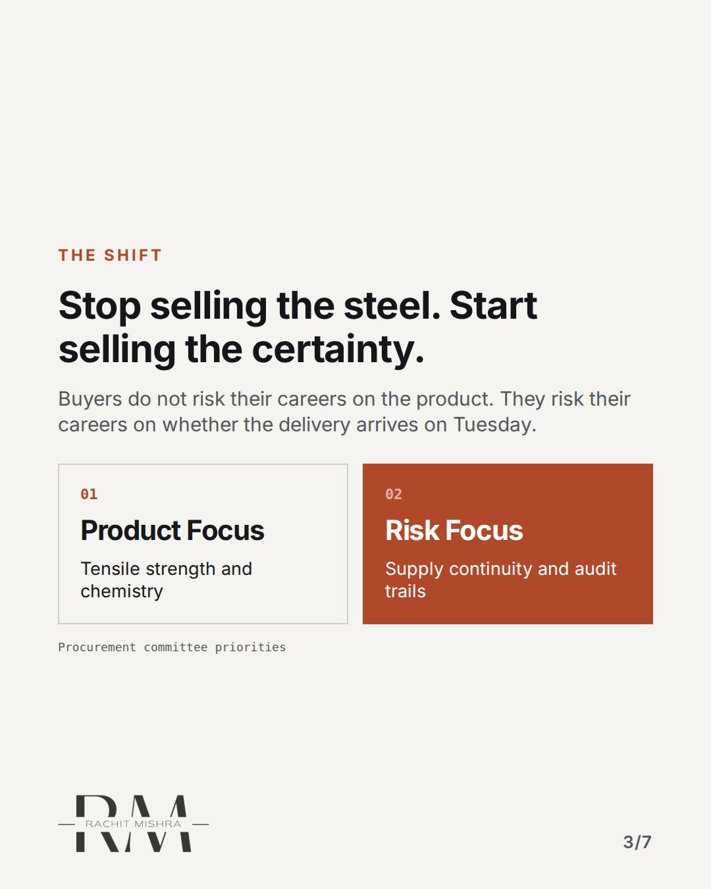
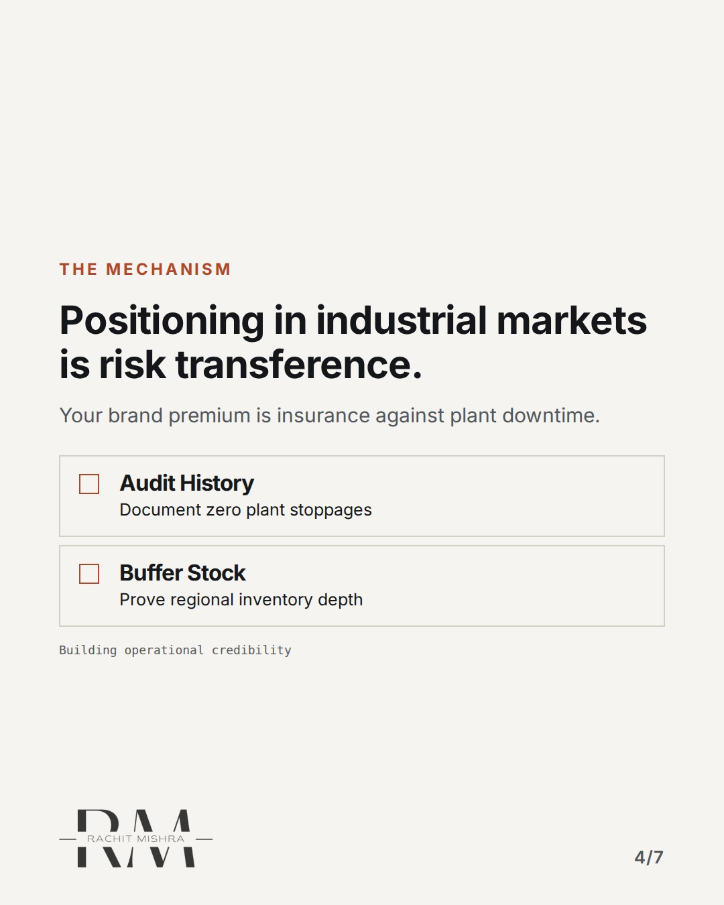
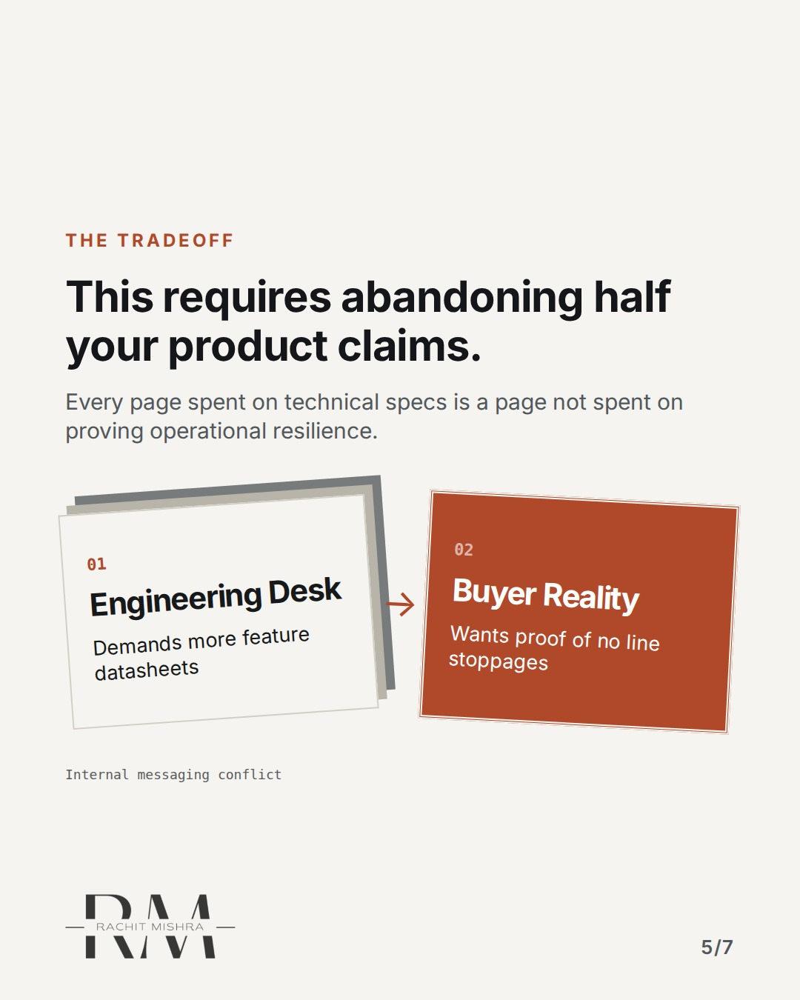
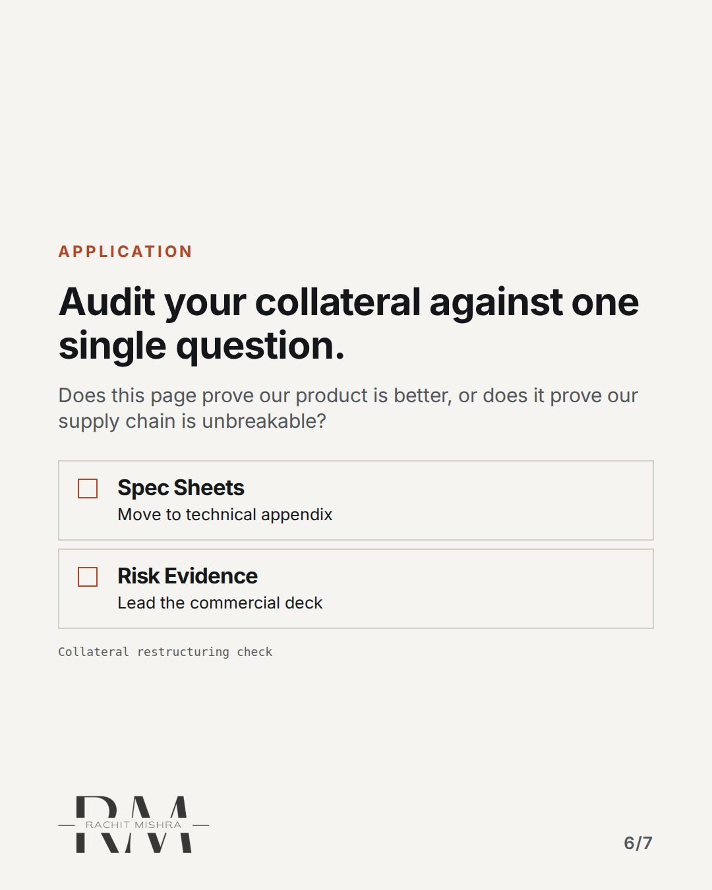
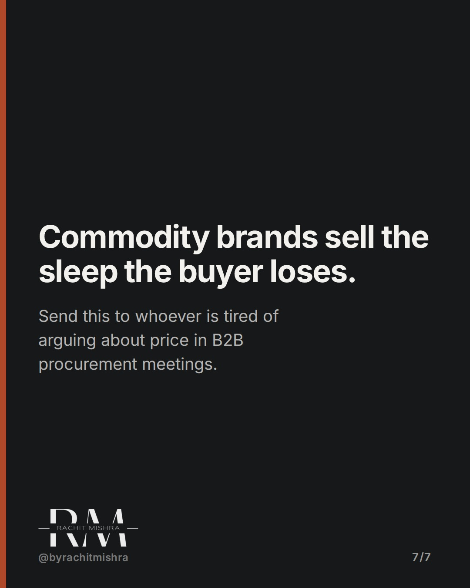

# commodity brand positioning

**CAROUSEL** · b2b_brand · goes live **2026-10-05T19:00:00+05:30**

> Targeting: `how to brand a commodity product`
>
> Claim: Commodity products cannot win on product features, so positioning must create an operational risk for choosing anyone else.
>
> Proof (practitioner_observation): Observed across multiple industrial supplier tenders where identical steel or chemical specifications force buyers to evaluate risk, logistics stability, and plant audit history rather than product performance.
>
> Rendered infographics: 5 — comparison, comparison, checklist, bottleneck, checklist

## Slides

7 rendered images sit in this folder — upload them in filename order.

**1.** 
### A commodity has no features to sell.



**2.** The Trap
### When products are identical, marketing defaults to price.
Lowering prices invites margin erosion and signals desperation to procurement committees.



**3.** The Shift
### Stop selling the steel. Start selling the certainty.
Buyers do not risk their careers on the product. They risk their careers on whether the delivery arrives on Tuesday.



**4.** The Mechanism
### Positioning in industrial markets is risk transference.
Your brand premium is insurance against plant downtime.



**5.** The Tradeoff
### This requires abandoning half your product claims.
Every page spent on technical specs is a page not spent on proving operational resilience.



**6.** Application
### Audit your collateral against one single question.
Does this page prove our product is better, or does it prove our supply chain is unbreakable?



**7.** 
### Commodity brands sell the sleep the buyer loses.
Send this to whoever is tired of arguing about price in B2B procurement meetings.



## Caption — copy from here

```
A commodity has no features to sell.

In how to brand a commodity product, this is the decision that changes the outcome.

Most industrial marketers double down on technical datasheets. That fails because the procurement committee already has the ISO certificate on file.

They are not buying better steel. They are buying the elimination of plant downtime.

Positioning a commodity means making your competitors look like a logistical gamble.

[b2b branding, industrial marketing, brand strategy, manufacturing marketing]

#b2bmarketing #industrialmarketing #brandstrategy

#b2bmarketing #industrialmarketing #brandstrategy
```

## Alt text

```
Carousel slides explaining how B2B commodity positioning relies on risk transference.
```

## How this post could fail

Could be misread as basic sales advice rather than a structural brand positioning shift.
