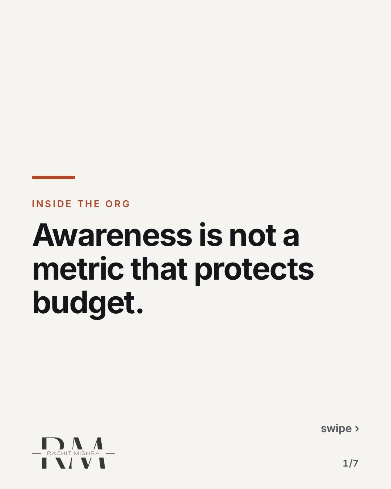
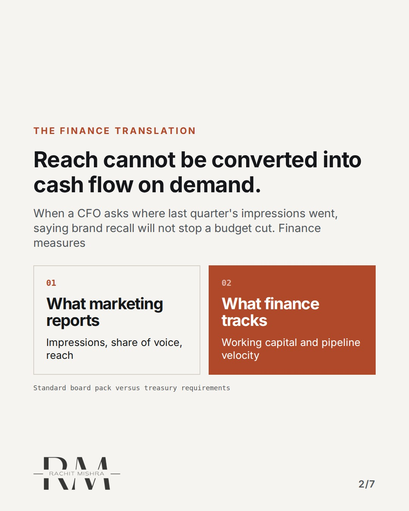
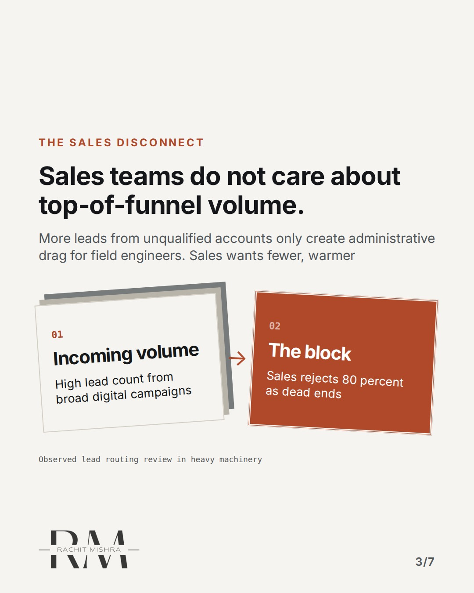
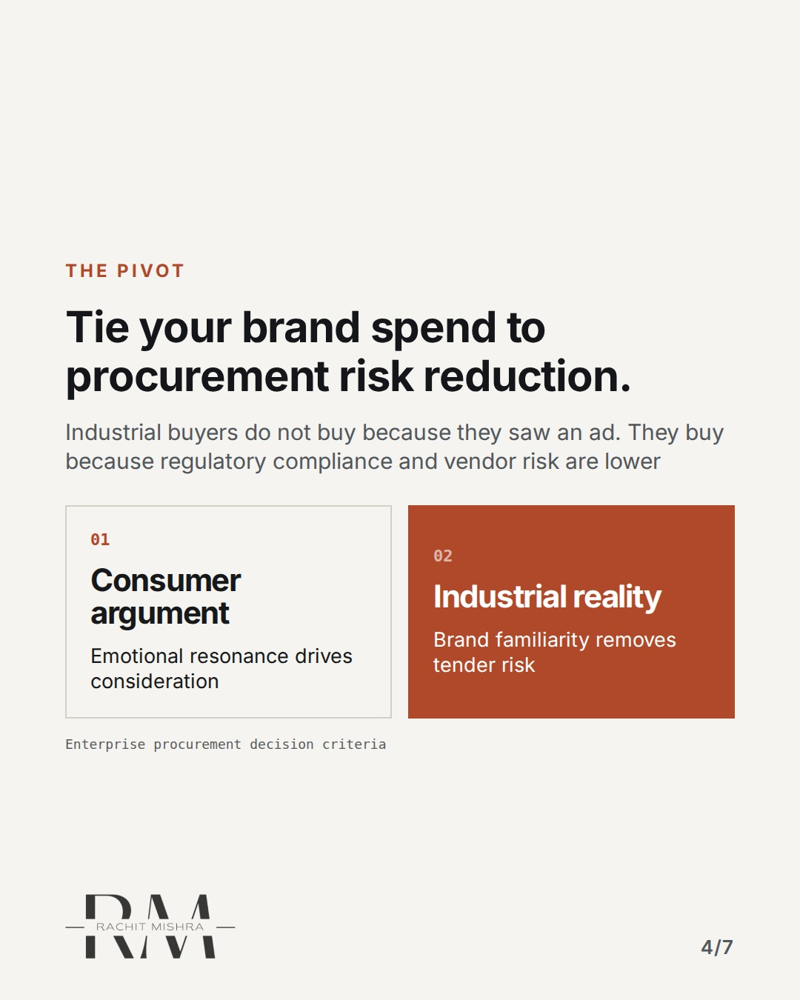
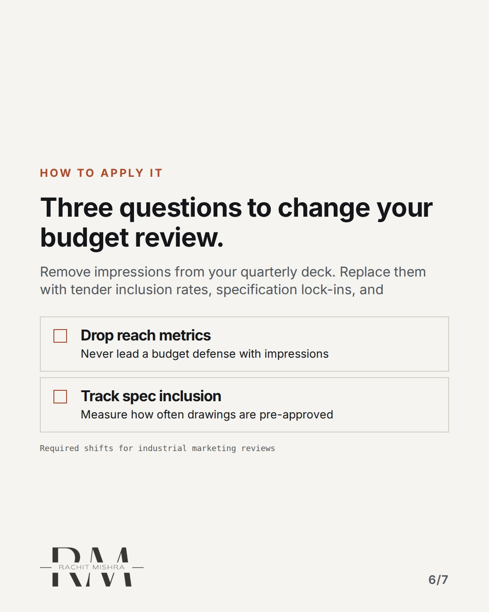

# defending a marketing budget

**CAROUSEL** · inside_the_org · goes live **2026-10-10T10:30:00+05:30**

> Targeting: `defending a marketing budget`
>
> Claim: You lose budget when you defend awareness because procurement and sales measure pipeline speed, not reach.
>
> Proof (practitioner_observation): Observed across industrial capital goods sales cycles where marketing requests are routinely cut during flat quarters because awareness metrics cannot be linked to tender movement.
>
> Rendered infographics: 5 — comparison, bottleneck, comparison, checklist, checklist

## Slides

7 rendered images sit in this folder — upload them in filename order.

**1.** 
### Awareness is not a metric that protects budget.



**2.** The finance translation
### Reach cannot be converted into cash flow on demand.
When a CFO asks where last quarter's impressions went, saying brand recall will not stop a budget cut. Finance measures



**3.** The sales disconnect
### Sales teams do not care about top-of-funnel volume.
More leads from unqualified accounts only create administrative drag for field engineers. Sales wants fewer, warmer



**4.** The pivot
### Tie your brand spend to procurement risk reduction.
Industrial buyers do not buy because they saw an ad. They buy because regulatory compliance and vendor risk are lower



**5.** The budget defense
### Stop defending marketing as an investment in growth.
Defend it as insurance against pricing pressure. Commodity suppliers without brand equity lose two points of margin on


**6.** How to apply it
### Three questions to change your budget review.
Remove impressions from your quarterly deck. Replace them with tender inclusion rates, specification lock-ins, and



**7.** 
### Budget survival is a function of risk mitigation, not reach.
Defend marketing budget by showing how it lowers procurement friction for the buyer.


## Caption — copy from here

```
Awareness is not a metric that protects budget.

In defending a marketing budget, this is the decision that changes the outcome.

Most in-house marketers lose their allocation during lean quarters because they report impressions to a committee that only tracks working capital and tender conversion.

When you defend defending a marketing budget with reach, you invite a cut. Defend it with risk reduction instead.

Send this to whoever is defending the brand budget this quarter.

[b2b marketing, industrial branding, marketing budget, stakeholder management]

#marketingleadership #inhousemarketing #brandgovernance
```

## Alt text

```
Carousel slides explaining why awareness metrics fail to protect B2B marketing budgets.
```

## How this post could fail

Could be read as generic advice about proving ROI if readers do not connect it specifically to industrial procurement cycles.
