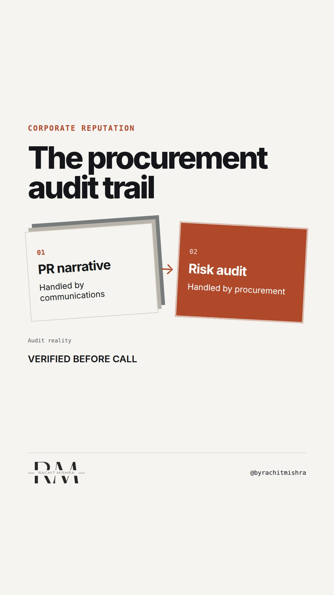

# corporate_reputation_cost_audit

**REEL** · reputation · goes live **2026-10-08T17:00:00+05:30**

> Targeting: `corporate reputation`
>
> Claim: Corporate reputation is not protected by communication exercises; it is defended by operational thresholds that procurement committees verify before any purchase order is issued.
>
> Proof (practitioner_observation): Observed across industrial procurement cycles where technical compliance is verified through safety audit trails and community clearance records long before commercial terms are discussed.
>
> Rendered infographics: 7 — bottleneck, bottleneck, comparison, checklist, comparison, comparison, checklist
>
> Reel assets: image `reputation-reflection.png` · music `bed-something (11).mp3`

## Cover



## Reel script

`reel.mp4` has been generated from this script and will publish automatically. To use your own footage instead, replace that file and delete `.generated-reel` from this folder.

| Time | On screen | Voiceover | Direction |
|---|---|---|---|
| 0:00-0:05 | **Reputation is priced in before they call you.** | Reputation is priced in before they call you. Most corporate communications teams believe reputation is managed through press releases and crisis holding statements. | Direct cut to a clean, quiet industrial office setting. Plain spoken delivery. |
| 0:05-0:10 | **The committee never reads your press release.** | The procurement committee never reads your press release. They look at your regulatory filings, safety records, and local community grievance logs. | Camera angle shifts slightly. Text overlays cleanly. |
| 0:10-0:16 | **Three checks verify your corporate reputation.** | Here are three checks that actually determine if your corporate reputation holds up under audit. | Clear transition to a structured list format on screen. |
| 0:16-0:21 | **Risk is measured in operational pauses.** | Risk is measured in operational pauses. A factory shut down by regulators is an supply chain failure, not a brand failure. | B-roll of industrial yard, quiet and slow, reinforcing the operational theme. |
| 0:21-0:26 | **Communication doesn't replace compliance.** | Communication doesn't create credibility. It gives credibility a voice once the operational proof is already established. | Final direct framing to camera, holding the cadence steady. |
| 0:26-0:31 | **Reputation is an engineering output.** | Treat reputation as an engineering output, not a marketing campaign. | Hold on final text card. |

## Caption — copy from here

```
Reputation is priced in before they call you.

In corporate reputation, this is the decision that changes the outcome.

When a procurement committee reviews an enterprise vendor, they do not evaluate campaign creative. They look at regulatory filings, plant safety incidents, and community dispute records from years prior.

Communication doesn't create credibility. It gives credibility a voice once the operational proof is already in place.

Send this to whoever is defending your corporate reputation budget against short-term campaign requests this quarter.

[corporate reputation, stakeholder trust, corporate communications, procurement risk]

#corporatecommunications #reputation #publicrelations
```

## Alt text

```
Industrial compliance audit checklist showing regulatory verification steps.
```

## How this post could fail

Readers might mistake this for generic advice about PR crisis management unless they recognise the industrial procurement audit reality.
