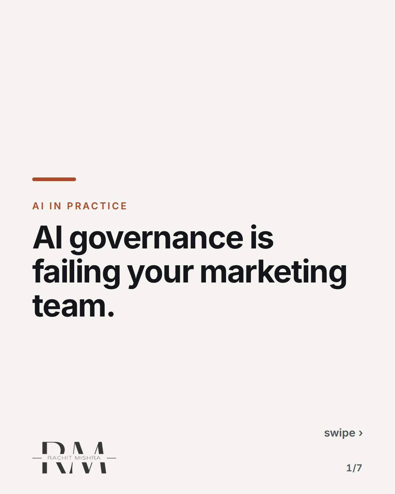
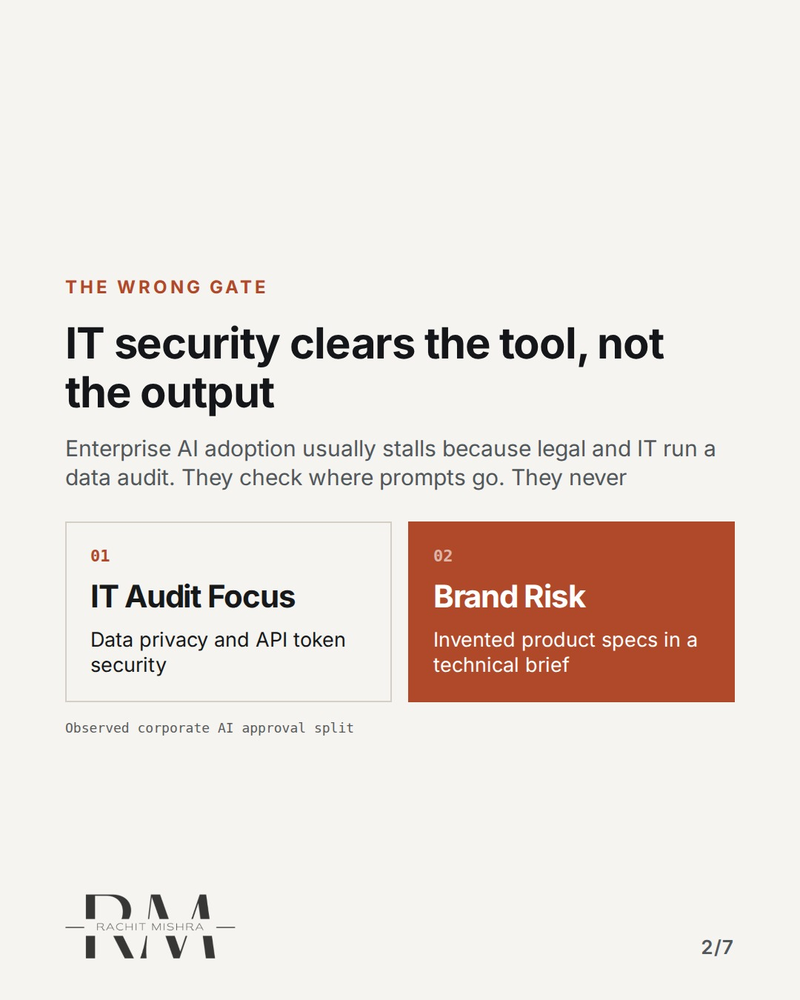
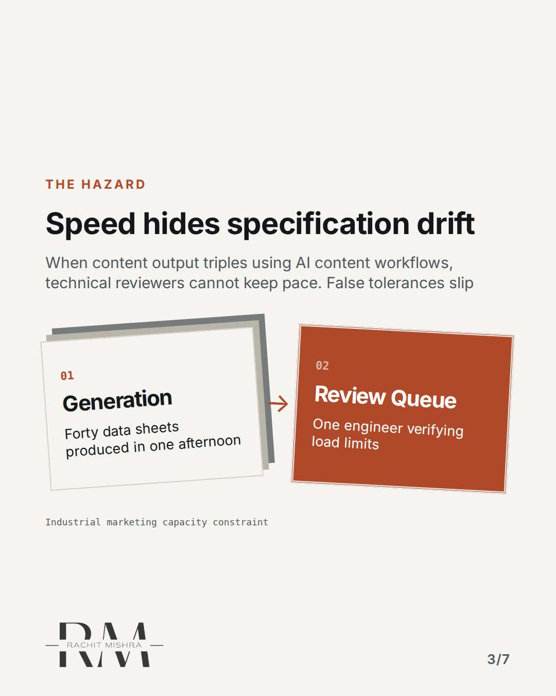
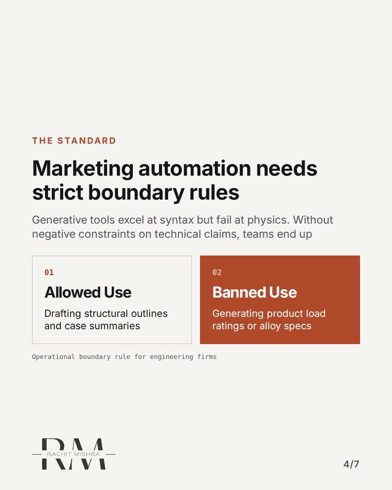
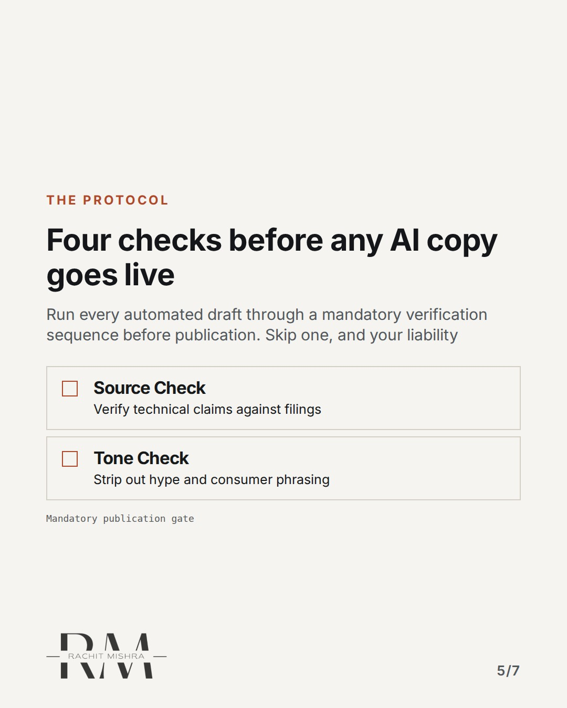
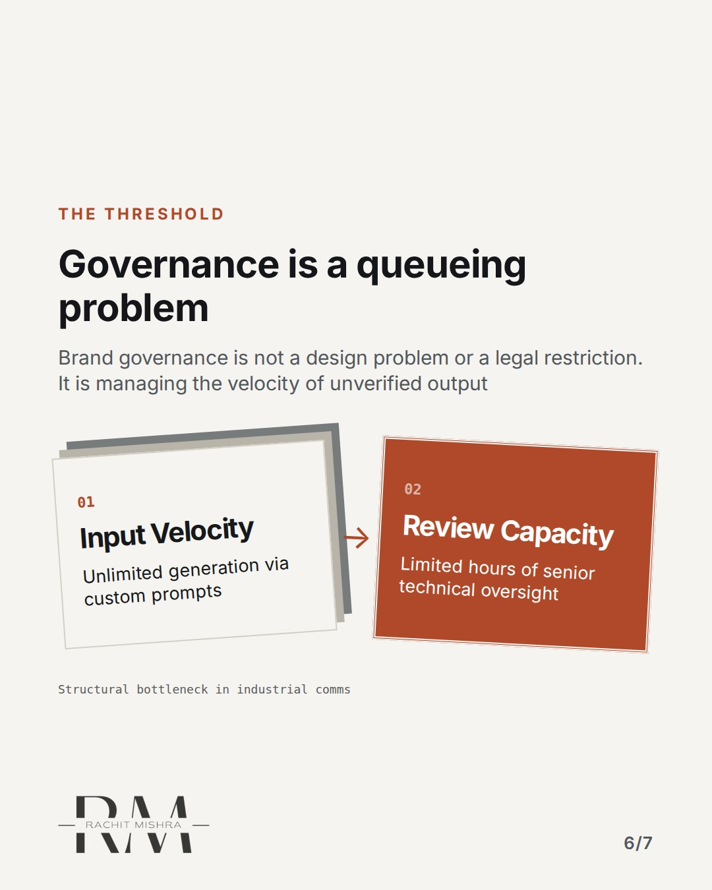

# aigovernanceformarketingteams

**CAROUSEL** · ai_in_practice · goes live **2026-10-07T20:00:00+05:30**

> Targeting: `AI governance for marketing teams`
>
> Claim: AI governance in industrial marketing fails because teams treat it as an IT security audit instead of a brand compliance protocol.
>
> Proof (practitioner_observation): Observed review cycles where enterprise IT cleared AI tools for data security, but left zero protocols for technical accuracy, regulatory claims, or specification drift in heavy industry collateral.
>
> Rendered infographics: 6 — comparison, bottleneck, comparison, checklist, bottleneck, checklist

## Slides

7 rendered images sit in this folder — upload them in filename order.

**1.** 
### AI governance is failing your marketing team.



**2.** The wrong gate
### IT security clears the tool, not the output
Enterprise AI adoption usually stalls because legal and IT run a data audit. They check where prompts go. They never



**3.** The hazard
### Speed hides specification drift
When content output triples using AI content workflows, technical reviewers cannot keep pace. False tolerances slip



**4.** The standard
### Marketing automation needs strict boundary rules
Generative tools excel at syntax but fail at physics. Without negative constraints on technical claims, teams end up



**5.** The protocol
### Four checks before any AI copy goes live
Run every automated draft through a mandatory verification sequence before publication. Skip one, and your liability



**6.** The threshold
### Governance is a queueing problem
Brand governance is not a design problem or a legal restriction. It is managing the velocity of unverified output



**7.** The principle
### AI governance is a verification pipeline
The point of AI governance for marketing teams is not restricting tools. It is matching publication speed to the actual


## Caption — copy from here

```
AI governance is failing your marketing team.

In AI governance for marketing teams, this is the decision that changes the outcome.

Most enterprises treat AI risk as an IT issue. They worry about data privacy while their teams use marketing automation to generate unverified technical specifications for heavy machinery.

When a consumer brand hallucinates a feature, customer support handles it. When an industrial brand hallucinates a load rating, a procurement committee walks away permanently.

Set the boundary rules before you scale the output.

Send this to whoever is defending AI content standards this quarter.

[enterprise ai adoption, ai governance for marketing teams, marketing operations, b2b marketing]

#aimarketing #martech #aigovernance
```

## Alt text

```
Carousel on why AI governance fails when treated as an IT security audit.
```

## How this post could fail

Could be read as generic anti-AI commentary if the distinction between consumer hallucination and industrial liability is not sharp enough.
